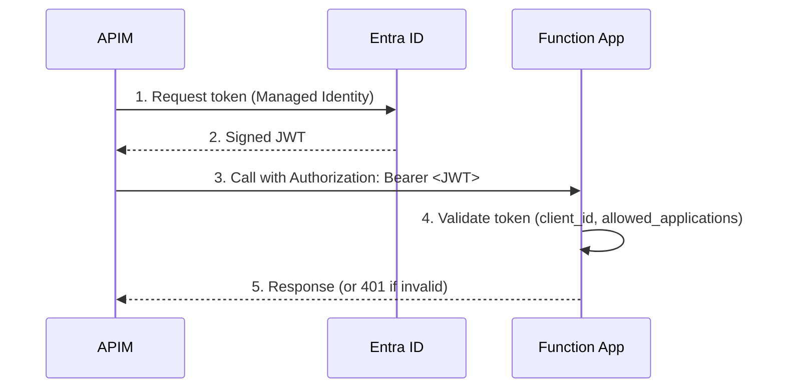

Add optional Entra ID authentication via `entra_id_authentication` variable.

When set, the module configures `auth_settings_v2` with an Active Directory v2 identity provider on both the Function App and its staging slot. This allows callers (e.g. APIM) to authenticate via their Managed Identity instead of using function keys, eliminating shared secret management.

The variable is `null` by default, preserving the existing key-based authentication behavior with no breaking changes.

### How it works



### Example

```hcl
module "function_app" {
  source = "pagopa-dx/azure-function-app/azurerm"
  # ... other parameters ...

  entra_id_authentication = {
    entra_application_client_id = data.azuread_application.my_app.client_id
    allowed_client_applications = [data.azuread_service_principal.apim.client_id]
    tenant_id                   = data.azurerm_subscription.current.tenant_id
  }
}
```
