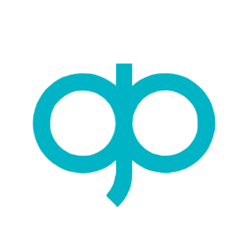

<div align="center">



# DevEx Initiative

<p align="center">
  <i align="center">Transforming the Development Experience 🚀</i>
</p>

</div>

<a name="readme-top"></a>

<h4 align="center">

DevEx initiative consists in a set of tools, patterns, and best practices aimed to innovate the Developer Experience (DevEx) and productivity.

<!-- 
[](#Contributing)
 -->


**&searr;&nbsp;&nbsp;The DevEx resources&nbsp;&nbsp;&swarr;**

[Documentation][docs_url] · [Blog][blog_url]

</h4>

## ⚡️ Quick Start

To start using DX tooling, conventions and best practices, refer to the [getting started](https://dx.pagopa.it/docs/) on the DX website.

This repository uses [mise](https://mise.jdx.dev/) to manage the local development tooling declared in [`mise.toml`](./mise.toml). Install `mise` by following the [official documentation](https://mise.jdx.dev/installing-mise.html), then bootstrap the tools from the repository root with:

```bash
mise install
pnpm install
```

<div align="right">

[&nwarr; Back to top](#readme-top)

</div>

## 💻 Contributing

If you want to contribute to the project, please read the [contributing guide](https://github.com/pagopa/dx/blob/main/CONTRIBUTING.md) first.

<div align="right">

[&nwarr; Back to top](#readme-top)

</div>

## 🤓 Contributors

<a href="https://github.com/pagopa/dx/graphs/contributors">
  
</a>

Made with [contrib.rocks](https://contrib.rocks).

<div align="right">

[&nwarr; Back to top](#readme-top)

</div>

## 💪 Motivation to Create

Imagine being able to release the first API for a new digital service into production in minutes instead of weeks, having fewer decisions to make, less code to interpret and maintain, onboarding new team members with zero downtime: this is the goal we set for ourselves.

<div align="right">

[&nwarr; Back to top](#readme-top)

</div>

<!-- Docs links -->

[docs_url]: https://dx.pagopa.it/docs/
[blog_url]: https://dx.pagopa.it/blog/
