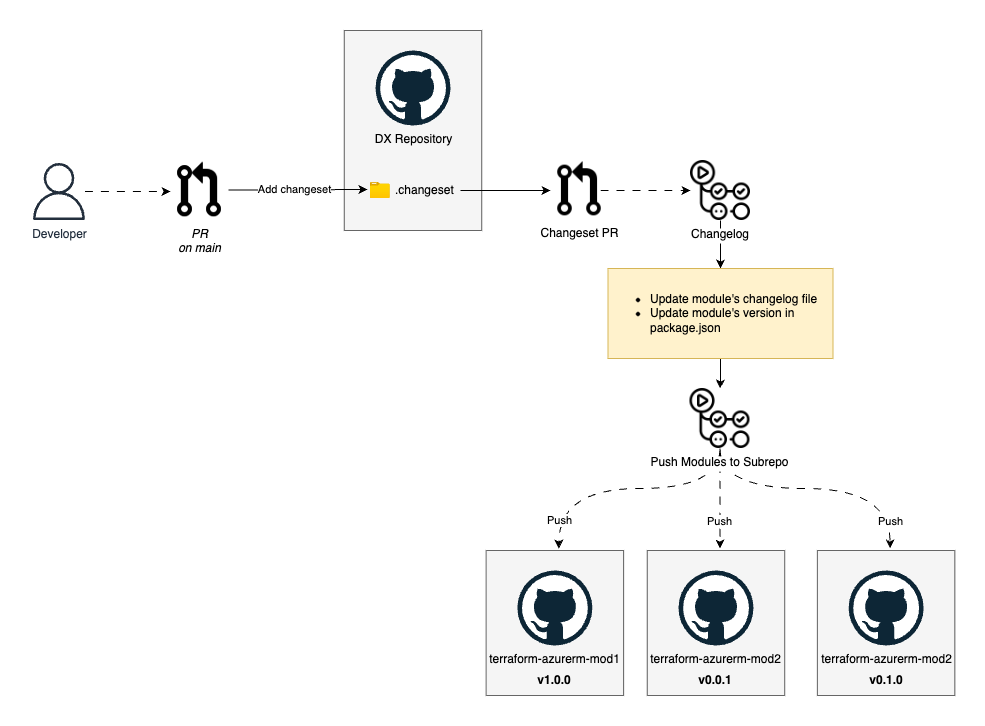

import Tabs from "@theme/Tabs";
import TabItem from "@theme/TabItem";

# Publishing Terraform Modules and Provider from Our Monorepo: Lessons Learned

At PagoPA, we heavily rely on Infrastructure as Code (IaC) practices to deliver our cloud solutions. Terraform has become a fundamental tool in our engineering toolkit, allowing us to manage our infrastructure efficiently and ensure consistency across environments.

As our projects grew in number and complexity, we faced a common challenge: how to effectively share and reuse Terraform code while maintaining quality and consistency.
This led us to explore publishing our modules and provider to the Terraform Registry, all while preserving our internal development process based on a monorepo structure.

In this post, we'll share our journey, the challenges we faced, and the technical solutions we implemented to bridge the gap between developing Terraform modules in a single repository and meeting the Terraform Registry requirements.

{/* truncate */}

## The Challenges We Faced

Before diving into our solution, let's outline the main challenges we were trying to overcome:

1.  **Encouraging Module Reuse**: Publishing modules to the registry provides a central, versioned source, encouraging teams to reuse the canonical module instead of duplicating code or reinventing the wheel.

2. **Inefficient Module Downloads**: Referencing modules directly from GitHub meant Terraform downloaded the entire repository for each module, causing slow `terraform init` times and inefficient storage space management.

3. **Version Management**: Without proper versioning, tracking changes and ensuring backward compatibility became increasingly difficult.

4. **Documentation**: Without a centralized place to document our modules, teams struggled to understand how to use them correctly.

5. **Registry Requirements**: The Terraform Registry has specific requirements for modules and providers, particularly around repository structure (one module per repository).

6. **Development Workflow**: We enjoy the benefits of a monorepo approach for code reviews, issue tracking, and shared CI/CD pipelines.

## Our Solution: Bridging Monorepo and Terraform Registry

We developed a system that allows us to:

1. Develop and maintain modules in our monorepo
2. Automatically publish them to dedicated repositories
3. Release them to the Terraform Registry with proper versioning

Here's a visual representation of our approach:



### Technical Implementation for Modules

The technical implementation involves several components working together to bridge our monorepo workflow with the Terraform Registry requirements.

#### 1. Structured Module Organization

Within our monorepo, we organize modules in the [`infra/modules`](https://github.com/pagopa/dx/tree/main/infra/modules) directory following a consistent pattern. Each module (such as [`azure_api_management`](https://github.com/pagopa/dx/tree/main/infra/modules/azure_api_management) and [`azure_container_app`](https://github.com/pagopa/dx/tree/main/infra/modules/azure_container_app)) contains its own code, tests, examples, and documentation, making it easy for developers to navigate and contribute.

#### 2. Automated Push to Sub-repositories

The heart of our solution is an automated [GitHub Action workflow](https://github.com/pagopa/dx/blob/main/.github/workflows/_release-bash-modules-to-subrepo.yaml) that handles synchronization between our monorepo and individual repositories. When changes are made to a module in our monorepo, the workflow detects these changes and pushes them to a dedicated sub-repository following the Terraform Registry naming convention. **Crucially, before pushing, automated tests are run against the modules to ensure quality and prevent regressions.**

For instance, our Azure API Management module in the monorepo is pushed to a repository named [`terraform-azurerm-azure-api-management`](https://github.com/pagopa-dx/terraform-azurerm-azure-api-management), making it ready for Registry distribution while preserving our centralized development model.

#### 3. Version Management with Changesets

We use [Changesets](https://github.com/changesets/changesets) to manage versions and generate changelogs:

1. Developers create a changeset describing their changes using the tool's command-line interface.
   ```bash
   # Example command for creating a changeset
   yarn changeset
   ```

2. This process prompts for the change type (patch/minor/major), a description of the changes, and the affected modules.

3. When merged, a release action automated by the tool bumps versions, updates changelogs, tags the repository, and triggers the sub-repository push.

This gives us proper semantic versioning and clear documentation of changes.

#### 4. Module Security with Lock Files

To ensure security and prevent supply chain attacks, we implemented a pre-commit system that generates lock files for all Terraform configurations using a [custom script](https://github.com/pagopa/dx/blob/main/infra/scripts/lock-modules.sh), similar to provider locks.

This is critical when using Registry modules, as it ensures that the exact module versions and their content hashes are verified before deployment.

<Tabs>
  <TabItem value="lock" label="Lock File Example" default>

```json
{
  "modules": {
    "registry.terraform.io/pagopa-dx/azure-role-assignments/azurerm": {
      "version": "0.0.1",
      "hash": "a123bc4567890def1234567890abcdef1234567890"
    }
  }
}
```

  </TabItem>
  <TabItem value="config" label="Pre-commit Config">

```yaml
repos:
  - repo: https://github.com/pagopa/dx
    rev: pre_commit_scripts@0.0.1
    hooks:
      - id: lock_modules
        exclude: ^.*/(_modules|modules|\.terraform)(/.*)?$
        files: src/(prod|dev) # Example paths
```

  </TabItem>
</Tabs>

### Bonus: Publishing Our Custom Provider

Beyond modules, we also developed a custom Terraform provider, [DX Azure provider](https://registry.terraform.io/providers/pagopa-dx/azure/latest), to encapsulate specific logic like our resource naming conventions. We applied a similar automated approach:

1.  **Development** happens in the monorepo (`infra/provider`).
2.  **Automated Workflow** ([`_release-bash-provider-to-subrepo.yaml`](https://github.com/pagopa/dx/blob/main/.github/workflows/_release-bash-provider-to-subrepo.yaml)) pushes code to a dedicated `terraform-provider-azure` repository.
3.  **Registry Publication**: Tagged releases trigger a CI/CD pipeline that builds, signs with GPG, and publishes the provider to the Terraform Registry under the `pagopa-dx/azure` namespace.

This allows teams to use our custom provider easily:

```hcl
terraform {
  required_providers {
    dx = {
      source  = "pagopa-dx/azure"
      version = "~> 0.0" // Specify desired version
    }
  }
}

provider "dx" {
  # Configuration options
}
```

## Benefits and Results

Our approach has yielded significant benefits:

### 1. Better Developer Experience

Teams can now simply reference our modules with clear versioning:

<Tabs>
  <TabItem value="before" label="Before" default>

```hcl
module "roles" {
  source = "github.com/pagopa/dx//infra/modules/azure_role_assignments?ref=main"
  // parameters...
}
```

  </TabItem>
  <TabItem value="after" label="After">

```hcl
module "roles" {
  source  = "pagopa-dx/azure-role-assignments/azurerm"
  version = "~> 0.0"
  // parameters...
}
```

  </TabItem>
</Tabs>

### 2. Semantic Versioning Benefits

With our approach to semantic versioning, teams now enjoy a clear contract for module updates. They can confidently upgrade modules within the same minor version knowing that breaking changes won't occur. This system helps developers easily identify when major changes require careful migration planning, reducing refactoring time during updates and making dependency management more straightforward.

### 3. Enhanced Documentation Access

The Registry serves as a professional, centralized documentation interface for all our infrastructure components. Teams can now browse comprehensive module documentation, review input and output variable specifications, find practical usage examples, and access version histories all in one place. This centralization eliminates the need to navigate multiple GitHub repositories or documentation sources, making it faster and easier to implement modules correctly.

### 4. Centralized Development with Decentralized Distribution

Our solution preserves the benefits of monorepo development while gaining the advantages of Registry distribution. We maintain centralized code reviews and issue tracking, consistent CI/CD pipelines, and a unified development workflow. Simultaneously, we benefit from an official publication channel, standardized documentation formats, semantic versioning, and simplified consumption for end users.

## Lessons Learned

Throughout this journey, we've learned several important lessons that shaped our approach and thinking about infrastructure code.

Automation proved absolutely essential. Without automated workflows, maintaining synchronization between our monorepo and sub-repositories would be practically impossible at scale. We've also discovered that versioning discipline matters deeply; semantic versioning provides a clear contract for users of our modules and provider.

Documentation has become a first-class citizen in our process. Good documentation dramatically reduces onboarding time and support requests, making teams more productive. We've embedded security into our workflow by using module lock files, ensuring supply chain security without compromising convenience.

Perhaps most interestingly, we found that the Registry's requirements for structure and documentation actually drove better practices across our entire infrastructure codebase, improving our overall IaC quality.

## Future Directions

As we continue to evolve our approach, we're now exploring several exciting directions. We plan to expand our module catalog to cover more infrastructure patterns common across our organization. Our team is also enhancing the provider with additional functions to address more use cases.

## Conclusion

Our journey from monorepo to Terraform Registry demonstrates that you don't have to choose between a centralized development workflow and standardized distribution. With the right automation and tools, you can have the best of both worlds.

By publishing our modules and provider to the Terraform Registry, we've improved code reuse, standardization, and documentation while maintaining our preferred development workflow. The investment in automation has paid dividends in terms of development velocity and code quality.

We hope our experience provides valuable insights for teams facing similar challenges in their Infrastructure as Code journey.

Have questions about our approach or want to see our modules? Check out our [Terraform Registry namespace](https://registry.terraform.io/namespaces/pagopa-dx) or feel free to contact us.
