import Tabs from "@theme/Tabs";
import TabItem from "@theme/TabItem";

**In a recent scan across just 3 Azure subscriptions, we identified over 100
potentially unused resources—48 of them classified as high-cost risks.** Premium
App Service Plans running empty, deallocated VMs still accruing charges,
orphaned disks accumulating month after month. The numbers don't lie: cloud
waste is real, pervasive, and expensive.

Cloud costs can quickly spiral out of control. Forgotten **virtual machines**,
**unattached disks**, idle **App Service Plans**—these _"ghost resources"_
accumulate over time, silently draining budgets. At PagoPA, as the DX team,
we've built **SaveMoney**, a scientific tool integrated into our DX CLI that
helps teams identify and optimize cloud spending without breaking a sweat.

SaveMoney is **read-only, metric-driven, and intelligent**. It doesn't delete or
modify anything—instead, it generates detailed reports to support informed
FinOps decisions.

<!-- truncate -->

## The Problem: Hidden Cloud Waste

In large cloud environments, it's easy to lose track of resources:

- A developer spins up a VM for testing and forgets to deallocate it
- An App Service Plan remains active after all apps are removed
- Disks persist after VMs are deleted
- Public IPs sit idle with no associated resources

These scenarios are common across organizations, and they add up to significant
unnecessary costs. Traditional cloud cost management tools often rely on simple
heuristics or require manual tagging—neither of which provides the full picture.

## The Solution: Metric-Based Analysis

SaveMoney takes a **scientific approach** to cost optimization by analyzing
actual Azure Monitor metrics over configurable time periods. Instead of guessing
whether a resource is unused, it examines:

- **CPU utilization** for Virtual Machines and App Service Plans
- **Network traffic** for VMs, Public IPs, and Static Web Apps
- **Memory consumption** for App Service Plans and Container Apps
- **Transaction counts** for Storage Accounts
- **Deployment state** for Container Apps and App Service Plans

This metric-based detection provides high confidence in the results, reducing
false positives and helping teams focus on truly wasteful resources.

## Architecture & Multi-Cloud Vision

SaveMoney follows a modular architecture designed for **multi-cloud support**:

```mermaid
flowchart TD
    User["👤 User / CI Pipeline"]
    CLI["🛠️ DX CLI<br/>savemoney command"]

    subgraph Analysis["Analysis Engine"]
        Config["⚙️ Configuration<br/><small>subscriptions, filters</small>"]
        Azure["☁️ Azure Analyzer"]
        AWS["☁️ AWS Analyzer<br/><small>🚧 Coming Soon</small>"]
    end

    subgraph Cloud["Azure Cloud"]
        Resources["📦 Resources<br/><small>VMs, Disks, App Services, etc.</small>"]
        Metrics["📊 Monitor Metrics<br/><small>CPU, Network, Transactions</small>"]
    end

    subgraph Output["📋 Reports"]
        Table["Table View<br/><small>human-readable</small>"]
        JSON["JSON<br/><small>automation-ready</small>"]
        Detailed["Detailed JSON<br/><small>AI/LLM analysis</small>"]
    end

    User --> CLI
    CLI --> Config
    Config --> Azure
    Config -.-> AWS
    Azure --> Resources
    Azure --> Metrics
    Azure --> Output

    style User stroke:#0078d4,stroke-width:2px
    style CLI fill:#107c10,color:#fff
    style Azure fill:#0078d4,color:#fff
    style AWS fill:#666,color:#fff,stroke:#ff9900,stroke-width:2px
    style Config stroke:#107c10,stroke-width:2px
    style Cloud stroke:#0078d4,stroke-width:2px
```



Currently, **Azure is the primary supported cloud provider**, with comprehensive
analysis for common resource types. AWS support is planned for future releases.
The architecture separates cloud-specific analyzers from the core logic, making
it straightforward to add new providers and expand coverage.

:::note Continuous Improvement

The Azure analyzer is actively evolving. We're continuously refining detection
logic, adding support for additional resource types, and improving metric-based
thresholds based on real-world feedback.

:::

## What SaveMoney Detects

SaveMoney currently analyzes **9 common Azure resource types**, focusing on the
ones that typically drive the most cloud waste:

- **🔴 High Cost Risk**: Virtual Machines (deallocated or idle), App Service
  Plans (empty or oversized)
- **🟡 Medium Cost Risk**: Orphaned Disks, unused Public IPs, idle Network
  Interfaces, disconnected Private Endpoints, low-traffic Storage Accounts and
  Container Apps
- **🟢 Low Cost Risk**: Static Web Apps with minimal traffic

Each resource is evaluated using a combination of **state checks** (is it
attached? running?) and **Azure Monitor metrics** (CPU usage, network traffic,
transactions) to minimize false positives.

:::tip

For the complete list of analyzed resources and detection criteria, check out
the
[official documentation](https://dx.pagopa.it/docs/dx-cli#savemoney--cost-optimization).

:::

## Getting Started

SaveMoney is available as part of the `@pagopa/dx-cli` toolchain. Here's how to
use it:

:::info Early Stage

SaveMoney is currently in its initial version. The CLI interface and available
commands will evolve over time with additional filters, output options, and
workflow integrations based on user feedback and real-world usage.

:::

### Prerequisites

- **Azure subscription(s)** with appropriate permissions
- **Azure CLI authentication**
- **Node.js 22 or higher**

### Installation

You can invoke the CLI directly via `npx` without installing globally, and if
you're already using the DX CLI, SaveMoney is included:

```bash
npx @pagopa/dx-cli savemoney --help
```

When installed locally in a monorepo you can also run:

```bash
pnpm dx savemoney --help
```

### Configuration Options

SaveMoney supports multiple configuration methods to fit different workflows:

<Tabs>
<TabItem value="config-file" label="Config File" default>

Create a JSON configuration file (e.g., `config.json`):

```json
{
  "tenantId": "your-tenant-id",
  "subscriptionIds": ["subscription-id-1", "subscription-id-2"],
  "preferredLocation": "italynorth",
  "timespanDays": 30
}
```

Then run:

```bash
npx @pagopa/dx-cli savemoney --config config.json
```

</TabItem>
<TabItem value="env-vars" label="Environment Variables">

Set environment variables:

```bash
export ARM_TENANT_ID="your-tenant-id"
export ARM_SUBSCRIPTION_ID="subscription-id-1,subscription-id-2"
```

Then run:

```bash
npx @pagopa/dx-cli savemoney
```

</TabItem>
<TabItem value="cli-options" label="CLI Options">

Pass options directly via command line:

```bash
npx @pagopa/dx-cli savemoney \
  --config config.json \
  --format table \
  --location italynorth \
  --days 30 \
  --verbose
```

</TabItem>
<TabItem value="interactive" label="Interactive Prompt">

If no configuration is provided, SaveMoney will prompt you interactively:

```bash
npx @pagopa/dx-cli savemoney
# Enter Tenant ID: your-tenant-id
# Enter Subscription IDs (comma-separated): sub-1,sub-2
```

</TabItem>
</Tabs>

### Output Formats

SaveMoney offers three output formats to suit different use cases:

#### 1. Table Format

A human-readable summary perfect for terminal viewing:

```bash
npx @pagopa/dx-cli savemoney --format table
```

<details>
<summary>Example output</summary>

```
┌────────────────────────┬─────────────────────────────────────┬────────────────┬────────┬──────────────────────────────────────────┐
│ Name                   │ Type                                │ Resource Group │ Risk   │ Reason                                   │
├────────────────────────┼─────────────────────────────────────┼────────────────┼────────┼──────────────────────────────────────────┤
│ vm-test-01             │ Microsoft.Compute/virtualMachines   │ rg-test        │ high   │ VM is deallocated.                       │
│ asp-unused-premium     │ Microsoft.Web/serverfarms           │ rg-prod        │ high   │ No apps deployed. Premium tier.          │
│ disk-unattached        │ Microsoft.Compute/disks             │ rg-dev         │ medium │ Disk is not attached to any VM.          │
│ pip-idle-static        │ Microsoft.Network/publicIPAddresses │ rg-network     │ medium │ Not associated. Static IP not in use.    │
└────────────────────────┴─────────────────────────────────────┴────────────────┴────────┴──────────────────────────────────────────┘
```

</details>

#### 2. JSON Format

Standard JSON output for integration with other tools or CI/CD pipelines:

```bash
npx @pagopa/dx-cli savemoney --format json
```

<details>
<summary>Example output</summary>

```json
[
  {
    "costRisk": "high",
    "location": "italynorth",
    "name": "vm-test-01",
    "reason": "Low CPU usage (avg 0.57%). Low network traffic (0.06 MB/day avg).",
    "resourceGroup": "rg-test",
    "subscriptionId": "xxxxxxxx-xxxx-xxxx-xxxx-xxxxxxxxxxxx",
    "suspectedUnused": true,
    "type": "Microsoft.Compute/virtualMachines"
  }
]
```

</details>

#### 3. Detailed JSON Format

Comprehensive output with **all resource metadata**, ideal for:

- Deep analysis with AI tools or LLMs
- Custom scripts and automation
- Audit trails and compliance reports

```bash
npx @pagopa/dx-cli savemoney --format detailed-json
```

## Real-World Impact

At PagoPA, SaveMoney could become an essential part of our FinOps practice.
Engineering teams can quickly identify orphaned resources across multiple
subscriptions, and the metric-based analysis gives them the confidence to act
without fear of false positives.

But we're just getting started.

## The Road Ahead

Our vision for SaveMoney goes beyond a CLI command. We're working to transform
it into a continuous FinOps platform that supports multiple cloud providers and
integrates seamlessly into development workflows.

### Multi-Cloud Expansion

While Azure is our primary focus, **AWS support is on the roadmap**. The modular
architecture we've built makes it straightforward to add analyzers for
additional cloud providers, bringing the same metric-driven approach to Amazon
Web Services and beyond.

### Automated Governance

Imagine receiving automated reports directly in Slack showing unused resources
detected in your subscriptions. Or having SaveMoney run in CI/CD pipelines,
flagging potential waste before it accumulates. These workflow integrations will
make cost optimization continuous and effortless.

### Smarter Analysis

We're continuously improving detection accuracy and expanding coverage:

- Enhanced detection logic for additional Azure resource types
- More sophisticated metric analysis and configurable thresholds
- Trend analysis to identify usage patterns and seasonal variations
- Integration with cloud pricing APIs for precise cost impact estimates
- Additional output formats

### Workflow Integration

The goal is to make cost optimization a **first-class citizen** in the
development lifecycle:

- Automated PR comments with cost impact analysis
- Policy-based governance
- Custom dashboards showing cost trends

## Get Started Today

Ready to uncover hidden waste in your Azure environment? SaveMoney is
open-source and available now as part of the DX toolchain.

**Start your first analysis in under a minute:**

```bash
npx @pagopa/dx-cli savemoney --help
```

**Explore the documentation:**

- [Full CLI documentation](https://dx.pagopa.it/docs/dx-cli#savemoney--cost-optimization)
  – Configuration options, output formats, and usage examples
- [GitHub repository](https://github.com/pagopa/dx/tree/main/packages/savemoney)
  – Source code and architecture details

---

Cloud cost optimization doesn't have to be a monthly fire drill. With the right
tools and automation, it becomes part of your daily workflow—invisible,
effortless, and continuous.

Happy cost optimization! 💰
