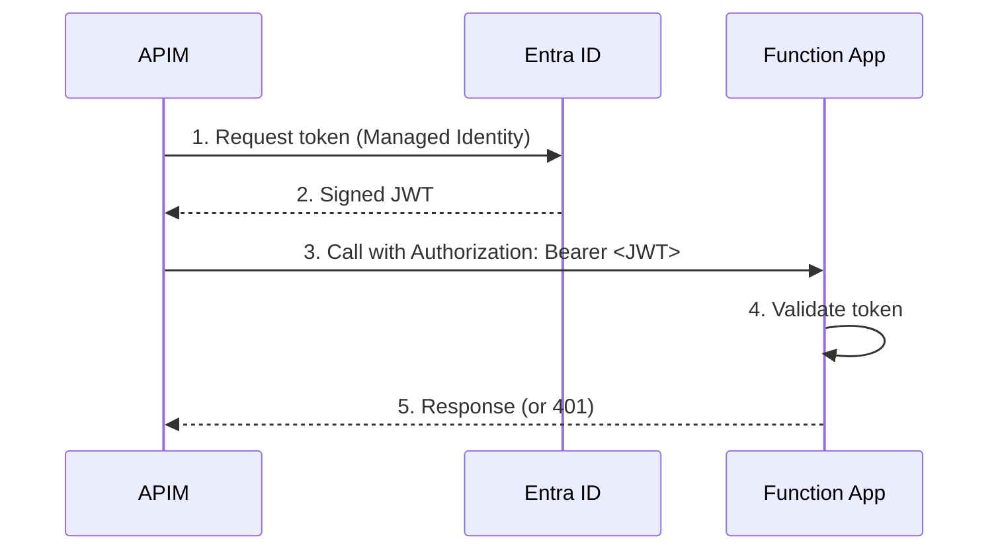

Managing shared secrets is a hidden cost of running APIs: function keys must be
stored in Key Vault, injected by APIM, and rotated periodically. One leaked key
means any caller can invoke your Function App. Beyond security concerns, shared
keys obscure your architecture: you lose track of who the caller is and how
changes to your Function App may ripple through your system. The DX team has shipped an update
to the **Azure Function App Terraform module** that eliminates this pattern
entirely.

<!-- truncate -->

## What Changed

The
[`azure-function-app`](https://registry.terraform.io/modules/pagopa-dx/azure-function-app/azurerm/latest)
module now accepts an `entra_id_authentication` variable. When set, the Function
App enforces **token-based authentication**: every inbound request must carry a
valid JWT issued by Entra ID. Unauthenticated calls receive HTTP 401 — no key
required, no secret to rotate.

APIM obtains the token automatically using its **system-assigned Managed
Identity**, so the integration remains seamless from the caller's perspective.

## How It Works



The module wires up Entra ID authentication (EasyAuth) under the hood: every
inbound request is validated against the tenant endpoint, and only APIM
identities explicitly listed in `allowed_callers_client_ids` can authenticate.

## Getting Started

```hcl
module "function_app" {
  source  = "pagopa-dx/azure-function-app/azurerm"
  version = "~> 4.1"

  # ... other required parameters ...

  entra_id_authentication = {
    audience_client_id         = data.azuread_application.my_app.client_id
    allowed_callers_client_ids = [data.azuread_service_principal.apim.client_id]
    tenant_id                  = data.azurerm_subscription.current.tenant_id
  }
}
```

On the APIM side, replace the `x-functions-key` header with the
`authentication-managed-identity` policy element — that's the only policy change
needed.

:::info

The Entra ID application must be created manually. Infrastructure contributors
do not have the required permissions to create Entra registrations via
Terraform. Open a ticket in **#team_devex_help** Slack channel to request one.

:::

## Key Benefits

| Aspect         | Before (key-based)        | After (Managed Identity)          |
| -------------- | ------------------------- | --------------------------------- |
| Secrets        | Function key in Key Vault | None — token-based                |
| Caller control | Any holder of the key     | Only `allowed_callers_client_ids` |
| Key rotation   | Manual, periodic          | Not needed                        |

## Learn More

For step-by-step configuration, APIM policy examples, and a recommended
blue-green migration strategy for existing Function Apps, read the full guide:

👉
[**Authenticating APIM to Function Apps with Managed Identity**](https://dx.pagopa.it/docs/infrastructure/azure/integrating-services/apim-function-app-authentication)
