# Multi-Cloud Connectivity: AWS ↔ Azure

Break down cloud silos and unlock the power of multi-cloud architecture. Our
Terraform module creates secure, seamless connectivity between your AWS and
Azure environments, enabling true hybrid cloud applications.

## Why Multi-Cloud?

🌐 **Best of Both Worlds** - Use AWS services where they excel and Azure
services where they shine  
🔄 **Avoid Vendor Lock-in** - Maintain flexibility and negotiating power with
cloud providers  
🛡️ **Enhanced Resilience** - Distribute workloads across multiple cloud
providers for ultimate reliability  
📈 **Strategic Flexibility** - Adapt to changing business needs, acquisitions,
or compliance requirements  
💰 **Cost Optimization** - Leverage competitive pricing and specialized services
from both clouds

## What You Get

✅ **Unified Network** - Your AWS and Azure resources communicate as if on the
same network  
✅ **Cross-Cloud DNS** - Resolve private hostnames seamlessly across both
clouds  
✅ **Zero Configuration Routing** - Automatic route management between
environments  
✅ **Enterprise Security** - Encrypted IPSec tunnels with BGP routing  
✅ **High Availability Options** - Redundant connections for mission-critical
workloads

## Multi-Cloud Use Cases

### 🚀 **Hybrid Applications**


Run your frontend on Azure App Service while leveraging AWS Lambda for
serverless compute, or use Azure AI services with data stored in AWS S3.

### 🔄 **Cloud Migration & Modernization**

Gradually migrate workloads between clouds without disrupting operations:

- **Phase 1**: Establish connectivity between existing AWS infrastructure and
  new Azure services
- **Phase 2**: Migrate services incrementally while maintaining integration
- **Phase 3**: Optimize workload placement based on performance and cost

### 🛡️ **Disaster Recovery & Business Continuity**

- **Primary**: Run production workloads on AWS
- **Secondary**: Maintain hot standby on Azure with real-time data replication
- **Failover**: Seamlessly switch to Azure during AWS outages

### 📊 **Data & Analytics Pipelines**

- Collect data in AWS S3 and process it with Azure Synapse Analytics
- Use AWS Redshift for data warehousing and Azure Power BI for visualization
- Leverage Azure Cognitive Services with data stored in AWS

## Multi-Cloud Architecture

### How It Works

The module creates secure IPSec tunnels between your AWS VPC and Azure Virtual
Network, establishing a private "bridge" between clouds:

```mermaid
graph TB
    subgraph AWS["☁️ AWS Cloud"]
        subgraph VPC["AWS VPC"]
            Apps1["🖥️ Your Applications<br/>10.0.x.x"]
            VPN_GW_AWS["🔒 VPN Gateway"]
        end
    end

    subgraph Azure["☁️ Azure Cloud"]
        subgraph VNet["Azure VNet"]
            Apps2["🖥️ Your Applications<br/>10.1.x.x"]
            VPN_GW_Azure["🔒 VPN Gateway"]
        end
    end

    VPN_GW_AWS -.->|"🔐 Encrypted IPSec Tunnel<br/>Private Traffic"| VPN_GW_Azure
    Apps1 -.->|"Cross-Cloud Communication"| Apps2

    classDef awsStyle fill:#ff9900,stroke:#232f3e,stroke-width:2px,color:#fff
    classDef azureStyle fill:#0078d4,stroke:#001e2b,stroke-width:2px,color:#fff
    classDef tunnelStyle stroke:#28a745,stroke-width:3px,stroke-dasharray: 5 5

    class AWS,VPC awsStyle
    class Azure,VNet azureStyle
```



### Development Configuration

**Single VPN Connection** - Perfect for:

- Development and testing environments
- Proof of concepts and prototypes
- Small-scale multi-cloud applications
- Cost-conscious implementations

### High Availability Configuration

**Redundant VPN Connections** - Essential for:

- Production multi-cloud applications
- Mission-critical workloads
- Enterprise disaster recovery
- 24/7 business operations

## Building Your Multi-Cloud Infrastructure

### Step 1: Multi-Cloud Prerequisites

✅ **AWS Environment Ready**

- VPC with private subnets and route tables
- NAT Gateway configured (`nat_gateway_count ≥ 1` for development)
- Appropriate IAM permissions for VPN resources

✅ **Azure Environment Ready**

- Virtual Network with Gateway Subnet (minimum /27 size)
- Resource group for network resources
- Appropriate RBAC permissions

✅ **Network Planning**

- **Non-overlapping CIDR blocks** between AWS and Azure
- DNS zone strategy for cross-cloud resolution
- Security group and NSG rules for inter-cloud traffic

:::warning \*\* Ensure your AWS VPC and Azure VNet CIDRs do not overlap

For example, an AWS VPC with `10.0.0.0/16` as a CIDR doesn't overlap with your
Azure VNet CIDR `10.1.0.0/16`.

This is **critical** for routing to work correctly.

Use [tools](https://mxtoolbox.com/subnetcalculator.aspx) to compute non
overlapping CIDRs.

:::

### Step 2: Choose Your Implementation Path

**For Development & Testing:**

- Single VPN connection for cost optimization
- Perfect for prototyping and small-scale applications
- 📖
  **[View Development Example →](https://github.com/pagopa/dx/tree/main/infra/modules/aws_azure_vpn/examples/development)**

**For Production & Enterprise:**

- High availability with redundant connections
- Mission-critical workloads and 24/7 operations
- 📖
  **[View Complete Example →](https://github.com/pagopa/dx/tree/main/infra/modules/aws_azure_vpn/examples/high_availability)**

### Step 3: Deploy with Terraform

```bash
# 1. Clone the examples
git clone https://github.com/pagopa/dx.git
cd dx/infra/modules/aws_azure_vpn/examples/development

# 2. Configure your variables
cp terraform.tfvars.example terraform.tfvars
# Edit terraform.tfvars with your AWS/Azure details

# 3. Deploy your multi-cloud connectivity
terraform init
terraform plan
terraform apply
```

### Step 4: Validate Multi-Cloud Connectivity

After deployment, verify your setup:

- ✅ Check VPN tunnel status in both AWS and Azure consoles
- ✅ Test cross-cloud ping between resources
- ✅ Verify DNS resolution across clouds
- ✅ Monitor tunnel health and performance

## Getting Started

Ready to implement multi-cloud connectivity? Choose your path:

📚
**[Complete Documentation](https://github.com/pagopa/dx/tree/main/infra/modules/aws_azure_vpn)** -
Detailed module documentation

⚙️
**[Configuration Examples](https://github.com/pagopa/dx/tree/main/infra/modules/aws_azure_vpn/examples)** -
Ready-to-use Terraform configurations

📦
**[Terraform Registry](https://registry.terraform.io/modules/pagopa-dx/aws-azure-vpn/aws)** -
Official module registry page

## Multi-Cloud Troubleshooting

### "Cross-cloud communication isn't working"

**Multi-cloud specific checks:**

1. **Network Isolation**: Verify CIDR blocks don't overlap between AWS (e.g.,
   10.0.0.0/16) and Azure (e.g., 10.1.0.0/16)
2. **Security Boundaries**: Check security groups (AWS) and NSGs (Azure) allow
   cross-cloud traffic
3. **VPN Status**: Confirm tunnels are established in both AWS and Azure
   consoles
4. **Wait Period**: Multi-cloud connections take 15-20 minutes to fully
   establish

### "DNS resolution across clouds failing"

**Cross-cloud DNS troubleshooting:**

1. **Zone Configuration**: Ensure DNS zones are correctly specified for both
   clouds
2. **Forwarder Connectivity**: Verify Azure DNS forwarder IP is reachable from
   AWS
3. **Resolution Test**: Try resolving by IP first, then by hostname
4. **Propagation Time**: DNS changes can take several minutes to propagate
   across clouds

### "High availability not working in multi-cloud setup"

**Enterprise multi-cloud checks:**

1. **Gateway Capacity**: Ensure Azure VPN Gateway supports active-active mode
2. **IP Allocation**: Verify sufficient public IP addresses are available
3. **Tunnel Health**: Check that all VPN tunnels show "Connected" status
4. **Load Distribution**: Confirm traffic is properly distributed across tunnels

## Validating Your Multi-Cloud Setup

After deployment, test your multi-cloud connectivity:

### 1. **Network Connectivity Test**

```bash
# From AWS EC2 instance, ping Azure VM private IP
ping 10.1.1.100

# From Azure VM, ping AWS EC2 private IP
ping 10.0.1.100
```

### 2. **Cross-Cloud DNS Test**

```bash
# Resolve Azure private DNS from AWS
nslookup myapp.azure.internal

# Resolve AWS private DNS from Azure
nslookup myapp.aws.internal
```

### 3. **Application Integration Test**

- Deploy a simple application spanning both clouds
- Test database connections across clouds
- Verify API calls between AWS and Azure services

## Multi-Cloud Best Practices

### 🏗️ **Architecture Patterns**

- **Microservices**: Deploy services on the cloud that best fits their
  requirements
- **Data Locality**: Keep data close to processing to minimize latency
- **Failure Domains**: Distribute critical components across clouds for
  resilience

### 🔒 **Security Considerations**

- **Network Segmentation**: Use separate subnets for cross-cloud communication
- **Encryption**: All traffic flows through encrypted IPSec tunnels
- **Access Control**: Implement strict IAM/RBAC policies on both clouds

### 📊 **Monitoring & Observability**

- Monitor VPN tunnel health on both AWS and Azure
- Set up alerts for connection failures
- Track cross-cloud traffic patterns and costs
- Use distributed tracing for multi-cloud applications

## What's Next in Your Multi-Cloud Journey?

After your VPN connection is established:

1. **Test connectivity** - Try pinging between your AWS and Azure resources
   using private IPs
1. **Design Multi-Cloud Applications** - Plan your architecture to leverage the
   best of both clouds
1. **Implement Cross-Cloud Data Sync** - Set up data replication strategies
1. **Build Multi-Cloud CI/CD** - Deploy to both clouds from a single pipeline
1. **Monitor Multi-Cloud Performance** - Track latency, costs, and reliability
   across clouds
1. **Scale Globally** - Expand to additional regions in both AWS and Azure

## Learn More

📚 **Documentation & Resources:**

- [Module Repository on GitHub](https://github.com/pagopa/dx/tree/main/infra/modules/aws_azure_vpn)
- [Terraform Registry Module](https://registry.terraform.io/modules/pagopa-dx/aws-azure-vpn/aws)
- [Multi-Cloud Architecture Patterns](./conventions/infra-folder-structure.md)

🛠️ **Get Support:**

- [Open an Issue](https://github.com/pagopa/dx/issues) for technical questions
- [Review Examples](https://github.com/pagopa/dx/tree/main/infra/modules/aws_azure_vpn/examples)
  for implementation guidance
- [Check Troubleshooting](#multi-cloud-troubleshooting) for common solutions

---

_Ready to break down cloud barriers and build the future of multi-cloud
applications? Start with our development example and unlock the power of AWS +
Azure today! 🚀_
