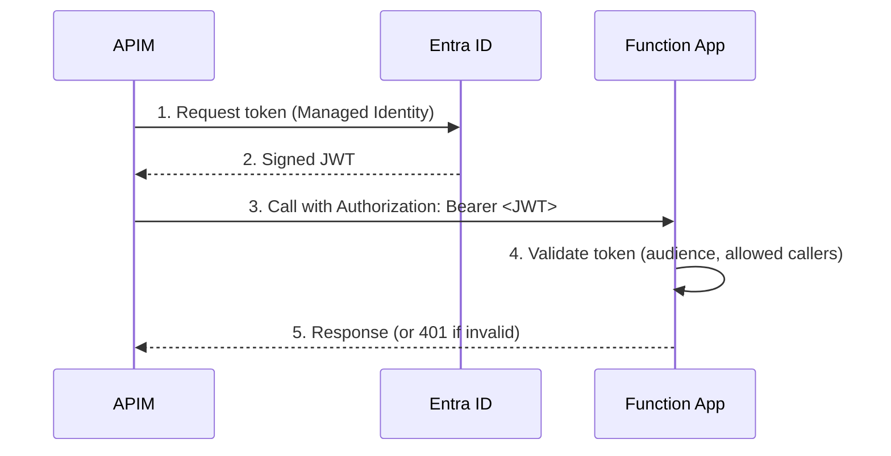

# Authenticating APIM to Function Apps with Managed Identity

This guide explains how to configure token-based authentication between **Azure
API Management (APIM)** and an **Azure Function App** using Managed Identity and
an Entra ID application, instead of relying on shared function keys.

## Why Managed Identity Instead of Function Keys?

By default, APIM authenticates to Function Apps by injecting an
`x-functions-key` header with a shared secret stored in Key Vault. While
functional, this approach has drawbacks:

| Aspect             | Key-based                        | Entra ID (Managed Identity)         |
| ------------------ | -------------------------------- | ----------------------------------- |
| Secrets            | Function key stored in Key Vault | None — token-based                  |
| Caller control     | Any holder of the key            | Only `allowed_callers_client_ids`   |
| Key rotation       | Manual rotation required         | No rotation needed                  |
| APIM policy        | `x-functions-key` header         | `<authentication-managed-identity>` |
| Function authLevel | `function`                       | `anonymous`                         |

Managed Identity authentication eliminates shared secrets entirely: APIM uses
its system-assigned identity to obtain a short-lived JWT from Entra ID, and the
Function App validates the token — no keys to store, rotate, or leak.

## How It Works



The Function App validates that:

- The JWT signature is valid (signed by the tenant's Entra ID)
- The `aud` (audience) claim matches the Entra ID application's `client_id`
- The caller's client ID is in the `allowed_callers_client_ids` allowlist

## Prerequisites

Before configuring the Terraform module, an **Entra ID application
registration** must exist to represent the Function App. This application acts
as the JWT audience.

:::warning

The Entra ID application **must be created manually**. Individual contributors
(ICs) do not have permissions to create Entra ID application registrations via
Terraform or manually from the Azure Portal.

To request the creation of an Entra ID application, open a ticket in the
**#team_devex_help** Slack channel.

:::

You will also need the **client ID of APIM's Managed Identity** (service
principal) to populate the `allowed_callers_client_ids` field. This is typically
managed by the platform team and can be retrieved with:

```bash
az ad sp list --display-name "<apim-name>" --query "[0].appId" -o tsv
```

## Implementation Steps

### Step 1: Retrieve Entra ID Data Sources

Once the Entra ID application has been created, reference it in Terraform using
data sources:

```hcl
data "azurerm_subscription" "current" {}

# The Entra ID application
data "azuread_application" "my_entra_id_app" {
  display_name = "<entra-app-display-name>"
}

# The APIM service principal (the allowed caller)
data "azuread_service_principal" "apim_service_principal" {
  display_name = "<apim-display-name>"
}
```

### Step 2: Configure the Function App Module

Pass the `entra_id_authentication` variable to the `azure_function_app` DX
module:

```hcl
module "function_app" {
  source  = "pagopa-dx/azure-function-app/azurerm"
  version = "~> 4.1"

  ...

  entra_id_authentication = {
    # The client ID of the Entra app representing this Function App
    audience_client_id = data.azuread_application.my_entra_id_app.client_id
    # The client IDs of callers allowed to authenticate (e.g. APIM)
    allowed_callers_client_ids = [data.azuread_service_principal.apim_service_principal.client_id]
    tenant_id = data.azurerm_subscription.current.tenant_id
  }

  tags = local.tags
}
```

When `entra_id_authentication` is set, the module configures `auth_settings_v2`
on the Function App to:

- Require a valid JWT on every request (`require_authentication = true`)
- Return HTTP 401 for unauthenticated calls
  (`unauthenticated_action = "Return401"`)
- Validate the token against the Entra ID v2.0 endpoint
- Restrict access to the specified caller client IDs

The module also exposes the `entra_id_authentication` output, which contains the
`audience_client_id` needed for the APIM policy:

```hcl
output "apim_audience" {
  value = module.function_app.entra_id_authentication.audience_client_id
}
```

### Step 3: Configure the APIM Policy

In the APIM inbound policy for the API backed by the Function App, replace any
`x-functions-key` header injection with the `authentication-managed-identity`
policy element:

```xml
<inbound>
  <base />
  <authentication-managed-identity resource="<audience_client_id>" />
</inbound>
```

Replace `<audience_client_id>` with the value from
`module.function_app.entra_id_authentication.audience_client_id` (or the
corresponding Terraform output).

:::info

The `authentication-managed-identity` policy uses the **system-assigned identity
of the APIM instance** to request the token. Make sure the APIM instance has a
system-assigned identity enabled.

:::

### Step 4: Update Function Code

Since authentication is now enforced at the infrastructure level, the Function
App itself no longer needs to validate keys. Update all function endpoints to
use `authLevel: anonymous`:

```typescript
import {
  app,
  HttpRequest,
  HttpResponseInit,
  InvocationContext,
} from "@azure/functions";

export async function myHandler(
  request: HttpRequest,
  context: InvocationContext,
): Promise<HttpResponseInit> {
  return { status: 200, body: "OK" };
}

app.http("myFunction", {
  methods: ["GET", "POST"],
  authLevel: "anonymous", // Auth is enforced by Entra ID at the infra level
  handler: myHandler,
});
```

## Migration Strategy

Migrating an existing Function App from key-based to Managed Identity
authentication requires changes at the infrastructure, application, and APIM
policy levels simultaneously. The recommended approach is a **blue-green
migration**: create a new Function App instance with authentication enabled,
test it independently, and then switch traffic.

### Blue-Green Migration Steps

```
Old instance (key-based)          New instance (Entra ID auth)
─────────────────────────         ──────────────────────────────────
Function App (existing)   ──┐     Function App (new, entra_id_auth)
APIM backend → old        ──┘     APIM backend → new (test policy)
```

**Step 1 — Request the Entra ID application**

Open a ticket in **#team_devex_help** to have the Entra ID application created
for the new instance.

**Step 2 — Create the new Function App instance**

Deploy a new `azure_function_app` module instance with `entra_id_authentication`
configured, alongside the existing one. Assign a distinct `app_name` or
`instance_number` to avoid naming conflicts:

```hcl
# Existing instance (keep untouched until migration is complete)
module "function_app_v1" {
  source  = "pagopa-dx/azure-function-app/azurerm"
  version = "~> 4.1"
  environment = merge(local.environment, { instance_number = "01" })
  # ... no entra_id_authentication
}

# New instance with Entra ID authentication
module "function_app_v2" {
  source  = "pagopa-dx/azure-function-app/azurerm"
  version = "~> 4.1"
  environment = merge(local.environment, { instance_number = "02" })

  entra_id_authentication = {
    audience_client_id         = data.azuread_application.my_function_app.client_id
    allowed_callers_client_ids = [data.azuread_service_principal.apim.client_id]
    tenant_id                  = data.azurerm_subscription.current.tenant_id
  }
  # ...
}
```

**Step 3 — Update the application code**

In the new Function App, change all function endpoints to `authLevel: anonymous`
(as shown in [Step 4](#step-4-update-function-code) above), and deploy it to the
new instance.

**Step 4 — Add a test APIM backend**

Create a secondary APIM backend pointing to the new Function App and add a test
API revision or a separate operation to validate the Managed Identity flow
end-to-end without affecting production traffic.

**Step 5 — Switch production traffic**

Once the new instance is verified:

1. Update the primary APIM backend URL to point to the new Function App.
2. Replace the APIM inbound policy (remove `x-functions-key`, add
   `authentication-managed-identity`).
3. Apply the Terraform changes and the APIM policy update atomically.

**Step 6 — Decommission the old instance**

After traffic has been fully switched and monitored for a burn-in period, remove
the old `function_app_v1` module and clean up any Key Vault secrets that were
used for key-based auth.

:::info

Keep the old instance running until you are confident the new one is stable. The
two instances can coexist because they have different names and separate private
endpoints.

:::

## References

- [DX `azure-function-app` module on Terraform Registry](https://registry.terraform.io/modules/pagopa-dx/azure-function-app/azurerm/latest)
- [Azure APIM `authentication-managed-identity` policy](https://learn.microsoft.com/en-us/azure/api-management/authentication-managed-identity-policy)
- [Azure Functions `authLevel` documentation](https://learn.microsoft.com/en-us/azure/azure-functions/functions-bindings-http-webhook-trigger?tabs=python-v2#http-auth)
- [Microsoft Entra ID application registrations](https://learn.microsoft.com/en-us/entra/identity-platform/quickstart-register-app)
