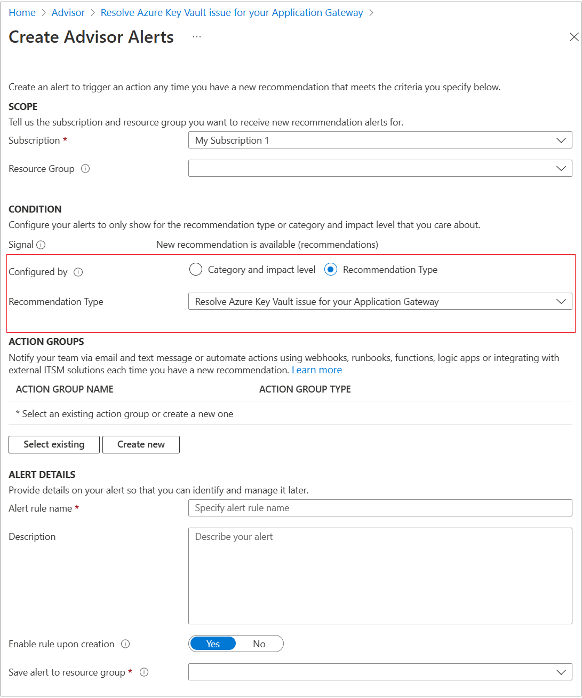

# Adding a TLS certificate to Azure Application Gateway

## Overview

When you expose a new hostname through Azure Application Gateway (App Gateway),
you must attach a valid TLS certificate. This guide walks you through adding a
certificate stored in Azure Key Vault and wiring it to App Gateway, plus how to
enable alerting if renewals fail.

## How-To

### Creating a new TLS Certificate

If you still need the certificate and its automatic renewal pipeline, see
[Creating a new TLS Certificate](creating-tls-cert.md).

## Creating or Configuring the KeyVault

If you already have a Key Vault, skip to the next section. Otherwise, create a
new
[KeyVault](https://registry.terraform.io/providers/hashicorp/azurerm/latest/docs/resources/key_vault)
with the following characteristics:

```hcl
resource "azurerm_key_vault" "this" {
  ...

  enable_rbac_authorization     = true
  enabled_for_disk_encryption   = true
  soft_delete_retention_days    = 30
  purge_protection_enabled      = true
  # TODO: when pipeliens will be moved to GitHub, set this to false. Ref: creating-tls-cert.md##how-to-create-a-new-tls-certificate
  public_network_access_enabled = true

  network_acls {
    bypass         = "AzureServices"
    default_action = "Allow" #tfsec:ignore:AZU020
  }
}

# private endpoint
resource "azurerm_private_endpoint" "this" {
  ...

  private_service_connection {
    ...
    private_connection_resource_id = azurerm_key_vault.this.id
    is_manual_connection           = false
    subresource_names              = ["vault"]
  }

  private_dns_zone_group {
    name                 = "private-dns-zone-group"
    private_dns_zone_ids = [var.private_dns_zone_id]
  }
}

```

### Setting up IAM roles

App Gateway must be able to read the certificate from Key Vault. Ensure the
User‑assigned managed identity attached to your App Gateway has the
`Key Vault Secrets User` role on the Key Vault scope. You can assign it via
Terraform, for example:

```hcl
module "iam_tlscert_kv_admins" {
  source  = "pagopa-dx/azure-role-assignments/azurerm"
  version = "~> 1.2"

  subscription_id = var.subscription_id
  principal_id    = # the principal ID of the User-assigned managed identity associated within the Application Gateway

  key_vault = [{
    name                = azurerm_key_vault.tlscert_itn_01.name
    resource_group_name = azurerm_key_vault.tlscert_itn_01.resource_group_name
    has_rbac_support    = # true or false depending on the chosen KeyVault access model
    description         = "Allows Application Gateway to read certificates from the KeyVault"
    roles = {
      secrets      = "reader"
    }
  }]
}
```

If your KeyVault uses RBAC and the certificate already exists, add it to App
Gateway with Az PowerShell:

:::note

If you don't have PowerShell installed, you can use the Azure Cloud Shell
through the Azure Portal

:::

```powershell

Connect-AzAccount -SubscriptionName "<subscription-name>"

# Get the Application Gateway we want to modify
$appgw = Get-AzApplicationGateway -Name "<appgw-name>" -ResourceGroupName "<appgwp-rg>"

# For each certificate
$secret = Get-AzKeyVaultSecret -VaultName "<kv-name>" -Name "<certificate-name>"

# Build a versionless secret ID so App Gateway will always use the latest version
$secretUri = $secret.Id -replace ":443", ""
$secretId  = $secretUri.Substring(0, $secretUri.LastIndexOf('/'))

# To verify the secret version is correct, its value should be like:
echo $secretId
# https://<kv-name>.vault.azure.net/secrets/<certificate-name>

# Specify the secret ID from Key Vault
Add-AzApplicationGatewaySslCertificate -KeyVaultSecretId $secretId -ApplicationGateway $appgw -Name $secret.Name

# You can remove an existing certificate with:
# Remove-AzApplicationGatewaySslCertificate -Name "<cert-name>" -ApplicationGateway $appgw

# Commit the pending changes to the Application Gateway
Set-AzApplicationGateway -ApplicationGateway $appgw

```

To validate the operation, associate the certificate to an HTTPS listener, and
verify via the Azure Portal that certificate information such as expiration
date, are available on the `Listener TLS certificates` pane.

## Setting up Alerting for Certificate Rotation Failures

Application Gateway logs any error and is integrated with Azure Advisor to
surface any misconfiguration with a recommendation for its fix. To turning on
alerts:

- Open `Advisor` in the Azure portal
- Select `Alerts` from the left menu.
- In `Configured By`, select `Recommendation Type`
- Select "Resolve Azure Key Vault issue for your Application Gateway" in the
  recommendation type
- Select your action group or create a new one


