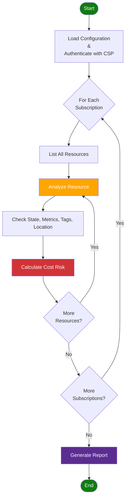

The SaveMoney tool helps identify underutilized and unused cloud resources that
may be costing your organization money. It performs read-only analysis across
your cloud infrastructure, generating actionable reports to support FinOps
decisions without modifying any resources.

## Overview

SaveMoney scans your cloud subscriptions using provider APIs and metrics to
scientifically detect:

- **Inactive Resources** - VMs, storage, and services with minimal usage
- **Orphaned Resources** - Unattached disks, unused IPs, and dangling network
  interfaces
- **Oversized Resources** - Services running on unnecessarily expensive tiers
- **Misconfigured Resources** - Resources in wrong regions or missing management
  tags

All analysis is performed in **read-only mode** - the tool never modifies, tags,
or deletes resources.

## Supported Cloud Providers

### ✅ Azure

Full support for Azure resource analysis with intelligent detection algorithms
based on Azure Monitor metrics and resource states.

## Quick Start

```bash
# Interactive mode (prompts for configuration)
npx @pagopa/dx-cli savemoney

# Using configuration file
npx @pagopa/dx-cli savemoney --config config.json

# With verbose output and JSON format
npx @pagopa/dx-cli savemoney --config config.json --format json --verbose
```

## Analysis Flow

The tool follows a systematic approach to analyze resources:

<details>
<summary>See the Diagram</summary>



</details>

## Configuration

### Authentication

The tool supports multiple authentication methods:

- **Azure CLI** - `az login` (recommended for local development)
- **Managed Identity** - Automatic in Azure environments

### Configuration Options

You can provide configuration through a JSON file (using `--config`),
command-line options, or environment variables. All options can be mixed and
matched.

| Option / Parameter  | CLI Flag           | Alias | Type       | Required | Default      | Description                                        |
| :------------------ | :----------------- | :---- | :--------- | :------: | :----------- | :------------------------------------------------- |
| `tenantId`          | N/A                | N/A   | `string`   |    ✅    | N/A          | Azure Active Directory Tenant ID                   |
| `subscriptionIds`   | N/A                | N/A   | `string[]` |    ✅    | N/A          | Array of Azure subscription IDs to scan            |
| `preferredLocation` | `--location <loc>` | `-l`  | `string`   |    ❌    | `italynorth` | Preferred Azure region (flags misplaced resources) |
| `timespanDays`      | `--days <number>`  | `-d`  | `number`   |    ❌    | `30`         | Days to look back for metrics analysis             |
| N/A                 | `--config <path>`  | `-c`  | `string`   |    ❌    | N/A          | Path to JSON configuration file                    |
| N/A                 | `--format <fmt>`   | `-f`  | `string`   |    ❌    | `table`      | Output format: `table`, `json`, `detailed-json`    |
| N/A                 | `--verbose`        | `-v`  | `boolean`  |    ❌    | `false`      | Enable detailed logging per resource (CLI only)    |

### Configuration File Example

Create a `config.json` file:

```json
{
  "tenantId": "xxxxxxxx-xxxx-xxxx-xxxx-xxxxxxxxxxxx",
  "subscriptionIds": [
    "xxxxxxxx-xxxx-xxxx-xxxx-xxxxxxxxxxxx",
    "yyyyyyyy-yyyy-yyyy-yyyy-yyyyyyyyyyyy"
  ],
  "preferredLocation": "italynorth",
  "timespanDays": 30
}
```

Then use it with:

```bash
npx @pagopa/dx-cli savemoney --config config.json
```

### Environment Variables

Alternatively, use environment variables:

```bash
export ARM_TENANT_ID="xxxxxxxx-xxxx-xxxx-xxxx-xxxxxxxxxxxx"
export ARM_SUBSCRIPTION_ID="sub-1,sub-2,sub-3"
```

:::tip

If `tenantID` and `subscriptionID` are not provided via filem and `--config`
option are not configured, the tool will ask them interactively.

:::

## Analyzed Azure Resources

The tool analyzes the following Azure resource types for potential cost
optimization:

| Resource Type       | Risk | What It Detects                                    | Key Detection Criteria                                                                   |
| :------------------ | :--: | :------------------------------------------------- | :--------------------------------------------------------------------------------------- |
| Virtual Machines    |  🔴  | VMs that are deallocated or severely underutilized | • Deallocated/stopped state<br/>• CPU < 1%<br/>• Network traffic < 10 MB                 |
| App Service Plans   |  🔴  | Empty or underutilized plans (especially Premium)  | • No apps deployed<br/>• CPU < 5%<br/>• Memory < 10%<br/>• Premium tier with no workload |
| Managed Disks       |  🟡  | Unattached disks incurring storage costs           | • Disk state is "Unattached"<br/>• No `managedBy` property                               |
| Public IP Addresses |  🟡  | Unused static IPs that continue billing            | • Not associated with any resource<br/>• Static allocation<br/>• Network traffic < 1 MB  |
| Network Interfaces  |  🟡  | NICs not attached to VMs or Private Endpoints      | • Not attached to VM<br/>• Not associated with Private Endpoint<br/>• No public IP       |
| Private Endpoints   |  🟡  | Misconfigured or unused Private Endpoints          | • No private link connections<br/>• All connections rejected/disconnected<br/>• No NICs  |
| Storage Accounts    |  🟡  | Storage accounts with minimal activity             | • Transaction count < 100 over timespan                                                  |

**Risk Levels:** 🔴 High · 🟡 Medium · 🟢 Low

All resources are additionally evaluated for:

- **Missing Tags** - Resources without tags may be unmanaged or orphaned
- **Location Mismatch** - Resources outside preferred region may have compliance
  or cost implications

## Output Formats

### JSON Format

Structured JSON array output for integration with other tools:

```bash
npx @pagopa/dx-cli savemoney --config config.json --format json
```

**Example Output:**

```json
[
  {
    "costRisk": "medium",
    "location": "westeurope",
    "name": "ex12345",
    "reason": "Very low transaction count (0). Resource not in preferred location (italynorth).",
    "resourceGroup": "dx-d-weu-test-rg-01",
    "subscriptionId": "xxxxxxxx-xxxx-xxxx-xxxx-xxxxxxxxxxxx",
    "suspectedUnused": true,
    "type": "Microsoft.Storage/storageAccounts"
  },
  {
    "costRisk": "medium",
    "location": "italynorth",
    "name": "dx-d-itn-example-kv-pep-02",
    "reason": "No tags found.",
    "resourceGroup": "dx-d-itn-example-rg-01",
    "subscriptionId": "xxxxxxxx-xxxx-xxxx-xxxx-xxxxxxxxxxxx",
    "suspectedUnused": true,
    "type": "Microsoft.Network/privateEndpoints"
  }
]
```

### Table Format - **Default**

Human-readable console table output ideal for quick inspection:

```bash
npx @pagopa/dx-cli savemoney --config config.json --format table
```

### Detailed JSON Format

Complete output including full Azure resource metadata for AI analysis:

```bash
npx @pagopa/dx-cli savemoney --config config.json --format detailed-json
```

## Usage Examples

### Basic Analysis

```bash
# Interactive mode - prompts for configuration
npx @pagopa/dx-cli savemoney

# Using config file
npx @pagopa/dx-cli savemoney --config azure-config.json

# Using CLI options only
npx @pagopa/dx-cli savemoney --location westeurope --days 60 --verbose
```

### Custom Timespan

```bash
# Analyze last 60 days instead of default 30
npx @pagopa/dx-cli savemoney --config config.json --days 60
```

### Verbose Mode for Debugging

```bash
# See detailed analysis for each resource
npx @pagopa/dx-cli savemoney --config config.json --verbose
```

## ✅ Best Practices

- **Run Regularly** - Schedule weekly or monthly analysis to catch cost drift
  early
- **Start with Table Format** - Use for quick visual inspection before deeper
  analysis
- **Review Before Action** - Always validate findings before deleting resources
- **Use Verbose Mode** - When investigating unexpected results or debugging
- **Check Metrics Timespan** - Longer timespans (60-90 days) provide more
  accurate usage patterns
- **Combine with Tags** - Tag resources properly to avoid false positives
- **Document Decisions** - Keep records of why resources are kept or removed

## ⚠️ Limitations

- **Read-Only Analysis** - Does not modify, tag, or delete resources
- **Metrics Availability** - Some resources may have limited historical metrics
- **Cost Estimates** - Does not calculate actual cost savings (focuses on risk
  level)
- **Context Required** - Some flagged resources may be intentionally idle (e.g.,
  test environments)

## Troubleshooting

### Authentication Errors

```bash
# Ensure Azure CLI is logged in
az login

# Verify subscription access
az account list --output table

# Check your current subscription
az account show
```

### No Resources Found

- Verify subscription IDs in configuration
- Check Azure RBAC permissions (Reader role minimum required)
- Ensure resources exist in the subscriptions

### Metrics Not Available

Some resources may not have historical metrics if:

- The resource was recently created
- Metrics collection is disabled
- Insufficient permissions to access Monitor data

### False Positives

Resources flagged as unused may be:

- Intentionally idle (disaster recovery, staging)
- Scheduled workloads (batch processing)
- Development/testing environments

**Solution:** Use tags to mark resources as "keep" or document special cases.
