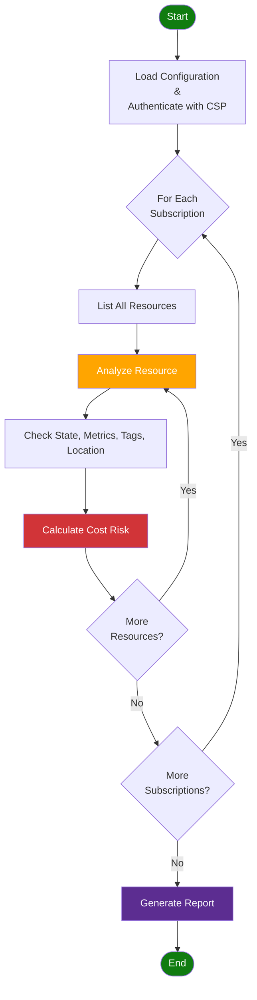

The `@pagopa/dx-cli` is a command-line tool that helps teams implement PagoPA
DevEx guidelines consistently and evolve repositories safely.

## Installation

You can invoke the CLI directly via `npx` without installing globally:

```bash
npx @pagopa/dx-cli --help
```

When installed locally in a monorepo you can also run:

```bash
pnpm dx --help
```

> The binary name is `dx`.

---

## Usage

### `doctor` – Repository Validation

Validate your repository against DevEx guidelines. Typical checks include:

- Presence and correctness of pre-commit configuration.
- `turbo.json` configuration sanity.
- Required monorepo scripts in `package.json`.
- Workspace declaration and structure.

Run the command:

```bash
npx @pagopa/dx-cli doctor
```

Exit code: `0` if all checks pass, `1` if one or more checks fail.

Example output:

```text
✔ pre-commit configuration ok
✔ turbo configuration ok
✖ monorepo scripts missing: build, test
```

### `codemod` – Repository Migrations

Codemods are scripted migrations that modify repository files to align with
evolving platform standards. They aim to be safe, incremental, and repeatable.

#### List Available Codemods

```bash
npx @pagopa/dx-cli codemod list
```

You will get a brief list of migration identifiers. Use one of them with
`codemod apply`.

##### Current Codemods

| identifier           | description                                                                                                                            |
| -------------------- | -------------------------------------------------------------------------------------------------------------------------------------- |
| `use-pnpm`           | Migrate the project to use pnpm (lockfile import, workspace rewriting, workflow updates).                                              |
| `use-azure-appsvc`   | Migrate `web_app_deploy` and `function_app_deploy` to [`release-azure-appsvc`](./azure/application-deployment/release-azure-appsvc.md) |
| `update-code-review` | Update [`js_code_review`](./typescript/code-review.md) workflow reference to latest commit with required permissions.                  |

#### Apply a Codemod

```bash
npx @pagopa/dx-cli codemod apply <id>
```

Arguments:

- `<id>`: The codemod identifier from the list output.

:::warning[Safety & Best Practices]

- Always run codemods on a clean working tree (commit or stash your changes
  first).
- Review the diff after applying a codemod (`git diff`).
- Run `pnpm install` (if package manager changed) and project validation scripts
  afterward.

:::

### `savemoney` – Cost Optimization

The SaveMoney tool helps identify underutilized and unused cloud resources that
may be costing your organization money.

Scans your cloud subscriptions using provider APIs and metrics to scientifically
detect:

- **Inactive Resources** - VMs, storage, and services with minimal usage
- **Orphaned Resources** - Unattached disks, unused IPs, and dangling network
  interfaces
- **Oversized Resources** - Services running on unnecessarily expensive tiers
- **Misconfigured Resources** - Resources in wrong regions or missing management
  tags

All analysis is performed in **read-only mode** - the tool never modifies, tags,
or deletes resources.

#### Supported Cloud Providers

- ✅ Azure: Full support for Azure resource analysis with intelligent detection
  algorithms based on Azure Monitor metrics and resource states.

#### Quick Start

```bash
# Interactive mode (prompts for configuration)
npx @pagopa/dx-cli savemoney

# Using configuration file
npx @pagopa/dx-cli savemoney --config config.json

# With verbose output and JSON format
npx @pagopa/dx-cli savemoney --config config.json --format json --verbose
```

#### Analysis Flow

The tool follows a systematic approach to analyze resources:

<details>
<summary>See the Diagram</summary>



</details>

#### Configuration

##### Authentication

The tool supports multiple authentication methods:

- **Azure CLI** - `az login` (recommended for local development)
- **Managed Identity** - Automatic in Azure environments

##### Configuration Options

| Parameter           | Type       | Req. | CLI Flag               | Description                                                |
| :------------------ | :--------- | :--: | :--------------------- | :--------------------------------------------------------- |
| `tenantId`          | `string`   | Yes  | -                      | Azure Tenant ID                                            |
| `subscriptionIds`   | `string[]` | Yes  | -                      | Azure subscription IDs to scan                             |
| `preferredLocation` | `string`   |  No  | `--location`,<br/>`-l` | Preferred Azure region<br/>(default: `italynorth`)         |
| `timespanDays`      | `number`   |  No  | `--days`,<br/>`-d`     | Days to look back for metrics analysis<br/>(default: `30`) |

**CLI-only options:**

- `--config`, `-c` - Path to config file
- `--format`, `-f` - Output format, possible values: `table` (_default_),
  `json`, `detailed-json`
- `--verbose`, `-v` - Enable detailed logging

##### Configuration Example

Create a `config.json` file:

```json
{
  "tenantId": "xxxxxxxx-xxxx-xxxx-xxxx-xxxxxxxxxxxx",
  "subscriptionIds": [
    "xxxxxxxx-xxxx-xxxx-xxxx-xxxxxxxxxxxx",
    "yyyyyyyy-yyyy-yyyy-yyyy-yyyyyyyyyyyy"
  ],
  "preferredLocation": "italynorth",
  "timespanDays": 30
}
```

Alternatively, use environment variables:

```bash
export ARM_TENANT_ID="xxxxxxxx-xxxx-xxxx-xxxx-xxxxxxxxxxxx"
export ARM_SUBSCRIPTION_ID="sub-1,sub-2,sub-3"
```

:::tip

If required parameters are not provided via config file, environments or CLI,
the tool will prompt for them interactively.

:::

#### Analyzed Azure Resources

The tool analyzes the following Azure resource types for potential cost
optimization:

| Resource Type       | Risk | What It Detects                                    |
| :------------------ | :--: | :------------------------------------------------- |
| Virtual Machines    |  🔴  | VMs that are deallocated or severely underutilized |
| App Service Plans   |  🔴  | Empty or underutilized plans (especially Premium)  |
| Managed Disks       |  🟡  | Unattached disks incurring storage costs           |
| Public IP Addresses |  🟡  | Unused static IPs that continue billing            |
| Network Interfaces  |  🟡  | NICs not attached to VMs or Private Endpoints      |
| Private Endpoints   |  🟡  | Misconfigured or unused Private Endpoints          |
| Storage Accounts    |  🟡  | Storage accounts with minimal activity             |

**Risk Levels:** 🔴 High · 🟡 Medium · 🟢 Low

All resources are additionally evaluated for:

- **Missing Tags** - Resources without tags may be unmanaged or orphaned
- **Location Mismatch** - Resources outside preferred region may have compliance
  or cost implications

#### Output Formats

Available formats:

- **`table`** (default) - Human-readable console table for quick inspection
- **`json`** - Structured JSON array for integration with other tools
- **`detailed-json`** - Complete output with full Azure resource metadata for AI
  analysis

<details>
<summary>Example JSON Output</summary>

```json
[
  {
    "costRisk": "medium",
    "location": "westeurope",
    "name": "ex12345",
    "reason": "Very low transaction count (0). Resource not in preferred location (italynorth).",
    "resourceGroup": "dx-d-weu-test-rg-01",
    "subscriptionId": "xxxxxxxx-xxxx-xxxx-xxxx-xxxxxxxxxxxx",
    "suspectedUnused": true,
    "type": "Microsoft.Storage/storageAccounts"
  }
]
```

</details>

#### Usage Examples

```bash
# Interactive mode
npx @pagopa/dx-cli savemoney

# With config file
npx @pagopa/dx-cli savemoney --config config.json

# Custom timespan and format
npx @pagopa/dx-cli savemoney --config config.json --days 60 --format json

# Verbose output for debugging
npx @pagopa/dx-cli savemoney --config config.json --verbose
```

#### ✅ Best Practices

- **Run Regularly** - Schedule weekly or monthly analysis to catch cost drift
  early
- **Start with Table Format** - Use for quick visual inspection before deeper
  analysis
- **Review Before Action** - Always validate findings before deleting resources
- **Use Verbose Mode** - When investigating unexpected results or debugging
- **Check Metrics Timespan** - Longer timespans (60-90 days) provide more
  accurate usage patterns
- **Combine with Tags** - Tag resources properly to avoid false positives
- **Document Decisions** - Keep records of why resources are kept or removed

#### ⚠️ Limitations

- **Read-Only Analysis** - Does not modify, tag, or delete resources
- **Metrics Availability** - Some resources may have limited historical metrics
- **Cost Estimates** - Does not calculate actual cost savings (focuses on risk
  level)
- **Context Required** - Some flagged resources may be intentionally idle (e.g.,
  test environments)

<details>
<summary><strong>Troubleshooting</strong></summary>

- **Authentication Errors**

  ```bash
  az login                        # Ensure Azure CLI is logged in
  az account list --output table  # Verify subscription access
  ```

- **No Resources Found**
  - Verify subscription IDs in configuration
  - Check Azure RBAC permissions (Reader role minimum required)
  - Ensure resources exist in the subscriptions
- **Metrics Not Available** Some resources may not have historical metrics if
  recently created, metrics collection is disabled, or insufficient permissions.
- **False Positives** Resources flagged as unused may be intentionally idle (DR,
  staging) or scheduled workloads. Use tags to mark resources as "keep".

</details>

---

## Feedback

Found an issue or need a new codemod? Open an issue in the
[pagopa/dx](https://github.com/pagopa/dx) repository describing the use case.
