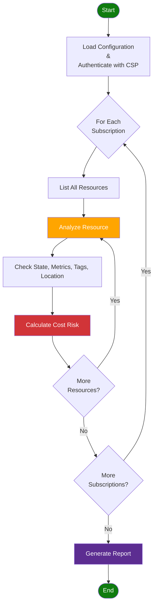

The `@pagopa/dx-cli` is a command-line tool that helps teams implement PagoPA
DevEx guidelines consistently and evolve repositories safely.

## Requirements {#requirements}

The following tools must be installed on your machine:

| Tool                                                                                                        | Version                                       |
| ----------------------------------------------------------------------------------------------------------- | --------------------------------------------- |
| [Node.js](https://nodejs.org/)                                                                              | **>= 22.0.0**                                 |
| [Terraform](https://developer.hashicorp.com/terraform/install) or [tfenv](https://github.com/tfutils/tfenv) | latest                                        |
| [GitHub CLI](https://cli.github.com/)                                                                       | latest                                        |
| [Azure CLI](https://learn.microsoft.com/en-us/cli/azure/install-azure-cli)                                  | latest (required for Azure environments only) |

Before running any command that interacts with GitHub or a cloud provider,
ensure you are logged in:

```bash
gh auth login
```

```bash
az login
```

:::warning[Azure session expiry]

Within PagoPA, `az login` sessions expire every **12 hours**. If a command fails
with an authentication error, run `az login` again before retrying.

:::

## Installation

You can invoke the CLI directly via `npx` without installing globally:

```bash
npx @pagopa/dx-cli --help
```

When installed locally in a monorepo you can also run:

```bash
pnpm dx --help
```

> The binary name is `dx`.

---

## Usage

### `init` – Initialize Resources

Bootstrap a new project following DevEx conventions.

**Always provisions**:

- The monorepository, both locally and remotely on GitHub.com, with dotfiles and
  a devcontainer configuration.

#### Prompt Reference

The `init` command is interactive. The tables below explain what each prompt
expects and where to find the required values.

| Prompt                  | What to enter                                                                                 |
| ----------------------- | --------------------------------------------------------------------------------------------- |
| **Name**                | The GitHub repository name. Use lowercase letters and hyphens (e.g., `eng-myteam-myproject`). |
| **GitHub Organization** | The GitHub organization that will own the repository. Defaults to `pagopa`.                   |
| **Description**         | A short description of the project (optional).                                                |

#### Example Usage

```text
npx @pagopa/dx-cli init

✔ Terraform is installed!
✔ You are logged in to Azure (andrea.grillo@pagopa.it)

? Name test-project
? GitHub Organization pagopa-dx
? Description a custom description
✔ Workspace files created successfully!

✔ GitHub repository created successfully!
✔ Code pushed to GitHub successfully!
✔ Pull Request created successfully!

Workspace created successfully!
- Name: test-project
- GitHub Repository: https://github.com/pagopa-dx/test-project

Next Steps:
1. Review the Pull Request in the GitHub repository: https://github.com/pagopa-dx/test-project/pull/1
2. Visit https://dx.pagopa.it/getting-started to deploy your first project
```

After the command completes, you will have a new GitHub repository with an open
Pull Request to merge the initial project structure.

### `add` - Scaffold New Components

Scaffold new components in your project following DevEx guidelines.

#### Currently Supported Components

| Component Type | Description                                |
| -------------- | ------------------------------------------ |
| `environment`  | Add a new cloud environment to the project |

#### `environement`

Add a new cloud environment following DevEx conventions.

**Always provisions**:

- GitHub environments corresponding to the specified cloud environments
- A self-hosted GitHub Runner with permissions to perform cloud operations, in
  order to run workflows (GitHub Actions) that require cloud access

**Additionally provisions (if no Terraform state file is detected for the
project):**

- A VPN to let users access private cloud resources
- Standardized network configuration
- Standardized monitoring configuration
- Infrastructure required to manage the Terraform state file (e.g., Azure
  Storage Account with blob locking)

This interactive command will prompt you for several inputs and then generate
the project structure accordingly.

:::info[Supported Cloud Providers]

Currently, only Azure is supported as cloud provider for the `add environment`
command.

:::

##### Prompt Reference

The `add environment` command is interactive. The tables below explain what each
prompt expects and where to find the required values.

| Prompt                               | What to enter                                                                                                                                          |
| ------------------------------------ | ------------------------------------------------------------------------------------------------------------------------------------------------------ |
| **Environment name**                 | Select `PROD`, `UAT`, or `DEV`.                                                                                                                        |
| **Cloud provider(s)**                | Select `Microsoft Azure` (currently the only supported provider).                                                                                      |
| **Account(s)**                       | Select one or more Azure subscriptions belonging to your product. Contact your Engineering Leader if you are unsure which subscriptions to pick.       |
| **Prefix**                           | A short identifier (2–4 characters) used in Azure resource names. It should match the prefix already in use for your product (e.g., `dx`, `io`, `pn`). |
| **Domain**                           | An optional sub-grouping for the project (e.g., `payments`). Leave empty if not needed.                                                                |
| **Cost center**                      | Select the cost center for your team.                                                                                                                  |
| **Business unit**                    | The business unit or team that owns this project (free text).                                                                                          |
| **Management team**                  | The team responsible for managing the environment (free text, e.g., `devex`).                                                                          |
| **Default location for \<account\>** | The primary Azure region for the selected account (e.g., `Italy North`). Asked once per selected account.                                              |

**Initialization** _(conditional — only asked when the environment is new)_

| Prompt                                             | What to enter                                                                                                        |
| -------------------------------------------------- | -------------------------------------------------------------------------------------------------------------------- |
| **Initialize it now?**                             | Confirm `Yes` to provision the baseline cloud infrastructure (VPN, network, monitoring, Terraform backend).          |
| **Cloud Account for the remote Terraform backend** | Shown only when multiple accounts are selected. Pick the account that will host the Terraform state Storage Account. |
| **GitHub Runner App ID**                           | The `App ID` retrieved in the [Prepare the GitHub App](../monorepository-setup.mdx#setting-up-a-github-app) section. |
| **GitHub Runner App Installation ID**              | The `Installation ID` retrieved in the same section.                                                                 |
| **GitHub Runner App Private Key**                  | An editor will open — paste the full content of the `.pem` private key file, then save and close the editor.         |

##### Example Usage

```text
npx @pagopa/dx-cli add environment

✔ Terraform is installed!
✔ You are logged in to Azure (andrea.grillo@pagopa.it)

? Environment name PROD
? Cloud provider(s) Microsoft Azure
? Account(s) (Press <space> to select, <a> to toggle all, <i> to invert selection, and <enter> to proceed)
 ◯ DEV-ENGINEERING
 ◯ DEV-IO
❯◯ DEV-DEVEX
 ◯ UAT-DEVEX
(Move up and down to reveal more choices)

[...]

✔ Environment created successfully!
```

After the command completes, you will have a new GitHub repository with an open
Pull Request to merge the initial project structure.

### `doctor` – Repository Validation

Validate your repository against DevEx guidelines. Typical checks include:

- Presence and correctness of pre-commit configuration.
- `turbo.json` configuration sanity.
- Required monorepo scripts in `package.json`.
- Workspace declaration and structure.

Run the command:

```bash
npx @pagopa/dx-cli doctor
```

Exit code: `0` if all checks pass, `1` if one or more checks fail.

Example output:

```text
✔ pre-commit configuration ok
✔ turbo configuration ok
✖ monorepo scripts missing: build, test
```

### `codemod` – Repository Migrations

Codemods are scripted migrations that modify repository files to align with
evolving platform standards. They aim to be safe, incremental, and repeatable.

#### List Available Codemods

```bash
npx @pagopa/dx-cli codemod list
```

You will get a brief list of migration identifiers. Use one of them with
`codemod apply`.

##### Current Codemods

| identifier           | description                                                                                                                             |
| -------------------- | --------------------------------------------------------------------------------------------------------------------------------------- |
| `use-pnpm`           | Migrate the project to use pnpm (lockfile import, workspace rewriting, workflow updates).                                               |
| `use-azure-appsvc`   | Migrate `web_app_deploy` and `function_app_deploy` to [`release-azure-appsvc`](../azure/application-deployment/release-azure-appsvc.md) |
| `update-code-review` | Update [`js_code_review`](../typescript/code-review.md) workflow reference to latest commit with required permissions.                  |

#### Apply a Codemod

```bash
npx @pagopa/dx-cli codemod apply <id>
```

Arguments:

- `<id>`: The codemod identifier from the list output.

:::warning[Safety & Best Practices]

- Always run codemods on a clean working tree (commit or stash your changes
  first).
- Review the diff after applying a codemod (`git diff`).
- Run `pnpm install` (if package manager changed) and project validation scripts
  afterward.

:::

### `savemoney` – Cost Optimization

The SaveMoney tool helps identify underutilized and unused cloud resources that
may be costing your organization money.

Scans your cloud subscriptions using provider APIs and metrics to scientifically
detect:

- **Inactive Resources** - VMs, storage, and services with minimal usage
- **Orphaned Resources** - Unattached disks, unused IPs, and dangling network
  interfaces
- **Oversized Resources** - Services running on unnecessarily expensive tiers
- **Misconfigured Resources** - Resources in wrong regions or missing management
  tags

All analysis is performed in **read-only mode** - the tool never modifies, tags,
or deletes resources.

#### Supported Cloud Providers

- ✅ Azure: Full support for Azure resource analysis with intelligent detection
  algorithms based on Azure Monitor metrics and resource states.

#### Quick Start

```bash
# Interactive mode (prompts for configuration)
npx @pagopa/dx-cli savemoney

# Using configuration file
npx @pagopa/dx-cli savemoney --config config.yaml

# With verbose output and JSON format
npx @pagopa/dx-cli savemoney --config config.yaml --format json --verbose
```

#### Analysis Flow

The tool follows a systematic approach to analyze resources:

<details>
<summary>See the Diagram</summary>



</details>

#### Configuration

##### Authentication

The tool supports multiple authentication methods:

- **Azure CLI** - `az login` (recommended for local development)
- **Managed Identity** - Automatic in Azure environments

##### Configuration Options

| Parameter           | Type       | Req. | CLI Flag               | Description                                                |
| :------------------ | :--------- | :--: | :--------------------- | :--------------------------------------------------------- |
| `subscriptionIds`   | `string[]` | Yes  | -                      | Azure subscription IDs to scan                             |
| `preferredLocation` | `string`   |  No  | `--location`,<br/>`-l` | Preferred Azure region<br/>(default: `italynorth`)         |
| `timespanDays`      | `number`   |  No  | `--days`,<br/>`-d`     | Days to look back for metrics analysis<br/>(default: `30`) |

**CLI-only options:**

- `--config`, `-c` - Path to YAML config file
- `--format`, `-f` - Output format, possible values: `table` (_default_),
  `json`, `detailed-json`, `lint`
- `--tags`, `-t` - Filter resources by Azure tags (e.g. `env=prod team=dx`)
- `--verbose`, `-v` - Enable detailed logging

##### Configuration Example

Create a `config.yaml` file:

```yaml
azure:
  subscriptionIds:
    - xxxxxxxx-xxxx-xxxx-xxxx-xxxxxxxxxxxx
    - yyyyyyyy-yyyy-yyyy-yyyy-yyyyyyyyyyyy
  preferredLocation: italynorth
  timespanDays: 30
  thresholds: # optional — omit to use built-in defaults
    vm:
      cpuPercent: 5
    storage:
      transactionsPerDay: 50
```

Alternatively, use the environment variable:

```bash
export ARM_SUBSCRIPTION_ID="sub-1,sub-2,sub-3"
```

:::tip

If `subscriptionIds` is not provided via config file or environment variable,
the tool will prompt for it interactively. Authentication is handled
automatically by `DefaultAzureCredential` (e.g. via `az login` or managed
identity).

:::

#### Analyzed Azure Resources

The tool analyzes the following Azure resource types for potential cost
optimization:

| Resource Type       | Risk | What It Detects                                    |
| :------------------ | :--: | :------------------------------------------------- |
| Virtual Machines    |  🔴  | VMs that are deallocated or severely underutilized |
| App Service Plans   |  🔴  | Empty or underutilized plans (especially Premium)  |
| Managed Disks       |  🟡  | Unattached disks incurring storage costs           |
| Public IP Addresses |  🟡  | Unused static IPs that continue billing            |
| Network Interfaces  |  🟡  | NICs not attached to VMs or Private Endpoints      |
| Private Endpoints   |  🟡  | Misconfigured or unused Private Endpoints          |
| Storage Accounts    |  🟡  | Storage accounts with minimal activity             |
| Container Apps      |  🟡  | Not running, zero replicas, low resource usage     |
| Static Web Apps     |  🟢  | No traffic or very low usage patterns              |

**Risk Levels:** 🔴 High · 🟡 Medium · 🟢 Low

All resources are additionally evaluated for:

- **Missing Tags** - Resources without tags may be unmanaged or orphaned
- **Location Mismatch** - Resources outside preferred region may have compliance
  or cost implications

#### Tag Filtering

Use `--tags` to restrict the analysis to resources that match **all** specified
Azure tags (AND logic):

```bash
npx @pagopa/dx-cli savemoney --config config.yaml --tags env=prod team=dx
```

Only resources that have every listed tag with the exact expected value will be
analyzed. This is useful to scope a scan to a specific environment or team
without editing the config file.

#### Custom Thresholds

Analysis thresholds (e.g. minimum CPU%, minimum transactions/day) can be
overridden by adding a `thresholds` section inside the `azure` block of your
config YAML. Only the fields you want to change are required — all others keep
their built-in defaults.

```yaml
azure:
  subscriptionIds:
    - xxxxxxxx-xxxx-xxxx-xxxx-xxxxxxxxxxxx
  thresholds:
    vm:
      cpuPercent: 5
    appService:
      cpuPercent: 10
      memoryPercent: 20
    storage:
      transactionsPerDay: 50
```

#### Output Formats

Available formats:

- **`table`** (default) - Human-readable console table for quick inspection
- **`json`** - Structured JSON array for integration with other tools
- **`detailed-json`** - Complete output with full Azure resource metadata for AI
  analysis
- **`lint`** - Linter-style output grouped by resource ID, with risk icons and a
  summary line

<details>
<summary>Example JSON Output</summary>

```json
[
  {
    "costRisk": "medium",
    "location": "westeurope",
    "name": "ex12345",
    "reason": "Very low transaction count (0). Resource not in preferred location (italynorth).",
    "resourceGroup": "dx-d-weu-test-rg-01",
    "subscriptionId": "xxxxxxxx-xxxx-xxxx-xxxx-xxxxxxxxxxxx",
    "suspectedUnused": true,
    "type": "Microsoft.Storage/storageAccounts"
  }
]
```

</details>

#### Usage Examples

```bash
# Interactive mode
npx @pagopa/dx-cli savemoney

# With config file
npx @pagopa/dx-cli savemoney --config config.yaml

# Custom timespan and format
npx @pagopa/dx-cli savemoney --config config.yaml --days 60 --format json

# Linter-style output
npx @pagopa/dx-cli savemoney --config config.yaml --format lint

# Filter to a specific environment
npx @pagopa/dx-cli savemoney --config config.yaml --tags env=prod

# Verbose output for debugging
npx @pagopa/dx-cli savemoney --config config.yaml --verbose
```

#### ✅ Best Practices

- **Run Regularly** - Schedule weekly or monthly analysis to catch cost drift
  early
- **Start with Table Format** - Use for quick visual inspection before deeper
  analysis
- **Review Before Action** - Always validate findings before deleting resources
- **Use Verbose Mode** - When investigating unexpected results or debugging
- **Check Metrics Timespan** - Longer timespans (60-90 days) provide more
  accurate usage patterns
- **Combine with Tags** - Tag resources properly to avoid false positives
- **Document Decisions** - Keep records of why resources are kept or removed

#### ⚠️ Limitations

- **Read-Only Analysis** - Does not modify, tag, or delete resources
- **Metrics Availability** - Some resources may have limited historical metrics
- **Cost Estimates** - Does not calculate actual cost savings (focuses on risk
  level)
- **Context Required** - Some flagged resources may be intentionally idle (e.g.,
  test environments)

<details>
<summary><strong>Troubleshooting</strong></summary>

- **Authentication Errors**

  ```bash
  az login                        # Ensure Azure CLI is logged in
  az account list --output table  # Verify subscription access
  ```

- **No Resources Found**
  - Verify subscription IDs in configuration
  - Check Azure RBAC permissions (Reader role minimum required)
  - Ensure resources exist in the subscriptions
- **Metrics Not Available** Some resources may not have historical metrics if
  recently created, metrics collection is disabled, or insufficient permissions.
- **False Positives** Resources flagged as unused may be intentionally idle (DR,
  staging) or scheduled workloads. Use tags to mark resources as "keep".

</details>

---

## Feedback

Found an issue or need a new codemod? Open an issue in the
[pagopa/dx](https://github.com/pagopa/dx) repository describing the use case.
