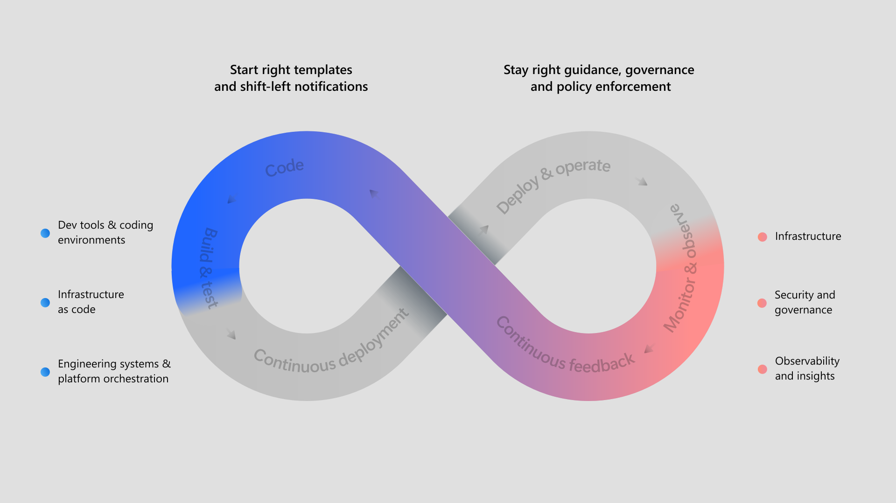

# Getting Started

Getting started with DX tooling can sometimes feel overwhelming, as it covers a
wide range of scenarios. This page provides initial guidance to help you
understand core concepts and start using our tools effectively.

 _Source:
[What is platform engineering? - Microsoft Learn](https://learn.microsoft.com/en-us/platform-engineering/what-is-platform-engineering)_

## Key Concepts to Know

We know you're eager to dive in and start coding, but spending a few minutes on
this section will save you from getting stuck later 🫷.

### Mono Repositories: yes please!

Using a mono repository is mandatory to adopt DX tooling, as several components
are designed on that assumption.
[Mono repos offer several advantages](https://pagopa.github.io/technology-radar/methods-and-patterns/monorepo.html),
and DX tools are designed with them in mind.

### Supported Platforms

Our tools are built to work seamlessly with GitHub and multiple Cloud Service
Providers (CSPs).

:::info

Currently, Azure is the only supported CSP. However, we are actively working on
adding support for AWS as well.

:::

### Terraform Modules

All our Terraform modules are available on
[the public Terraform Registry](https://registry.terraform.io/namespaces/pagopa-dx)
under the `pagopa-dx` organization.

Keep in mind
[you can contribute](https://pagopa.github.io/dx/docs/infrastructure/contributing-to-dx-terraform-modules/)
to improve them.

### Our Design Principles

Our tools are designed to make you
[autonomous in your daily work](index.md#how-this-differs-from-technology-standards-iniative)
by providing golden paths and best practices. You don't need to understand how
the tools work internally—though everything is open source and
[contributions are welcome](https://pagopa.github.io/dx/docs/conventions/pull-requests/acceptance-criteria).
Instead, you can focus on delivering value.

We also provide guidance to help you adopt useful conventions during your
journey:

- [Optimize Git](./conventions/git/index.md) usage.
- [Create effective Pull Requests](./conventions/pull-requests/index.md).
- [Name Azure resources](./conventions/azure-naming-convention.md) consistently.
- [Organize your folders](./conventions/infra-folder-structure.md) for
  Infrastructure as Code (IaC) sources.

## Start Your First Project

Define boundaries for your services and plan how to split your projects. Once
you're ready, create a repository on GitHub and
[configure it using DX tooling](./infrastructure/monorepository-setup.md).

## Set Up Your First GitHub Workflows

The DX repository
[provides several templates](https://github.com/pagopa/dx/tree/main/.github) -
all [properly documented](./pipelines/index.md) - to speed up continuous
integration and delivery for your apps and IaC code. These templates cover
various scenarios, such as TypeScript code validation, web app deployment
(including FaaS!), building and pushing Docker images to
[GitHub registry](https://github.com/orgs/pagopa/packages?repo_name=dx), and
more. Feel free to choose the ones that best suit your needs!

## Explore More Resources

If you're enjoying our tooling, there's much more to discover on this website:

- **Articles**: Guidance for common use cases.
- **Conventions**: Predefined conventions to better organize resources.
- **Infrastructure**: DX tooling for cloud-related topics.
- **Pipelines**: DX tooling for GitHub Actions.

Stay up to date with our [blog](https://pagopa.github.io/dx/blog/).

### Contributing

If you're excited about our work, you can contribute by following the
[contribution guidelines](TBD).
