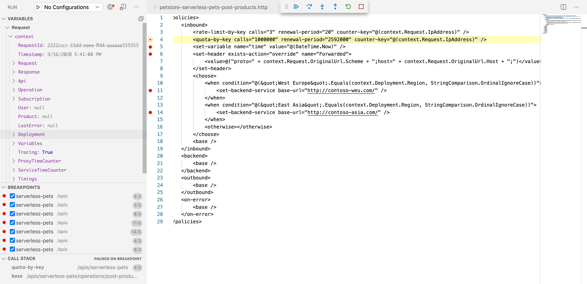

# API Management Best Practices

Azure API Management (APIM) is a cloud-based service that enables organizations
to publish, secure, transform, maintain, and monitor APIs. This documentation
outlines few best practices for software engineers using APIM.

The goal is to:

- Enhance security and confidence in API modifications by enabling testing in
  production
- Improve operational simplicity
- Increase developer autonomy

## Leveraging Versioning and Revisions for Safe Testing

APIM provides built-in capabilities for API versioning and revisions, offering a
structured way to manage API changes without disrupting active services.

Thus, leveraging on versioning and revisions is reccommended for:

- Testing in production
  - Modify policies and configurations safely before publishing changes
  - Conduct tests in production without impacting existing API consumers
  - Align versioning with downstream staging services (e.g. AppService and
    Function App staging slots)
- Keeping track of changes:
  - Maintain a clear changelog for tracking revisions
- Introducing breaking changes by maintaining previous API versions

### Versioning

Versioning allows multiple versions of an API Group to coexist. Clients can
request a specific version through:

- Path parameter (e.g. `/api/v1/resource`)
- Header parameter
- Query string parameter

If client does not specify a version, APIM fallbacks to the version chosen as
default.

### Revisions

Revisions enable fine-grained control over API modifications. Each API version
can have multiple revisions with the following states:

- Current: The active revision used for API invocations
- Online: Available for invocation, but only with explicit revision selection
  (e.g. `/api/v1/resource;rev=2`).
- Offline: Inactive but can be promoted to online or current status

## Debugging APIM Policies

Visual Studio Code can connect to an online APIM instance, and provide debugging
capabilities to developers. For example, it is possible to debug a policy by
using breakpoints, from the local environment. In fact, VS Code can:

- Debug policies with built-in breakpoint support
- Create API Groups using OpenAPI definitions
- Associate APIs with products
- Switch between revisions
- Execute API tests

## Using VS Code to Debug Version and Revision-Based Policies

This section shows a guide through VS Code policy-debugging capabilities.

1. Choose an existing API group
2. Define a new API version
3. Create revisions for incremental modifications and policy updates, and set as
   `Online`
4. Test the revision via VS Code:
   1. Install the `API Management`
      [extension for VS Code](https://marketplace.visualstudio.com/items?itemName=ms-azuretools.vscode-apimanagement)
   2. (Optional) Install the `REST Client`
      [extension for VS Code](https://marketplace.visualstudio.com/items?itemName=humao.rest-client):
      it automatically manage the subscription key in request header
      (`Ocp-Apim-Debug`)
   3. Run the `API Management` extension and select the APIM instance
   4. Navigate through the desired API group and operation to debug
   5. Right click and select `Start Policy Debugging`
   6. Set a breakpoint in policy body
   7. Invoke the API under test specifying its revision name in URL (e.g. `/api/v1/resource;rev=2`)
5. Finalize changes and promote a revision to current when ready
6. Document modifications using changelogs available through APIM

