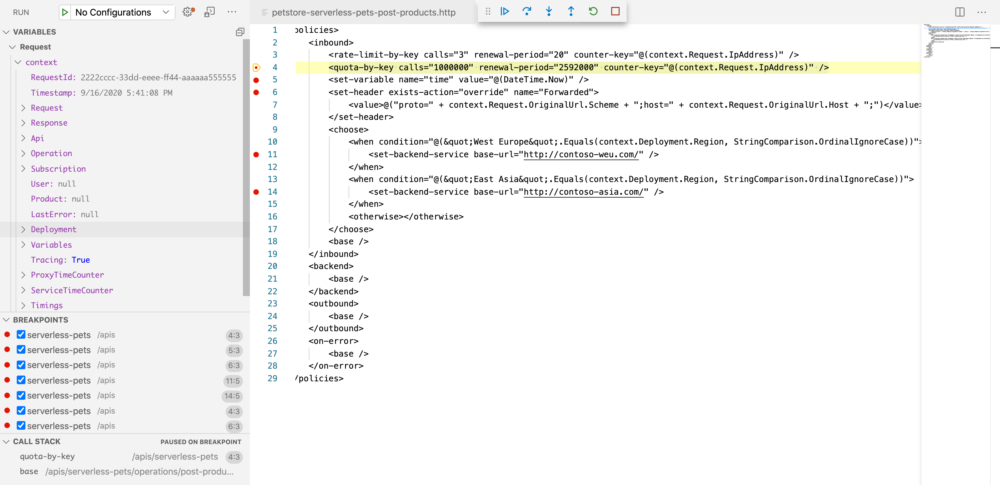

# Testing APIs in Production

APIM provides built-in capabilities for testing in production, offering a
structured way to manage API changes without disrupting active services.
Specifically, revisions enable fine-grained control over API modifications. Each
API version can have multiple revisions with the following states:

- Current: The active revision used for API invocations
- Online: Available for invocation, but only with explicit revision selection
  (e.g. `/api/v1/resource;rev=2`).
- Offline: Inactive but can be promoted to online or current status

This mechanism allows to:

- Modify policies and configurations safely before publishing changes
- Conduct tests in production without impacting existing API consumers
- Align versioning with downstream staging services (e.g. AppService and
  Function App staging slots)

To use revisions, follows these steps:

1. Choose an existing API group
2. Define a new API version
3. Create revisions for incremental modifications (e.g. `rev 2`) and policy
   updates, and set as `Online`
4. Test the revision by invoking the API under test and specifying its revision
   name in the URL (e.g. `/api/v1/resource;rev=2`)
5. Finalize changes and promote a revision to current when ready
6. Document modifications using changelogs available through APIM

As showed in the next chapter,
[VS Code can help you in debugging policies](#debugging-apim-policies-via-vs-code)
via its built-in debugger.

## Debugging APIM Policies via VS Code

Visual Studio Code can connect to an online APIM instance, and provide debugging
capabilities to developers. For example, it is possible to debug a policy by
using breakpoints, from the local environment. In fact, VS Code can:

- Debug policies with built-in breakpoint support
- Create API Groups using OpenAPI definitions
- Associate APIs with products
- Switch between revisions
- Execute API tests

To leverage VS Code policy-debugging capabilities:

1. Install the `API Management`
   [extension for VS Code](https://marketplace.visualstudio.com/items?itemName=ms-azuretools.vscode-apimanagement)
2. (Optional) Install the `REST Client`
   [extension for VS Code](https://marketplace.visualstudio.com/items?itemName=humao.rest-client):
   it automatically manage the subscription key in request header
   (`Ocp-Apim-Debug`)
3. Run the `API Management` extension and select the APIM instance
4. Navigate through the desired API group and operation to debug
5. Right click and select `Start Policy Debugging`
6. Set a breakpoint in policy body
7. Invoke the API under test

