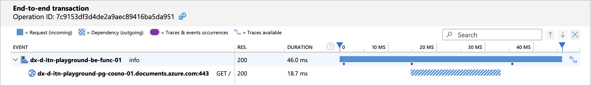

# Integrate Tracing in Azure NodeJS Applications

This guide covers the integration of Azure services with OpenTelemetry (OT) for
tracing NodeJS applications, along with benchmarking and performance insights.

## What is the OpenTelemetry status in Azure

Microsoft is rapidly adopting **OpenTelemetry (OT)** as the standard for
tracing, migrating from older custom solutions (e.g., vendor protocols for
**Application Insights**).

**OpenTelemetry (OT)** is an open-source framework for collecting monitoring and
telemetry data, including traces, metrics, and logs, from software applications
to improve observability and debugging.

The OT ecosystem for NodeJS consists of vendor-neutral libraries that enable a
NodeJS process (whether on Azure or AWS) to send metrics to an OT "collector":

[open-telemetry/opentelemetry-js: OpenTelemetry JavaScript Client](https://github.com/open-telemetry/opentelemetry-js)

In the specific case of Azure, the collector is **Azure Monitor**.

The reference OT package for NodeJS in the Azure ecosystem is
[@azure/monitor-opentelemetry](https://www.npmjs.com/package/@azure/monitor-opentelemetry),
which exports a method `useAzureMonitor` that enables the necessary
instrumentation for popular libraries (such as `http`, `redis`, `mysql`,
`postgresql`, etc.), so metrics can be transparently traced for users of
different SDK clients.

OT instrumentation is implemented through runtime patching of the client SDK
calls. Therefore, you need to import the necessary libraries
(`@azure/monitor-opentelemetry`) and call the `useAzureMonitor` method before
including any other package in the codebase.

## Patch native NodeJS fetch

The `@azure/monitor-opentelemetry` package does not patch the native fetch
method by default, which is commonly used in modern NodeJS applications.

At the time of writing this document, instrumenting the native fetch of NodeJS
(based on the undici package) requires an additional step on top of using the
`useAzureMonitor` method:

[Monitor OpenTelemetry - Add native fetch instrumentation](https://github.com/Azure/azure-sdk-for-js/issues/29864)

See
[Example Integration with App Service](#example-integration-with-app-service)
for a complete example.

:::warning

If you are using version 2.x of the Application Insights SDK, be aware that it
does not support instrumentation of the native fetch methods so external HTTP
requests will not be traced unless you use some custom fetch wrapper.

This is a further reason to migrate to the new version of the SDK (3.x) or to
use the `@azure/monitor-opentelemetry` package.

:::

## Instrument ESM applications

Currently, there are some challenges with instrumenting ESM applications. While
the basic configuration enables data flow to Application Insights (visible on
the Azure Portal), end-to-end correlation does not function as expected.

[Instrumentation of ESM modules is still experimental](https://github.com/open-telemetry/opentelemetry-js/tree/main/experimental/packages/opentelemetry-instrumentation#instrumentation-for-ecmascript-modules-esm-in-nodejs-experimental)
and may not be as seamless as transpiling TypeScript to CommonJS modules.  
[Inspired by a GitHub issue addressing a similar problem](https://github.com/open-telemetry/opentelemetry-js/issues/4845#issuecomment-2253556217),
there is an alternative method to instrument the `@azure/monitor-opentelemetry`
package.

### Steps to Instrument an ESM Application

- Create a new `.mjs` file, you can call it `instrumentation.mjs` for example
- Add the following code to the beginning of the file:

```javascript
import { createAddHookMessageChannel } from "import-in-the-middle";
import { register } from "module";

const { registerOptions, waitForAllMessagesAcknowledged } =
  createAddHookMessageChannel();

register("import-in-the-middle/hook.mjs", import.meta.url, registerOptions);
```

- Set up the instrumentation SDK you want to use:

```javascript
useAzureMonitor();
```

or in case you want to use the `applicationinsights` SDK:

```javascript
appInsights.setup().start();
```

This basic setup for both `@azure/monitor-opentelemetry` and
`applicationinsights` SDKs is enough to start sending telemetry data to Azure
Monitor assuming the environment variable
`APPLICATIONINSIGHTS_CONNECTION_STRING` is set up correctly.

- Import the necessary instrumentations and register them

```javascript
// If necessary, add other instrumentations, like the undici one
registerInstrumentations({
  instrumentations: [instrumentAzureFunctions(), new UndiciInstrumentation()],
  meterProvider: metrics.getMeterProvider(),
  tracerProvider: trace.getTracerProvider(),
});
```

- At the end of the file, add the following code:

```javascript
await waitForAllMessagesAcknowledged();
```

By following these steps, you can configure the `@azure/monitor-opentelemetry`
or `applicationinsights` package along with other instrumentations in an ESM
application.

### Run the Instrumented Application

To ensure the instrumentation works correctly, you need to import the
`instrumentation.mjs` file when running the application by using the
`NODE_OPTIONS` environment variable:

```bash
"NODE_OPTIONS": "--import ./dist/instrumentation.mjs",
```

Ensure you use the correct path to the `instrumentation.mjs` file, as it may
vary depending on your project structure.

After setting everything up and running your application, you will see telemetry
data in Azure Monitor with service correlation:



### Use the `@pagopa/azure-tracing` Package

To simplify the setup and avoid repetitive boilerplate, you can use the
`@pagopa/azure-tracing` package.  
It provides a convenient wrapper around the `@azure/monitor-opentelemetry`
library, making instrumentation easier and more consistent.

For usage details and examples, refer to the
[official documentation on npm](https://www.npmjs.com/package/@pagopa/azure-tracing).

:::warning

Please note: until the package reaches a stable `1.x` release, it is considered
in beta.  
While we aim to keep the API stable, changes may occur as the package evolves.

:::

## Use the Application Insights SDK

The latest version of the Application Insights SDK (3.x) is essentially a
wrapper around OT functionalities provided by the `@azure/monitor-opentelemetry`
package:

[microsoft/ApplicationInsights-node.js: Microsoft Application Insights SDK for Node.js](https://github.com/microsoft/ApplicationInsights-node.js)

The new AI SDK uses the `@azure/monitor-opentelemetry` package under the hood:
the `useAzureMonitor` method is called at the bootstrap of the application to
enable tracing and metrics.

Moreover, the SDK provides a series of
"[shims](https://github.com/microsoft/ApplicationInsights-node.js/tree/main/src/shim)"
that enable its adoption in legacy applications using tracing methods from
previous versions (e.g., `trackEvent`) without refactoring the existing code.

:::note

Although you can enable tracing and metrics using only the
`@azure/monitor-opentelemetry` package, if you want to use legacy AI methods
(e.g., `trackEvent`), you must use the **AI SDK** and call the `setup` and
`start` methods at the bootstrap of the application to initialize the default
`TelemetryClient`.

:::

Alternatively, you can use only `@azure/monitor-opentelemetry` to send custom
events. To achieve this, ensure you are using version
[1.0.0-beta.29](https://github.com/Azure/azure-sdk-for-js/blob/main/sdk/monitor/monitor-opentelemetry-exporter/CHANGELOG.md#100-beta29-2025-03-04)
or later of the `@azure/monitor-opentelemetry-exporter`.

```typescript
import { useAzureMonitor } from "@azure/monitor-opentelemetry";
import { logs } from "@opentelemetry/api-logs";

useAzureMonitor(/* Add your Azure Monitor options here */);

// ...

// The logger name can be any string and is used to identify the logger
// within log processors. This allows different processing rules to be applied,
// enabling custom settings for sampling and log levels.

// The AI SDK uses "ApplicationInsightsLogger" as the default logger name.
// Refer to the source code here:
// https://github.com/microsoft/ApplicationInsights-node.js/blob/03c380558f15fd46c20ba90de343e8d427f1be30/src/main.ts#L39
// It is not mandatory to use the same name. However, if you do, the logger
// will inherit the same configuration settings as the AI SDK.

logs.getLogger("ApplicationInsightsLogger").emit({
  attributes: {
    "microsoft.custom_event.name": "my-custom-event",
    "foo": "bar",
    ... // other custom attributes
  },
});
```

When evaluating to choose between the AI SDK and the Azure Monitor package,
consider that the AI SDK may fall behind new versions of
`@azure/monitor-opentelemetry`, so going with the latter may be more
future-proof. The AI SDK is still advantageous if you need to use legacy AI
methods.

## Enable HTTP KeepAlive

:::note

Unlike previous versions, HTTP KeepAlive is enabled by default in all modern
Azure SDKs, and there is no longer a need to set up a custom agent.

[azure-sdk-for-js/sdk/core/core-rest-pipeline/src/pipelineRequest.ts](https://github.com/Azure/azure-sdk-for-js/blob/main/sdk/core/core-rest-pipeline/src/pipelineRequest.ts#L149)

:::

## Set Sample Rate in AI SDK

When using the AI SDK, it's a good practice to limit the number of traces sent
to **Application Insights** by setting the sample rate.

The sample rate can be set in different ways.

### Use the `applicationinsights.json` configuration file

See
https://github.com/microsoft/ApplicationInsights-node.js?tab=readme-ov-file#configuration

```json
{
  "samplingPercentage": 30
}
```

### Use the `APPLICATIONINSIGHTS_CONFIGURATION_CONTENT` environment variable

This environment variable takes precedence over the `applicationinsights.json`
and has the same format as the JSON file.

```typescript
process.env["APPLICATIONINSIGHTS_CONFIGURATION_CONTENT"] =
  process.env["APPLICATIONINSIGHTS_CONFIGURATION_CONTENT"] ??
  JSON.stringify({
    samplingPercentage: 5,
  } satisfies Partial<IJsonConfig>);
```

### Set sample rate programmatically

```typescript
import * as ai from "applicationinsights";

ai.setup();
ai.defaultClient.config.samplingPercentage = 5;
ai.start();
```

## Enable sampling of traces and custom events with OpenTelemetry

OpenTelemetry uses Tracer and Loggers for different types of telemetry data:

- **traces**: Used for traces (HTTP requests and other external calls) and
  metrics.
- **logs**: Used for console logs and custom events.

:::warning

By design OpenTelemetry SDKs sample only _traces_ but not _logs_.

:::

In the context of Application Insights, the terminology differs:

- **traces**: Correspond to logs emitted by the application using `console.log`
  (or `context.log` in Azure Functions) and _custom events_.
- **dependencies**: Correspond to Opentelemetry _traces_.

To enable **parent based** sampling for _logs_ and _custom events_, you can set
the following option when initializing the AI SDK _before_ calling `ai.start()`:

```typescript
ai.defaultClient.config.azureMonitorOpenTelemetryOptions = {
  enableTraceBasedSamplingForLogs: true,
};
```

This setting will ensure that _logs_ and _custom events_ are sampled based on
the parent trace context. Without this setting, _logs_ and _custom events_ will
always be forwarded at a 100% sample rate.

## Check if sampling is enabled

To check if sampling is enabled, you can use the following query in **Log
Analytics**:

```kql
union requests,dependencies,pageViews,browserTimings,exceptions,traces,customEvents
| where timestamp > ago(1h)
| summarize RetainedPercentage = 100/avg(itemCount) by bin(timestamp, 1m), itemType, sdkVersion
```

Of course, you need to add a filter for the Azure Function or App Service
instance you are interested in.

If you see values < 100 then sampling is enabled for that item type.

## Integrate with App Services

Both **Azure Functions** and **App Services (NodeJS)** allow integration with
**Application Insights** without using the SDK. This integration is active in
the following scenarios:

1. The legacy environment variable **APPINSIGHTS_INSTRUMENTATIONKEY** is set.
2. The environment variable **APPLICATIONINSIGHTS_CONNECTION_STRING** is set.

When either of these variables is set, the **NodeJS** application incorporates a
custom AI agent that starts at bootstrap before importing any other module.

:::warning

On App Services, this mechanism interferes with the programmatic setup of the AI
SDK, overwriting its settings. Therefore, it is recommended to disable the
default integration by removing these environment variables whether you are
using the AI SDK programmatically.

:::

When using the AI SDK, check that the default AI integration is disabled by
ensuring that the `APPINSIGHTS_INSTRUMENTATIONKEY` and
`APPLICATIONINSIGHTS_CONNECTION_STRING` variables are not set. It is recommended
to use a custom environment variable that will be configured in the
`useAzureMonitor` and/or `ai.setup` settings.

To verify that the default integration is indeed disabled, navigate to the
**"Application Insights"** panel of the App Service on the Azure portal.

At the time of writing, the default integration (agent) does not support
end-to-end tracing which can be achieved only by using the AI SDK 3.x
programmatically.

### Integrate with Next.js Deployed on Azure App Service

For `Next.js` applications deployed on **App Service**, similar considerations
apply. However, since there is no single entry point as with other frameworks,
you must use the **instrumentation module**. This module is loaded first by
**Next.js** to ensure that **Application Insights/OpenTelemetry** is initialized
before anything else:

https://nextjs.org/docs/app/building-your-application/optimizing/open-telemetry#manual-opentelemetry-configuration

It is possible to use the `@azure/monitor-opentelemetry` package to instrument a
Next.js application. However, in order to track the HTTP calls made by the
application, you need to use the `undici` instrumentation. This instrumentation
is not included in the `@azure/monitor-opentelemetry` package, so you need to
add it manually.  
Here is a snippet to enable tracing in a Next.js application that uses the App
router:

```javascript
// apps/instrumentation.ts

import { useAzureMonitor } from "@azure/monitor-opentelemetry";
import { metrics, trace } from "@opentelemetry/api";
import { registerInstrumentations } from "@opentelemetry/instrumentation";
import { UndiciInstrumentation } from "@opentelemetry/instrumentation-undici";

export async function register() {
  useAzureMonitor();

  registerInstrumentations({
    instrumentations: [new UndiciInstrumentation()],
    meterProvider: metrics.getMeterProvider(),
    tracerProvider: trace.getTracerProvider(),
  });
}
```

## Integration with Azure Functions

**Azure Functions** are a bit more complex to integrate with **OpenTelemetry**
since you have to handle it both in the **Azure Functions** runtime (host) and
in the application code (worker).

### End-to-End tracing with host AI integration enabled

The **Azure Functions** runtime (host) activates monitoring when the
`APPLICATIONINSIGHTS_CONNECTION_STRING` is set.

:::warning

At the time of writing, only when activating OpenTelemetry
(`"telemetryMode": "OpenTelemetry"` in host.json), the **Azure Functions**
runtime produces extraneous traces that are not part of the application code.
This behavior is expected to be fixed in the future:

https://github.com/Azure/azure-functions-host/issues/10770#issuecomment-2627874412

:::

In both configurations (OpenTelemetry enabled or disabled), when using the AI
3.x SDK, you get end-to-end tracing of the application code (worker). Next step
is align sample rate in AI SDK and Azure Functions runtime.

#### Azure Function OpenTelemetry Instrumentation

To enable end-to-end tracing in **Azure Functions** with OpenTelemetry, you need
to add the related instrumentation to the worker code:

https://github.com/Azure/azure-functions-nodejs-opentelemetry

This instrumentation uses the Azure Function runtime (host) telemetry context to
propagate it to the worker code. If you don't use this instrumentation, worker
traces will not be linked to the incoming HTTP request.

At the time of writing, there is no way to disable verbose logging when using
this package:

https://github.com/Azure/azure-functions-nodejs-opentelemetry/issues/8

Until this issue is resolved, it is recommended to extract and use only the part
that
[enables end-to-end tracing](https://github.com/Azure/azure-functions-nodejs-opentelemetry/blob/main/src/instrumentation.ts#L54).

See [Code Snippets](#code-snippets) for the hook implementation that enables
end-to-end tracing in Azure Functions.

### Align Sample Rate in AI SDK and Azure Functions Runtime

AI SDK use a fixed sample rate, while the Azure Functions runtime (host) uses an
adaptive sampling mechanism. To minimize discrepancies in the number of traces
recorded, it is recommended to align the sample rate in the AI SDK with the
Azure Functions runtime.

To align the sample rate in the Azure Functions runtime with the AI SDK, you can
set these options in `host.json` to the same value used programmatically:

```json
{
  "logging": {
    "applicationInsights": {
      "samplingSettings": {
        "minSamplingPercentage": 5,
        "maxSamplingPercentage": 5,
        "initialSamplingPercentage": 5
      }
    }
  }
}
```

Alternatively, you may use the following environment variables for the same
purpose:

```bash
AzureFunctionsJobHost__logging__applicationInsights__samplingSettings__minSamplingPercentage=5
AzureFunctionsJobHost__logging__applicationInsights__samplingSettings__maxSamplingPercentage=5
AzureFunctionsJobHost__logging__applicationInsights__samplingSettings__initialSamplingPercentage=5
```

Beware that the runtime also relies on the
`AzureFunctionsJobHost__logging__applicationInsights__samplingSettings_maxTelemetryItemsPerSecond`
variable to limit the number of traces sent, so perfect alignment cannot be
guaranteed.

### Configure log levels for the Azure Functions runtime

The Azure Functions runtime (host) allows you to configure log levels for
different categories of logs. This configuration can be set in `host.json` or
using environment variables.

For example, to set the log level for `Function` category to `Information`:

```json
{
  "logging": {
    "logLevel": {
      "Function": "Information"
    }
  }
}
```

To set the same log level using environment variables instead:

```bash
AzureFunctionsJobHost__logging__logLevel__Function=Information
```

The latter approach is useful when you want to override the log level at runtime
without redeploying the function app.

Setting the log level for the `Function` category to `Information` will generate
two traces for _each_ function execution (e.g.,
`Executed 'Functions.redis-fetch' (Succeeded, Id=d555444c-a409-4932-86a8-8c84d3777ba8, Duration=184ms)`).

While this can be useful for debugging and monitoring, it is not recommended for
production as it can produce a _large_ number of traces. Note that setting this
value to `Warning` or higher will prevent `context.log` and `context.info`
messages from being recorded in Application Insights. This is considered a
reasonable trade-off since critical logs can still be captured using
`context.warning` or `context.error`, and the `Information` level can be enabled
for debugging purposes when needed.

The suggested approach is to set the default log level to `Warning` or higher in
production and use the AI SDK for custom events and logging:

```json
{
  "logging": {
    "logLevel": {
      "default": "Warning",
      "Host.Results": "Information",
      "Host.Aggregator": "Information"
    }
  }
}
```

This setup will ensure that only critical logs are recorded in Application
Insights, while the AI SDK can be used for _custom events_ and to trace
_exceptions_ and _warnings_.

Moreover, we keep the `Host.Results` and `Host.Aggregator` categories at
`Information` to capture HTTP requests, function execution results and counters,
useful for monitoring and alerting.

If capturing `context.info` or `context.log` is essential, you can set the log
level for the specific `Function` category to `Information`:

```json
{
  "logging": {
    "logLevel": {
      "Function.MyFunctionName.User": "Information"
    }
  }
}
```

Moreover, only for local debugging, you can set

```json
{
  "logging": {
    "logLevel": {
      "Host.Function.Console": "Information"
    }
  }
}
```

This will capture all `console.log` messages locally, but they won't be sent to
Application Insights in production.

Refer to https://github.com/anthonychu/functions-log-suppression for more
details.

### Sampling gotchas within Azure Functions

1. Beware that `traces` (logs) and `customEvents` emitted by the AI SDK are not
   sampled. This implies that even if you configure a sample rate of 5% in the
   AI SDK, you will still see 100% of `traces` and `customEvents`.
2. When using `"telemetryMode": "OpenTelemetry"` in `host.json`, it appears that
   there is no way to enable sampling at all for the host yet:
   https://github.com/Azure/azure-functions-host/issues/10770#issuecomment-2629318006
3. If you want to override `logLevels` using environment variables, beware that
   "_App settings that contain a period aren't supported when running on Linux
   in an Elastic Premium plan or a Dedicated (App Service) plan_", see
   https://learn.microsoft.com/en-us/azure/azure-functions/configure-monitoring?tabs=v2#overriding-monitoring-configuration-at-runtime

### End-to-End tracing with host AI integration disabled

If you choose to disable the default AI integration and rely solely on the AI
SDK (using a variable other than `APPLICATIONINSIGHTS_CONNECTION_STRING`), you
will lose end-to-end tracing of the application code (worker) because the
runtime (host) will no longer record HTTP requests.

To achieve full integration and enable end-to-end tracing of calls in this
scenario, you need to incorporate a wrapper around the Functions' handlers that
[programmatically activates the OpenTelemetry mechanisms](#example-of-ot-context-wrapper-for-azure-functions).

Benchmarks have shown that this wrapper does not introduce any significant
performance penalties, so you can safely use it in production.

## Set Cloud Role Name

When using the AI SDK, the `cloudRoleName` is set by default to the name of the
**App Service** or **Azure Function**. This value is used to identify the
service in **Application Insights** and group traces.

If you need to customize the `cloudRoleName` (the name of the service in
Application Insights), you can set the `OTEL_SERVICE_NAME` environment.

Setting a value for
`ai.defaultClient.context.tags[ai.defaultClient.context.keys.cloudRole]`
produces no result, even though some online tutorials suggest it. These
tutorials are now considered obsolete.

## Sampling and Performance

Load tests were performed on **App Service** and **Azure Functions**, with the
following conditions:

1. AI completely disabled.
2. AI enabled with sampling at 0%.
3. AI enabled with sampling at 50%.
4. AI enabled with sampling at 100%.

### Benchmark on App Service

The test was conducted using **Azure Load Test** on a test App Service (B1) for
5 minutes with an average of 200 requests per second. There was a maximum
overhead of 30ms observed between tests with 100% sampling compared to those
with AI disabled.


:::note

Using a sampling level < 30% introduces negligible overhead with AI enabled via
SDK

:::

### Benchmark on Azure Functions

The test was conducted on an **Azure Function** using the **Y1 consumption
plan** for 5 minutes with an average of 200 requests per second. Once the
instances had scaled, a maximum overhead of 60ms was observed between tests with
100% sampling and those with AI disabled.


It seems that the sampling value had less impact on time differences once the
instances had scaled horizontally. However, the time needed for scaling
increased linearly with the sampling values.

## Key Takeaways

1. It is recommended to start migrating logging and metric tracing procedures to
   **OpenTelemetry**, incorporating the new version of the **AI SDK 3.x**.
2. Adopting **OT** is currently the only method for achieving end-to-end
   tracing, including the tracing of native NodeJS fetch requests.
3. It is advisable to disable the default integrations and use the SDK
   programmatically on App Services.
4. The current OT implementation on **Azure Functions** is still unstable;
   monitor progress and avoid using `"telemetryMode": "OpenTelemetry"` in
   host.json until issues are solved.

## Code Snippets

### Example Integration with App Service

```javascript
import * as ai from "applicationinsights";

import { UndiciInstrumentation } from "@opentelemetry/instrumentation-undici";
import { registerInstrumentations } from "@opentelemetry/instrumentation";
import { metrics, trace } from "@opentelemetry/api";
import { IJsonConfig } from "applicationinsights/out/src/shim/types";

// setup sampling percentage from environment (optional)
// see https://github.com/microsoft/ApplicationInsights-node.js?tab=readme-ov-file#configuration
// for other options. environment variable is in JSON format and takes
// precedence over applicationinsights.json
process.env["APPLICATIONINSIGHTS_CONFIGURATION_CONTENT"] =
  process.env["APPLICATIONINSIGHTS_CONFIGURATION_CONTENT"] ??
  JSON.stringify({
    samplingPercentage: 30,
  } satisfies Partial<IJsonConfig>);

// setup cloudRoleName (optional)
process.env.OTEL_SERVICE_NAME =
  process.env.WEBSITE_SITE_NAME ?? "local-app-service";

ai.setup(process.env["AI_SDK_CONNECTION_STRING"]).start();

// this must be called _after_ starting the AI SDK
// in order to instantiate the OTEL tracer provider
registerInstrumentations({
  tracerProvider: trace.getTracerProvider(),
  meterProvider: metrics.getMeterProvider(),
  // instrument native node fetch
  instrumentations: [new UndiciInstrumentation({
    requestHook: (span, requestInfo) => {
      const { origin, method, path } = requestInfo;
      // Default instrumented attributes don't feed well into AppInsights,
      // so we set them manually.
      span.setAttributes({
        "http.url": `${origin}${path}`,
        "http.method": method,
        "http.target": path,
        "http.host": origin,
      });
    },
    responseHook: (span, { response }) => {
      // Same as above, set the status code manually.
      span.setAttribute("http.status_code", response.statusCode);
    },
  })],
});
//
// Only when using Azure Function uncommented the code below
//
//  import { app } from "@azure/functions";
//  import { context as otelContext, propagation } from '@opentelemetry/api';
//
// app.hook.preInvocation((context) => {
//   const traceContext = context.invocationContext.traceContext;
//   if (traceContext) {
//     context.functionHandler = otelContext.bind(
//       propagation.extract(otelContext.active(), {
//         traceparent: traceContext.traceParent,
//         tracestate: traceContext.traceState,
//       }),
//       context.functionHandler,
//     );
//   }
// });
//
export default ai;
```

### Example of OT Context wrapper for Azure Functions

```javascript
import { HttpRequest, InvocationContext, HttpHandler } from "@azure/functions";
import {
  Attributes,
  SpanKind,
  SpanOptions,
  SpanStatusCode,
  TraceFlags,
  context,
  trace,
  Span,
  SpanContext,
} from "@opentelemetry/api";
import {
  SEMATTRS_HTTP_METHOD,
  SEMATTRS_HTTP_STATUS_CODE,
  SEMATTRS_HTTP_URL,
} from "@opentelemetry/semantic-conventions";

export default function withAppInsights(func: HttpHandler) {
  return async (req: HttpRequest, invocationContext: InvocationContext) => {
    if (
      process.env["DISABLE_FUNCTION_WRAPPER"]
    ) {
      return await func(req, invocationContext);
    }
    const startTime = Date.now();

    // Extract the trace context from the incoming request
    const traceParent = req.headers.get("traceparent");
    const parts = traceParent?.split("-");

    const parentSpanContext: SpanContext | null =
      parts &&
      parts.length === 4 &&
      parts[1].length === 32 &&
      parts[2].length === 16
        ? {
            traceId: parts[1],
            spanId: parts[2],
            traceFlags: TraceFlags.NONE,
          }
        : null;

    const activeContext = context.active();

    // Set span context as the parent context if any
    const parentContext = parentSpanContext
      ? trace.setSpanContext(activeContext, parentSpanContext)
      : activeContext;

    const attributes: Attributes = {
      [SEMATTRS_HTTP_METHOD]: "HTTP",
      [SEMATTRS_HTTP_URL]: req.url,
    };

    const options: SpanOptions = {
      kind: SpanKind.SERVER,
      attributes: attributes,
      startTime: startTime,
    };

    // Emulates an HTTP request span
    const span: Span = trace
      .getTracer("ApplicationInsightsTracer")
      .startSpan(`${req.method} ${req.url}`, options, parentContext);

    let res;
    try {
      res = await context.with(trace.setSpan(activeContext, span), async () => {
        return await func(req, invocationContext);
      });
      const status = res?.status;
      if (status) {
        span.setStatus({
          code: status < 400 ? SpanStatusCode.OK : SpanStatusCode.ERROR,
        });
        span.setAttribute(SEMATTRS_HTTP_STATUS_CODE, status);
      }
    } catch (error) {
      span.setStatus({
        code: SpanStatusCode.ERROR,
        message: error instanceof Error ? error.message : JSON.stringify(error),
      });
      throw error;
    } finally {
      span.end(Date.now());
    }

    return res;
  };
}
```

```javascript
app.http("root", {
  route: "/",
  methods: ["GET"],
  authLevel: "anonymous",
  handler: withAppInsights(async (req) => ({
    body: `Hello, ${req.query.get("name")}!`,
  })),
});
```
