# Implementing Azure IAM Across Subscriptions using Terraform

Managing Azure Identity and Access Management (IAM) across multiple
subscriptions can be complex. This guide provides a step-by-step approach to
implementing cross-subscription role assignments using Terraform, ensuring a
clear separation of concerns and resource ownership.

## Overview

In Azure, to enable a resource (e.g., Managed Identity, Service Principal) to
access another resource, you need to create a `Role Assignment` that assigns
specific roles to the target. However, managing Terraform code across separate
Git repositories for each subscription can be challenging.

The diagram below is a high-level view of the architecture described in the next
sections. The ultimate goal is to ensure a clear separation of concerns and
resource ownership.



## Step-by-Step Implementation

### Requirements

To implement a cross-subscription role assignment, you will need:

- Principal ID: The ID of the resource in Subscription A that needs access; this
  could be either a Managed Identity or an Entra ID group
- Subscription ID: The ID of Subscription B where the target resource is located
- Role Definition: The appropriate role that grants the necessary permissions
  (e.g., Reader, Contributor)

### Defining the Terraform Code

To create a `Role Assignment`, you can use the DX Terraform module
[dx-azure-role-assignments](https://registry.terraform.io/modules/pagopa/dx-azure-role-assignments/azurerm/latest)
which allows you to give more roles at a time to the same principal and
abstracts away the complexity of the role choice.

```hcl
module "roles" {
  source  = "pagopa/dx-azure-role-assignments/azurerm"
  version = "~> 0.0"

  principal_id = "caller-resource-id"

  cosmos = [
    {
      account_name        = "cosmosdb-account-name"
      resource_group_name = "cosmosdb-account-resource-group-name"
      role                = "writer"
    }
  ]

  key_vault = [
    {
      name                = "keyvault-name"
      resource_group_name = "keyvault-resource-group-name"
      roles = {
        secrets = "reader"
      }
    }
  ]

  storage_blob = [
    {
      storage_account_name = "storage-account-name"
      resource_group_name  = "storage-account-resource-group-name"
      container_name       = "container-name"
      role                 = "reader"
    }
  ]
}
```

If the target resource type is not supported by the module
([let us know!](https://github.com/pagopa/dx/issues/new)), you can create the
`Role Assignment` by using the Terraform resource for each assignment:

```hcl
resource "azurerm_role_assignment" "example" {
  scope                = "target-resource-id"
  role_definition_name = "Reader"
  principal_id         = "caller-resource-id"
  description          = "Add a meaningful description"
}
```

:::info

The `principal_id` value could be a hardcoded string as well as a reference to
the actual resource via Terraform `data` block. However, for the latter, both
you and the Managed Identities federated with your GitHub workflows need to have
the `Reader` role on the target resource (subscription A).

:::

## Best Practices

- Documentation: Document all cross-subscription relationships in a central
  location
- Comments: Add comments in the Terraform code explaining:
  - The purpose of the access
  - The source resource details
  - The date when access was granted
  - The ticket/request reference

## Maintenance Over Time

### Principal ID Changes

If the principal ID in Subscription A changes (e.g., due to recreation of a
resource):

- The team in Subscription A should notify the team in Subscription B
- The team in Subscription B should update the hardcoded principal ID

### Access Requirements Change

If the access requirements change:

- The team in Subscription A should create a new request
- The team in Subscription B should update the role assignment

## Conclusion

Implementing Azure IAM across subscriptions using Terraform can streamline your
access management processes. By following the steps outlined in this guide and
adhering to best practices, you can ensure secure and efficient management of
cross-subscription permissions.
