---
sidebar_label:
  Connecting Resources Across Azure Subscription via Private Endpoints
---

# Connecting resources across Azure Subscription via Private Endpoints

## Overview

This guide explains how to enable network connectivity between two Azure
resources in different subscriptions using Azure Private Endpoints via
Terraform.

The diagram below is a high-level view of the architecture described in the next
sections. The ultimate goal is to ensure a clear separation of concerns and
resource ownership.



In short:

- Team B manages services in subscription B that need to connect to services in
  subscription A.
- Team B, the caller, exclusively owns the Private Endpoint.
- The Private Endpoint Terraform code should be maintained in Team B's
  repository.
- Team A must approve the connection request without further interaction between
  the two teams.
- Each resource in subscription B requires its own Private Endpoint.
- Multiple applications from the same team should use the same Private Endpoint.

## Step-by-Step Implementation

### Caller Team: Defines the Private Endpoint in the Terraform codebase

Add the following code in caller's repository to create a Private Endpoint:

```hcl
resource "azurerm_private_endpoint" "example" {
  name                = "example-private-endpoint"
  location            = "caller-resource-location"
  resource_group_name = "caller-team-domain-rg"
  subnet_id           = "caller-team-pep-subnet"

  private_service_connection {
    name                           = "example-private-endpoint"
    private_connection_resource_id = "/subscriptions/<SUBSCRIPTION_A>/resourceGroups/<RESOURCE_GROUP>/providers/Microsoft.DocumentDB/databaseAccounts/<COSMOSDB_ACCOUNT>"
    is_manual_connection           = true
  }
}
```

For resources within the same subscription, the `is_manual_connection` property
is typically set to `false` to bypass the approval step, as the resource owner
is usually the same.

However, since the resources in this scenario are in different subscriptions,
the property must be set to `true` to initiate the approval process.

The `private_connection_resource_id` value is hardcoded in this example. To have
a reference via Terraform `data` block instead, the users that will apply the
Terraform configuration and the Managed Identities federated with the GitHub
workflows need to have the `Reader` role on the target resource.

### Target Team: Approves the Private Endpoint Request

Once the Terraform configuration is applied, a connection request is created in
the target subscription. The target team must approve the request in order to
activate the connection.

There are two ways to approve a Private Endpoint connection.

#### Via Azure Portal

1. In the Azure Portal, navigate to `Private Link Center`
2. Select `Pending Connections`
3. Locate the request and click `Approve`

#### Via Azure CLI

```bash
az network private-endpoint-connection approve \
  --resource-group <TARGET_RESOURCE_GROUP> \
  --name <PRIVATE_ENDPOINT_NAME> \
  --description "<DESCRIPTION>"
```

::: info

It is recommended to add a meaningful description to the connection, indicating
who is trying to connect and why this connection is necessary to facilitate the
integration.

:::
