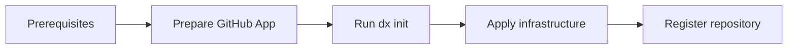

# Creating a DX-Ready Monorepo on GitHub

This guide explains how to creating a new monorepo using the DX CLI `init`
command. The command automates all repository scaffolding, cloud environment
setup, and GitHub runner provisioning in a single interactive session.



## Prerequisites

Before running the `init` command, ensure you have all the required tools
installed and the right access in place. See the
[DX CLI requirements](./dx-cli/index.md#requirements) for the full list of
tools, versions, and login instructions.

## Prepare the GitHub App {#obtaining-github-app-credentials}

The `init` command needs three GitHub App values to configure the self-hosted
GitHub runner. Follow the steps below **before** running `dx init`.

:::info[One GitHub App per product]

Each product at PagoPA has its own dedicated GitHub App. You do not need to ask
a GitHub Admin to create one unless it doesn't exist yet for your product.

You can check if an app already exists by browsing the
[authorization repository](https://github.com/orgs/pagopa/repositories?type=source&q=eng-github-au)
for your product's entry in `authorizations/<your-product>/data/apps.json` and
looking for an app with the name pattern `<team>-github-runner-internal` (e.g.
`engineering-github-runner-internal`).

If the app already exists, skip to
[Step 2](#step-2--retrieve-the-three-required-values-retrieve-the-three-required-values).

:::

### Step 1 — Request a GitHub App (only if it doesn't exist yet)

Open a Pull Request against the
[authorization repository](https://github.com/orgs/pagopa/repositories?type=source&q=eng-github-au)
adding a new entry under `authorizations/<your-product>/data/apps.json`. Leave
the `repositories` array **empty** for now — you will populate it after
`dx init` completes:

```json
{
  "apps": [
    {
      "app_name": "<product>-github-runner-internal",
      "org_wide": false,
      "description": "GitHub Runner App for <product>",
      "repositories": [],
      "app_managers": {
        "teams": ["<your-product-engineering-leader-team>"],
        "users": []
      }
    }
  ]
}
```

The app name must follow the pattern `<team>-<name>-internal` (e.g.
`engineering-github-runner-internal`).

Once the PR is ready, contact the **Technology team** to have the app created.
Refer to the
[internal procedure](https://pagopa.atlassian.net/wiki/spaces/Technology/pages/2628976829/Creazione+GithubApp+configurazione+repo)
for additional context.

### Step 2 — Retrieve the three required values {#retrieve-the-three-required-values}

Once the GitHub App exists, only **App Administrators** can access its settings.
Navigate to:
[https://github.com/organizations/pagopa/settings/apps](https://github.com/organizations/pagopa/settings/apps)

Retrieve the following three values:

| Value                 | Where to find it                                                                                                                   |
| --------------------- | ---------------------------------------------------------------------------------------------------------------------------------- |
| **App ID**            | App settings page → **About** section → **App ID**                                                                                 |
| **Installation ID**   | App settings page → **Install App** → click on the installation → the numeric ID is in the URL (e.g. `.../installations/12345678`) |
| **Private key (PEM)** | App settings page → **Private keys** section → **Generate a private key** → download the `.pem` file                               |

Keep these three values at hand: `dx init` will prompt you for them.

### Step 3 — Authenticate with GitHub and Azure

Log in to GitHub using the CLI:

```bash
gh auth login
```

Log in to Azure:

```bash
az login
```

:::warning[Azure session expiry]

Within PagoPA, `az login` sessions expire every **12 hours**. If the command
fails with an authentication error, run `az login` again before retrying.

:::

## Run `dx init` {#run-dx-init}

With prerequisites in place and the three GitHub App values ready, run:

```bash
npx @pagopa/dx-cli init
```

The command is fully interactive. Refer to the
[`init` command documentation](./dx-cli/index.md#init--initialize-resources) for
the full list of prompts and what each one expects.

When the command completes, a Pull Request will be open on the new GitHub
repository with the initial project structure ready to review.

## After `dx init` Completes

After the command completes successfully, work through the following steps in
order before merging the generated Pull Request.

### Step 1 — Migrate `infra/repository` Terraform state to remote storage

The `init` command initialises the Terraform state for `infra/repository`
locally. Migrate it to a remote backend so the whole team can share it.

If you are unsure which remote backend to use, copy the `backend` block from
`infra/bootstrapper/<env>/backend.tf` and adapt it for `infra/repository`. Then
run:

```bash
cd infra/repository
terraform init -migrate-state
```

Confirm the migration when prompted.

### Step 2 — Apply `infra/core` (if present)

If the repository does **not** include an `infra/core` folder, skip this step.
Otherwise, apply the configuration:

```bash
cd infra/core/<env>
terraform init
terraform apply
```

Store the three GitHub App values to the Key Vault using the Azure CLI
(**don't** use the Portal):

```bash
az keyvault secret set \
  --vault-name "<your-keyvault-name>" \
  --name "github-runner-app-id" \
  --value "<app-id>"

az keyvault secret set \
  --vault-name "<your-keyvault-name>" \
  --name "github-runner-app-installation-id" \
  --value "<installation-id>"

az keyvault secret set \
  --vault-name "<your-keyvault-name>" \
  --name "github-runner-app-key" \
  --file "<path-to-private-key.pem>"
```

:::info[Secrets already present?]

If the GitHub App already existed before running `dx init`, or if `infra/core`
was not applied (e.g. the core infrastructure is shared with other
repositories), the secrets are likely already stored in your product's shared
Key Vault (typically named `common-kv-01`). In that case you can skip this step.

:::

### Step 3 — Verify and apply `infra/bootstrapper`

Open `infra/bootstrapper/<env>/data.tf` and verify that the Entra ID groups
referenced there exist and match your team context.

Once verified, apply the bootstrapper:

```bash
cd infra/bootstrapper/<env>
terraform init
terraform apply
```

### Step 4 — Register the new repository

Open a Pull Request against the
[authorization repository](https://github.com/orgs/pagopa/repositories?type=source&q=eng-github-au)
to do two things:

1. **Add the new repository to the organization census** — follow your product's
   existing conventions in the authorization repo.
2. **Add the new repository to the GitHub App** — update the `repositories`
   array in `authorizations/<your-product>/data/apps.json` (the entry you
   created in Step 1 of
   [Prepare the GitHub App](#obtaining-github-app-credentials), or the existing
   entry if the app already existed) to include the new repository name.
