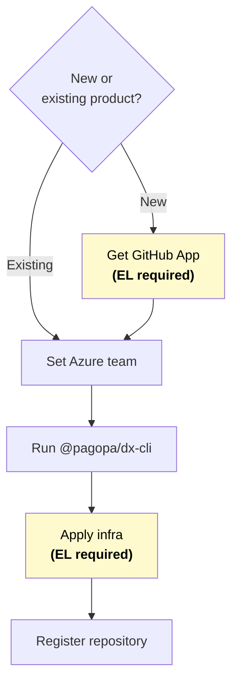

import Tabs from "@theme/Tabs";
import TabItem from "@theme/TabItem";

# Creating a Monorepo

This guide explains how to create a new workspace using the DX CLI command. The
command automates all repository scaffolding, cloud environment setup, and
GitHub runner provisioning in a single interactive session.

## Glossary

- **Product**: A PagoPA initiative (for example, IO or SelfCare) that owns
  repositories, teams, and delivery processes.
- **Workspace**: The monorepository that contains the source code for projects
  and infrastructure.
- **Engineering Leader (EL)**: The role with elevated permissions responsible
  for governance and approvals on critical steps such as app setup and
  infrastructure apply.

## Setup Flow



## Setting up your team on Azure {#setting-up-your-team-on-azure}

:::warning[For Engineering Leader only]

This step is intended for Engineering Leaders only.

:::

Before applying any infrastructure, you need to organize your team into Azure
Entra ID groups via Azure
[authorization repository](https://github.com/orgs/pagopa/repositories?q=eng-azure-au).

Ensure to have the following groups in your configuration, eventually split by
domains:

| Group                                           | Required roles                                                              |
| ----------------------------------------------- | --------------------------------------------------------------------------- |
| `<product>-<env>-adgroup-[<domain>]-admins`     | `Contributor`, `Storage Blob Data Contributor`, `Key Vault Secrets Officer` |
| `<product>-<env>-adgroup-[<domain>]-developers` | `Reader`, `Monitoring Contributor`, `Support Request Contributor`           |
| `<product>-<env>-adgroup-[<domain>]-externals`  | `Reader`                                                                    |

Once defined, assign each team member to one of the following groups based on
the responsibilities you want to grant them:

| Group        | Who belongs here                                                                      |
| ------------ | ------------------------------------------------------------------------------------- |
| `admins`     | Engineers with high privileges. They can also apply `core` and `bootstrapper` modules |
| `developers` | Engineers with development access on resources defined in the monorepository          |
| `externals`  | External collaborators with limited access                                            |

Finally, add people to the `vpn` group to grant them access to private
resources.

:::note

All Entra ID groups must be created by the
[authorization team](https://github.com/orgs/pagopa/teams?query=engineering-cloud)
before merging the PR.

:::

Finally, add yourself to the
[group](https://github.com/search?q=repo%3Apagopa%2Feng-azure-authorization%20sec-p-adgroup-externals&type=code)
that gives you required roles on networking level.

## Setting up a GitHub App

:::warning[For new product only]

This step is required only if you are setting up an Azure subscription or AWS
account. Otherwise, go to the [next section](#run-@pagopa/dx--cli).

:::

The `init` command needs a GitHub App to configure the self-hosted GitHub
runner.

:::info[One GitHub App per product]

Each product at PagoPA has its own dedicated GitHub App for the self-hosted
GitHub runner. You do not need to ask a
[GitHub Admin](https://github.com/orgs/pagopa/teams?query=engineering-cloud) to
create one unless it doesn't exist yet for your product.

You can check if an app already exists by browsing the
[authorization repository](https://github.com/orgs/pagopa/repositories?type=source&q=eng-github-au)
for your product's entry in `authorizations/<your-product>/data/apps.json` and
looking for an app with the name pattern `<product>-github-runner-internal`.

If the app already exists, proceed to
[Step 2](#step-2--retrieve-the-required-values).

:::

### Step 1 — Request a GitHub App (only if it doesn't exist yet) {#step-1--request-a-github-app-only-if-it-doesnt-exist-yet}

Open a Pull Request against the
[authorization repository](https://github.com/orgs/pagopa/repositories?type=source&q=eng-github-au)
adding a new entry under `authorizations/<your-product>/data/apps.json`. Leave
the `repositories` array **empty** for now — you will populate it after
`dx init` completes:

```json
{
  "apps": [
    {
      "app_name": "<product>-github-runner-internal",
      "org_wide": false,
      "description": "GitHub Runner App for <product>",
      "repositories": [],
      "app_managers": {
        "teams": ["<your-product-engineering-leader-team>"],
        "users": []
      }
    }
  ]
}
```

The app name must follow the pattern `<product>-github-runner-internal`.

Once the PR is ready, contact the
[GitHub App admins](https://github.com/orgs/pagopa/teams?query=engineering-cloud)
to have the app created. Refer to the
[internal procedure](https://pagopa.atlassian.net/wiki/spaces/Technology/pages/2628976829/Creazione+GithubApp+configurazione+repo)
for additional context.

### Step 2 — Retrieve the required values {#step-2--retrieve-the-required-values}

Once the GitHub App exists, only **App Administrators** can access its settings.
Navigate to:
[https://github.com/organizations/pagopa/settings/apps](https://github.com/organizations/pagopa/settings/apps)

Retrieve the following three values:

| Value                 | Where to find it                                                                                                                   |
| --------------------- | ---------------------------------------------------------------------------------------------------------------------------------- |
| **App ID**            | App settings page → **About** section → **App ID**                                                                                 |
| **Installation ID**   | App settings page → **Install App** → click on the installation → the numeric ID is in the URL (e.g. `.../installations/12345678`) |
| **Private key (PEM)** | App settings page → **Private keys** section → **Generate a private key** → download the `.pem` file                               |

Keep these three values at hand: `@pagopa/dx-cli` will prompt you for them.

## Run `@pagopa/dx-cli` {#run-@pagopa/dx--cli}

Before running the `init` command, ensure you have all the required tools
installed and the right access in place. See the
[`dx-cli` requirements](./dx-cli/index.md#requirements) for the full list of
tools, versions, and login instructions.

With prerequisites in place and the GitHub App values ready, run:

```bash
npx @pagopa/dx-cli init
```

When done, a Pull Request will be open on the new GitHub repository with the
initial project structure ready to review.

When the command completes, add an environment:

```bash
cd <repo>
npx @pagopa/dx-cli add environment
```

These commands are fully interactive. Refer to the
[commands documentation](./dx-cli/index.md#usage) for the full list of prompts
and what each one expects.

Commit and push to GitHub the working changes.

## After `@pagopa/dx-cli` Completes

After the command completes successfully, work through the following steps in
order before merging the generated Pull Request.

### Step 1 — Migrate `infra/repository` Terraform state to remote storage

The `@pagopa/dx-cli` command initializes the Terraform state for
`infra/repository` locally. Migrate it to a remote backend so the whole team can
share it.

If you are unsure which remote backend to use, copy the `backend` block from
`infra/bootstrapper/<env>/backend.tf` and adapt it for `infra/repository`:

```bash
cp infra/bootstrapper/<env>/backend.tf infra/repository/backend.tf
perl -pi -e 's/bootstrapper\.(dev|uat|prod)/repository/g' infra/bootstrapper/prod/providers.tf
```

Then migrate state run:

```bash
cd infra/repository
terraform init -migrate-state
```

Confirm the migration when prompted.

### Step 2 — Verify and Apply Terraform configs

:::warning[For Engineering Leader only]

This step requires high permissions. Your Engineering Leader will handle this —
please coordinate with them before merging the generated Pull Request.

:::

:::info[Automation under development]

We are currently developing a pipeline that will automate the step 2,
eliminating the need for this manual step.

:::

#### Core (for new projects only)

Apply the
[Core](https://registry.terraform.io/modules/pagopa-dx/azure-core-infra/azurerm/latest)
Terraform configuration:

```bash
cd infra/core/<env>
terraform init
terraform apply
```

#### Bootstrapper

Open `infra/bootstrapper/<env>/data.tf` and verify that the Entra ID groups
referenced there are the ones set in
[Setting Up Your Team on Azure](setting-up-your-team-on-azure).

Once verified, apply the
[bootstrapper](https://registry.terraform.io/modules/pagopa-dx/azure-github-environment-bootstrap/azurerm/latest):

```bash
cd infra/bootstrapper/<env>
terraform init
terraform apply
```

### Step 3 — Register the new repository

Open a Pull Request against the
[authorization repository](https://github.com/orgs/pagopa/repositories?type=source&q=eng-github-au)
to do two things:

1. **Add the new repository to the organization census**, including GitHub user
   permissions
2. **Add the new repository to the GitHub App** — update the `repositories`
   array in `authorizations/<your-product>/data/apps.json` of the
   [authorization repository](https://github.com/orgs/pagopa/repositories?type=source&q=eng-github-au)
   to include the new one.
