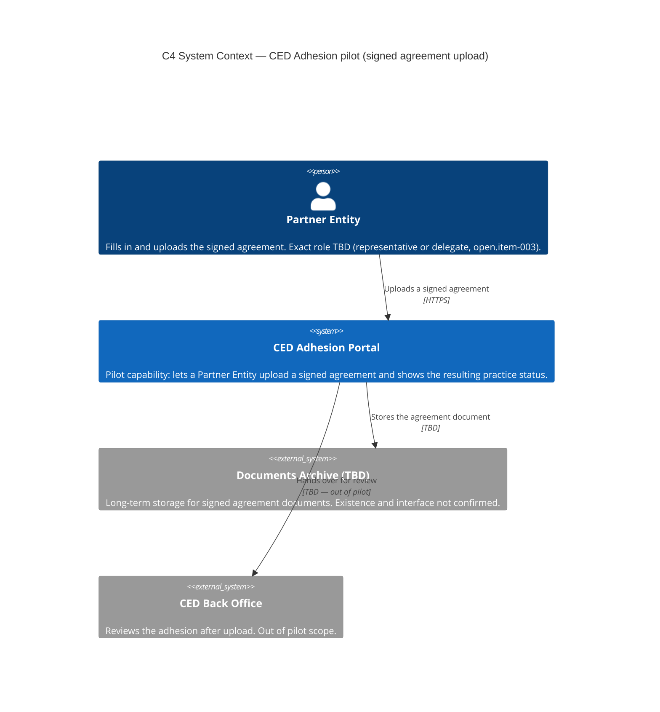
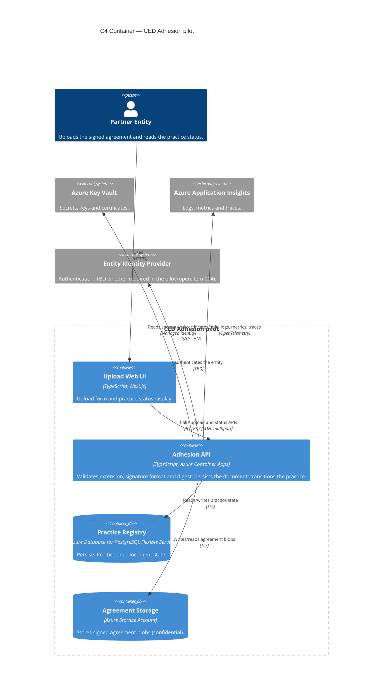
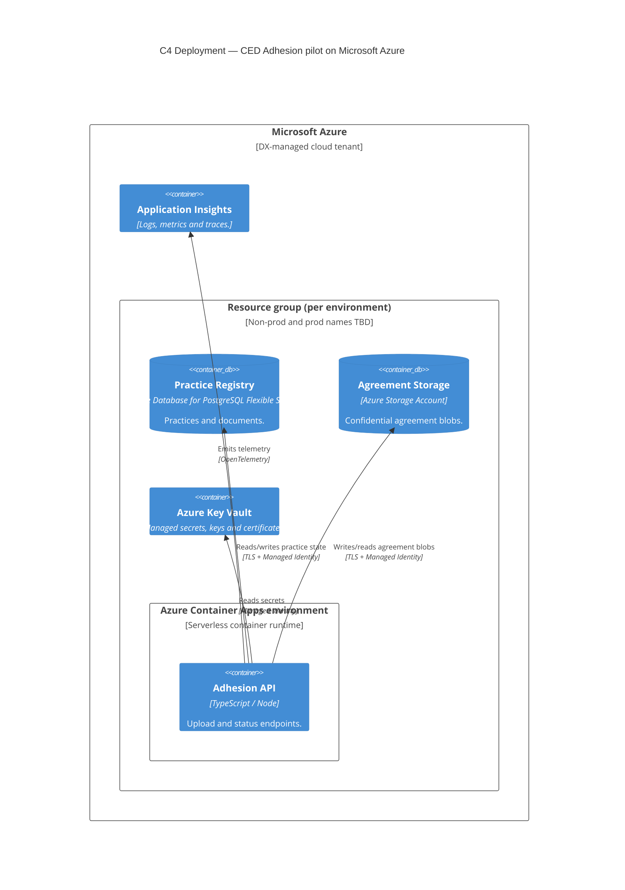

# Design Review / Software Requirements Specification — CED Adhesion: signed agreement upload (pilot)

> Section labels: `Always` is required in every DR/SRS; `If applicable` is
> populated when the topic exists, otherwise marked `N/A — <confirmed reason>`;
> `Optional` is included only when it adds value. Stable IDs and section anchors
> stay unchanged regardless of label or translation.
>
> **Minimum for backlog handoff** — a backlog agent can consume a DR/SRS with
> declared gaps when these are real: `Expected outcome` (outcome and scope),
> system context, the relevant NFRs, the `Domain model and glossary`, the
> repository link, and a Use Case catalog listing the child pages. Each `ready`
> child carries a priority, a binary acceptance check, its component and
> contract references, and its typed errors; the DR/SRS open questions carry a
> blocking flag. `metadata.status: review` is not required for handoff.

<!-- id: metadata -->

## Header and references — `Always`

| ID                              | Value                                                                |
| ------------------------------- | -------------------------------------------------------------------- |
| `metadata.status`               | draft                                                                |
| `metadata.title`                | CED Adhesion — signed agreement upload (pilot)                       |
| `metadata.canonical-outcome-id` | CED-ADHESION                                                         |
| `metadata.source-id`            | demo/prd.md                                                          |
| `metadata.owner`                | Product IO                                                           |
| `metadata.authors`              | Product IO App; Engineering IO App (TBD)                              |
| `metadata.last-updated`         | 2026-09-11                                                           |
| `metadata.version`              | 0.1                                                                  |

### Related artifacts — `Always`

| ID                             | Artifact                                    | Link or reference                       | Relationship / status                                                                                                |
| ------------------------------ | ------------------------------------------- | --------------------------------------- | ------------------------------------------------------------------------------------------------------------------- |
| `references.prd`               | PRD                                         | `demo/prd.md`                           | Source; day-zero draft, sponsor Disability Department, owner Product IO                                             |
| `references.rfc`               | RFCs                                        | N/A — no RFC exists                     | Greenfield initiative, no decision record yet (RF-03)                                                                |
| `references.service-blueprint` | Service Blueprint                           | N/A — not supplied                      | The PRD cites "blueprints" without a link; recorded as a gap (`open.item-012`, owner Product)                        |
| `references.figma`             | Figma / design discovery                    | N/A — no Figma frame supplied           | PRD states "No detailed Figma, no journey map beyond the board" (`open.item-012`)                                    |
| `references.contracts`         | OpenAPI / AsyncAPI / Data Contract          | `openapi.yaml` (this directory)         | Proposed draft upload/status API; `contracts.item-001`                                                               |
| `references.repository`        | Repository                                  | N/A — no repository exists              | Greenfield bootstrap; missing repository blocks Task routing (`open.item-005`)                                       |
| `references.reviews`           | Security / Privacy / Legal reviews          | N/A — none performed                    | No security, privacy, or legal review yet; recorded as gaps (NFR-05, `open.item-007`)                                |
| `references.dpia`              | DPIA / privacy review                       | N/A — none performed                    | Agreement content classed confidential; classification and retention TBD (`open.item-007`)                            |
| `references.launch-review`     | Launch Readiness Review (separate Go/No-Go) | N/A — not created                       | To be created before production launch; pilot only                                                                   |
| `references.glossary`          | Business glossary (PRD/Confluence)          | N/A — no external glossary              | Solution glossary lives in this DR/SRS                                                                               |
| `references.operations`        | Jira board / runbook / readiness artifacts  | N/A — none exist                        | No runbook or board yet; support readiness gap (`open.item-009`)                                                     |

<!-- id: expected-outcome -->

## Expected outcome of the initiative — `Always`

_Summarize the context, intended outcome, scope, non-goals, and linked PRD
objectives. Keep product outcomes concise; do not duplicate the PRD. When there
is no PRD, this section is the home of the initiative outcome and scope._

| ID                    | Item                 | Description                                                                                                                                                          | Source / status                       |
| --------------------- | -------------------- | -------------------------------------------------------------------------------------------------------------------------------------------------------------------- | ------------------------------------- |
| `outcome.context`     | Context and problem  | A Partner Entity wants to join CED by uploading a signed agreement, without opening manual tickets. Nothing exists yet for CED beyond embryonic goals and blueprints. | PRD `Problem statement`; confirmed    |
| `outcome.objective`   | Expected outcome     | On demo cases, a valid upload completes without a manual ticket and moves the practice to `PENDING`; an invalid upload returns a typed error without a state change.  | PRD BG-01, `How we measure success`   |
| `outcome.scope`       | In scope             | Entity signed-agreement upload through the new portal; format/digest verification; persistence of the document; proposed practice transition `REQUEST` → `PENDING`.   | PRD; proposed state names pending confirmation         |
| `outcome.non-goals`   | Out of scope         | Post-upload back office review, notifications, and the rest of the flow visible in the blueprint; production launch readiness.                                       | PRD `Problem statement`; confirmed    |
| `outcome.constraints` | Relevant constraints | Greenfield: no repository, no frozen agreement template, no OpenAPI, no detailed Figma; signature format only hypothesized as CAdES; agreement content confidential. | PRD RF-01..RF-03, context; confirmed  |

<!-- id: solution-design -->

## Solution design — `Always`

### Technology profile and constraints — `Always`

_Describe the preferred technology profile as high-level,
Technology-Radar-informed choices: CSP, programming language, runtime platform,
managed cloud services, architecture style, and contract format. Record explicit
constraints, the Technology Radar outcome, and any decisions or derogations. Do
**not** list day-to-day development tooling (package manager, runtime version
manager, test runner, linter, formatter, git hooks, diagram tooling, performance
tool): that reaches the coding agent as separate context. Mark unknown values as
open questions._

| ID                      | Topic                         | Preference / constraint                                                                     | Technology Radar outcome                                                                                        | Decision / derogation                            | Owner / status             |
| ----------------------- | ----------------------------- | ------------------------------------------------------------------------------------------- | -------------------------------------------------------------------------------------------------------------- | ------------------------------------------------ | -------------------------- |
| `tech.profile.item-001` | CSP                           | Microsoft Azure as the target cloud                                                         | Microsoft Azure — adopt                                                                                        | Proposed for the pilot                           | Engineering / proposed     |
| `tech.profile.item-002` | Programming language          | TypeScript for frontend and backend                                                         | TypeScript — adopt; ECMAScript Modules — adopt                                                                 | Proposed; CommonJS is hold                      | Engineering / proposed     |
| `tech.profile.item-003` | Runtime platform              | Azure Container Apps for the adhesion API                                                   | Azure Container Apps — adopt; Azure App Service — hold                                                         | Prefer Container Apps; App Service not allowed   | Engineering / proposed     |
| `tech.profile.item-004` | Runtime platform (alternative) | Azure Function App for event-driven extensions beyond the pilot                            | Azure Function App — adopt                                                                                     | Proposed, post-pilot                             | Engineering / proposed     |
| `tech.profile.item-005` | Managed cloud service         | Azure API Management as the API gateway and trust boundary                                  | Azure API Management Service — adopt                                                                           | Proposed for the pilot                           | Engineering / proposed     |
| `tech.profile.item-006` | Managed cloud service         | Azure Storage Account for confidential agreement blobs                                      | Azure Storage Account — adopt                                                                                   | Proposed for the pilot                           | Engineering / proposed     |
| `tech.profile.item-007` | Managed cloud service         | Practice and document persistence                                                           | Azure Database for PostgreSQL Flexible Server — adopt; Azure Cosmos DB — adopt                                  | Relational default proposed; Cosmos DB alternate | Engineering / open         |
| `tech.profile.item-008` | Managed cloud service         | Secrets, keys, and certificates                                                             | Azure Key Vault — adopt; Azure Managed Identity — adopt                                                         | Proposed for the pilot                           | Engineering / proposed     |
| `tech.profile.item-009` | Managed cloud service         | Observability (logs, metrics, traces)                                                       | Azure Application Insights — adopt; @pagopa/azure-tracing — adopt                                               | Proposed for the pilot                           | Engineering / proposed     |
| `tech.profile.item-010` | Managed cloud service         | Asynchronous messaging for the post-upload BO flow (out of pilot)                           | Azure Service Bus — assess                                                                                      | Out of scope for the pilot                       | Engineering / N/A — post-pilot |
| `tech.profile.item-011` | Architecture style            | Layered / clean separation of API, domain, and persistence                                  | Clean Architecture — trial                                                                                      | Proposed for the pilot                           | Engineering / proposed     |
| `tech.profile.item-012` | Contract format               | OpenAPI v3 for the upload and status API                                                    | OpenAPI v3 — adopt; OpenAPI v2 — hold                                                                          | Proposed; `contracts.item-001`                   | Engineering / proposed     |
| `tech.profile.item-013` | Signature verification        | CAdES signature verification capability                                                     | **Gap — no CAdES verification library identified on the Technology Radar**                                      | Library selection deferred (`open.item-006`)     | Engineering / open         |
| `tech.profile.item-014` | Web frontend                  | TypeScript web application for the upload form and status                                   | TypeScript — adopt; Next.js — adopt                                                                             | Proposed; hosting TBD                            | Engineering / proposed     |

Constraint: the pilot must not use Azure App Service (hold) or Azure Cache for
Redis (hold); if a cache is introduced later, Azure Managed Redis (adopt) is the
preferred path. This is a Radar-informed constraint, not a decision record.

### System context and dependencies — `Always`

_Describe the system boundary and external dependencies. Include a C4 System
Context diagram or link when available._

| ID                          | Component / dependency          | Responsibility                                                                 | Interface or trust boundary                          | Status              |
| --------------------------- | ------------------------------- | ------------------------------------------------------------------------------ | ---------------------------------------------------- | ------------------- |
| `solution.context.item-001` | Partner Entity                  | Fills in and uploads the signed agreement                                      | Web UI over HTTPS (public zone)                      | confirmed (role TBD) |
| `solution.context.item-002` | Upload Web UI                   | Renders the upload form and the practice status                                | HTTPS to the upload API                              | proposed            |
| `solution.context.item-003` | Adhesion API                    | Verifies the file, persists the document, transitions the practice             | HTTPS north-south; managed identity to Azure services | proposed            |
| `solution.context.item-004` | Documents Archive (TBD)         | Long-term document storage, if separate from the API storage account           | TBD                                                  | TBD (`open.item-005`) |
| `solution.context.item-005` | CED Back Office                 | Reviews the adhesion; consumes the `PENDING` practice                          | TBD — excluded from the pilot                        | out of scope        |
| `solution.context.item-006` | Entity authentication provider  | Authenticates the Partner Entity, if required in the pilot                     | TBD                                                  | TBD (`open.item-004`) |

### Static component view — `If applicable`

_Describe containers/components and their relationships. Link the C4 Container
diagram or equivalent. These are the components a Use Case references in the
catalog, so keep the IDs stable._

| ID                             | Component             | Owns / consumes                                                          | Dependencies                                              | Notes                                                                                                 |
| ------------------------------ | --------------------- | ------------------------------------------------------------------------ | --------------------------------------------------------- | ----------------------------------------------------------------------------------------------------- |
| `solution.components.item-001` | Agreement processing  | File validation (extension, signature format, digest) and Document write | Agreement Storage, Practice Registry, Key Vault           | The core component referenced by UC-01. Signature verification depends on `open.item-002` and `open.item-006`. |
| `solution.components.item-002` | Upload Web UI         | Upload form, confirmation, and status display                            | Adhesion API                                              | Proposed; hosting not decided.                                                                        |
| `solution.components.item-003` | Practice registry     | Practice and Document state, including `REQUEST` → `PENDING`             | Persistence (`tech.profile.item-007`)                     | State-transition invariant lives here.                                                                |
| `solution.components.item-004` | Agreement storage     | Confidential signed-agreement blobs                                      | Azure Storage Account, Key Vault, Managed Identity        | No PII in logs; encryption at rest.                                                                   |
| `solution.components.item-005` | Telemetry             | Logs, metrics, and traces for the upload flow                            | Application Insights, @pagopa/azure-tracing               | PII must never be logged (NFR-04).                                                                    |

### Domain model and glossary — `Always`

_Describe the solution vocabulary as a description, not a schema: entities and
value objects, their key attributes, relations, states/transitions, and
invariants, plus the shared terms and their meanings. Reference entities and
terms by name; do not assign them identifiers. Keep DDL, types, and code out of
the DR/SRS.

| Entity             | Description                                                                 | Key attributes                                                | Relations                       | States / invariants                                                                                                                   |
| ------------------ | --------------------------------------------------------------------------- | ------------------------------------------------------------- | ------------------------------- | ------------------------------------------------------------------------------------------------------------------------------------- |
| Practice           | One entity's adhesion request to CED.                                       | `onboardingId`, status, creation time                        | Has zero or more Documents      | Proposed states `REQUEST` → `PENDING` (names from the blueprint, to confirm). After the pilot, further review states are out of scope. Invariant: a Practice in `PENDING` has at least one valid Document with `signingStep = 1`. |
| Document           | A signed agreement file uploaded for a Practice at a given signing step.    | `signingStep`, signature format, digest, storage reference   | Belongs to one Practice         | Invariant: at most one valid Document per `signingStep` per Practice; the pilot accepts `signingStep = 1` only.                        |
| Agreement template | The contractual template the signed file must conform to.                   | Version (TBD)                                                 | Governs Document validity       | Version is not frozen (`open.item-001`).                                                                                              |
| Partner Entity     | The person or organisation joining CED.                                     | Role (representative or delegate TBD)                          | Uploads Documents for a Practice | Exact role is an open question (`open.item-003`).                                                                                     |

| Term                | Definition                                                                                   | Not to confuse with                                                        |
| ------------------- | -------------------------------------------------------------------------------------------- | -------------------------------------------------------------------------- |
| CED                 | The ecosystem/registry the Partner Entity joins.                                             | The adhesion Practice, which is one request to join.                       |
| Practice            | The adhesion request instance tracked through states.                                        | The Document, which is one file attached to a Practice.                    |
| `signingStep`       | The position of a document in the signing sequence; the pilot accepts step 1.                | The signature format (CAdES), which describes the file, not its position.  |
| Signature format    | The cryptographic format of the signed agreement (CAdES hypothesized).                       | Signature validity, which is the outcome of verification.                  |
| Digest              | The hash computed over the uploaded file to check integrity.                                 | The cryptographic signature, which proves origin/integrity of the content. |
| PENDING             | Proposed practice state after a successful upload, awaiting review.                          | `REQUEST`, the proposed pre-upload state.                                  |
| Typed error         | A stable semantic error identifier (`UPPER_SNAKE_CASE`) returned by the API for a failure.   | An HTTP status code, which is transport-level only.                        |

### Deployment and architecture view — `If applicable`

_Describe the runtime topology with the real cloud services deployed, the
service boundaries, the trust boundaries, and the environments where relevant.
Link the C4 Deployment diagram or equivalent. Do **not** put IaC, pipeline, or
SKU-level detail here: the implementation environment already exists and its
repository is recorded as a link in `Related artifacts`._

| ID                             | Environment / boundary        | Runtime placement                                                                       | Scaling / resilience                          | Status                          |
| ------------------------------ | ----------------------------- | --------------------------------------------------------------------------------------- | --------------------------------------------- | ------------------------------- |
| `solution.deployment.item-001` | Non-prod environment          | Azure Container Apps + PostgreSQL Flexible Server + Storage Account in one resource group | To be defined; pilot scale only               | proposed (`open.item-005`)      |
| `solution.deployment.item-002` | Production environment        | Same topology as non-prod, environment-isolated                                           | TBD; no SLO agreed (`NFR-02`)                 | TBD                             |
| `solution.deployment.item-003` | Public trust boundary         | Upload Web UI → API Management → Adhesion API                                             | API Management as the north-south entry point | proposed                        |
| `solution.deployment.item-004` | Internal trust boundary       | Adhesion API → Storage Account, PostgreSQL, Key Vault using Managed Identity               | Private endpoints proposed                    | proposed                        |
| `solution.deployment.item-005` | Observability boundary        | All application telemetry to Application Insights                                          | Retention TBD                                 | proposed                        |

### Assumptions, constraints, and trade-offs — `Always`

| ID                           | Type                                    | Statement or decision                                                                                              | Impact                                                            | Owner / decision date      | Evidence                              |
| ---------------------------- | --------------------------------------- | ------------------------------------------------------------------------------------------------------------------ | ----------------------------------------------------------------- | -------------------------- | ------------------------------------- |
| `solution.decision.item-001` | assumption                              | The signed agreement uses CAdES and verification covers format and validity only; signer identity is out of scope.  | Determines the verification component and errors                  | Product with Legal / TBD   | PRD RF-02 (`open.item-002`)           |
| `solution.decision.item-002` | constraint                              | Agreement content is confidential; classification and retention are not frozen.                                     | Blocks the production launch until classified                     | Product with Legal / TBD   | PRD context (`open.item-007`)         |
| `solution.decision.item-003` | trade-off                               | The pilot verifies the file synchronously in the upload request rather than asynchronously after acceptance.         | Simpler UX and state model; couples upload latency to verification | Engineering / TBD          | `solution.components.item-001`        |
| `solution.decision.item-004` | assumption                              | A Practice already exists in `REQUEST` with a known `onboardingId` before the upload step.                          | Precondition for UC-01; practice creation is not in the pilot     | Product / TBD              | PRD context; UC-01 preconditions      |
| `solution.decision.item-005` | constraint                              | No repository exists; the codebase and its contracts are created from scratch.                                       | Blocks Task routing and delivery estimates                        | Engineering / TBD          | PRD RF-03 (`open.item-005`)           |

### Make-or-buy and cross-Use-Case trade-offs — `Optional`

`make-or-buy` — Signature verification is a buy-or-reuse decision, not a build
decision: no CAdES verification component is identified on the Technology Radar
(`open.item-006`). Until a library or service is selected, the verification
component is a port with an unconfirmed adapter. Practical CI/CD, authentication,
and document-archive decisions are deferred to the relevant open questions.

<!-- id: non-functional -->

## Non-functional requirements and compliance — `Always`

| ID       | Area                                    | Requirement / target                                                                                              | Verification evidence                                  | Owner                    | Status      |
| -------- | --------------------------------------- | ----------------------------------------------------------------------------------------------------------------- | ------------------------------------------------------ | ------------------------ | ----------- |
| `NFR-01` | Performance                             | Upload handling latency target TBD.                                                                                | Load-test evidence TBD                                 | Engineering              | gap / open  |
| `NFR-02` | Availability / SLO                      | Availability target not confirmed; no SLO for the pilot.                                                          | Monitoring report                                      | Product with Engineering | gap / open  |
| `NFR-03` | Scalability                             | Demo/pilot scale only; no throughput target confirmed.                                                            | Load test                                              | Engineering              | gap / open  |
| `NFR-04` | Security                                | PII must never be written to logs; agreements encrypted in transit and at rest; secrets in Key Vault; least-privilege Managed Identity. | Security review TBD; log scan; TLS/at-rest check       | Engineering              | proposed    |
| `NFR-05` | Legal / privacy                         | Agreement documents are confidential; classification and retention must be confirmed before production.            | DPIA / privacy review (none yet)                       | Product with Legal/DPO   | gap (`open.item-007`) |
| `NFR-06` | Business continuity / disaster recovery | No RPO/RTO confirmed for the pilot.                                                                               | DR exercise (none)                                     | Engineering              | gap / open  |
| `NFR-07` | Monitoring / observability              | Structured logs, metrics, and traces via Application Insights and @pagopa/azure-tracing; an alert on 5xx upload rate. | Dashboard / alert                                     | Engineering              | proposed    |
| `NFR-08` | Accessibility / UX                      | Accessibility target not confirmed; no Figma to audit against.                                                     | Accessibility audit (none)                             | Product / Design         | gap / open  |

<!-- id: use-case-index -->

## Dynamic component view and Use Case index — `Always`

The individual Use Case documents are maintained by the `uc-engraver` skill.
Keep this section as the DR/SRS catalog only, link-first. Each entry is a stable
`UC-XX` ID, a title, and a link to its child page; in most cases the title is the
user story. Everything else — status (`draft` or `ready`), priority, actor,
source artifact, linked JTBD, components, contracts, trigger, flows, and
acceptance checks — lives on the child page.

| ID      | Title                              | Child page                                        |
| ------- | ---------------------------------- | ------------------------------------------------- |
| `UC-01` | Upload signed agreement (step 1)   | `use-cases/uc-01-upload-signed-agreement.md`      |

<!-- id: data-contracts -->

## Data and technical contracts — `If applicable`

_Complete for software, APIs, events, integrations, or persisted/transient
data. Otherwise write `N/A — <confirmed reason>`. Keep IDs stable: the Use Case
child pages reference these `contracts.*` entries._

| ID                   | Contract / entity                       | Type                                | Owner                   | Version / compatibility | Link                                            | Status                                              |
| -------------------- | --------------------------------------- | ----------------------------------- | ----------------------- | ----------------------- | ----------------------------------------------- | --------------------------------------------------- |
| `contracts.item-001` | Signed agreement upload and status API  | OpenAPI                             | Engineering (TBD)       | 0.1.0 draft             | [`openapi.yaml`](./openapi.yaml)                | proposed — gaps `open.item-001/002/004/006/010`     |
| `contracts.item-002` | Practice and Document data model        | Data contract (persistence)         | Engineering (TBD)       | TBD                     | N/A — to be authored with the repository         | gap (`open.item-005`)                               |
| `contracts.item-003` | Upload audit events                     | Audit / event contract              | Engineering (TBD)       | TBD                     | N/A — audit events proposed, not specified       | gap (`open.item-007`)                               |

### Data lifecycle and audit — `If applicable`

`contracts.data-lifecycle` — Agreement documents are confidential and stored in
Azure Storage Account with encryption at rest and in transit; no PII is written
to logs (NFR-04). Retention, classification, and deletion rules are not
confirmed (`open.item-007`, owner Product with Legal/DPO). Audit events for
upload attempts and practice state transitions are proposed but not specified
(`contracts.item-003`); the event taxonomy and sink are TBD. Practice and
Document state persists in the Practice Registry. Upstream: practice creation
before the upload (out of pilot scope). Downstream: the CED Back Office review
(out of pilot scope). No support API is defined for the pilot.

<!-- id: execution-readiness -->

## Execution, validation, rollout, and readiness — `Always`

### Delivery strategy — `Always`

| ID                       | Topic                 | Strategy                                                                                                              | Evidence / owner           | Status             |
| ------------------------ | --------------------- | --------------------------------------------------------------------------------------------------------------------- | -------------------------- | ------------------ |
| `execution.rollout`      | Rollout / migration   | Pilot rollout strategy not confirmed; greenfield, no migration. A non-prod environment first, then a controlled pilot. | Engineering / TBD          | gap / open         |
| `execution.rollback`     | Rollback / recovery   | Not confirmed; greenfield pilot, so rollback is redeploy plus data cleanup of pilot uploads.                          | Engineering / TBD          | gap / open         |
| `execution.dependencies` | Delivery dependencies | Agreement template (`open.item-001`), signature format (`open.item-002`), authentication (`open.item-004`), repository (`open.item-005`), verification library (`open.item-006`). | Product / Engineering      | blocked by decisions |

### Validation strategy — `Always`

_Describe end-to-end acceptance strategy, contract validation, non-functional
verification, observability checks, and evidence locations. Requirement-level
acceptance checks remain in the child Use Cases._

| ID                      | Validation area        | Scenario / evidence                                                                                             | Owner       | Status     |
| ----------------------- | ---------------------- | --------------------------------------------------------------------------------------------------------------- | ----------- | ---------- |
| `validation.e2e`        | End-to-end             | A valid demo fixture upload leads to `PENDING`; an invalid upload leads to a typed error with no state change.   | Engineering | proposed   |
| `validation.contracts`  | Contract / integration | Lint and test `openapi.yaml` against the implemented API (Optic — trial).                                        | Engineering | proposed   |
| `validation.nfr`        | NFR / compliance       | Load test for p95 (K6 — adopt); log scan to prove no PII; privacy review (`open.item-007`).                       | Engineering | gap / open |
| `validation.operations` | Operational readiness  | Runbook and alert validation; no runbook exists yet (`open.item-009`).                                            | Engineering | gap        |

### Readiness gates — `Always`

Two gates with different consumers. The normative criteria live in the
`dr-blacksmith` model
([`dr-srs-model.md`](../../plugins/aiepdf/skills/dr-blacksmith/references/dr-srs-model.md));
record only evidence here.

**Review gate** (document-level) — `metadata.status` moves `draft` → `review` →
`baseline` only through this gate. The skill proposes the promotion with
evidence; a human reviewer confirms it.

| ID                      | Criterion                                                                                                                                                                                                                               | Evidence / status                                                                                                   |
| ----------------------- | --------------------------------------------------------------------------------------------------------------------------------------------------------------------------------------------------------------------------------------- | ------------------------------------------------------------------------------------------------------------------- |
| `ready.outcome-id`      | `metadata.canonical-outcome-id` is present and stable                                                                                                                                                                                   | `CED-ADHESION` — present                                                                                            |
| `ready.prd`             | Linked PRD has owner, outcome, JTBD, KPI, and guardrails — or, for a direct DR/SRS intake, outcome and scope are in `Expected outcome`                                                                                                  | PRD has owner (Product IO), outcome, JTBD-01, KPI (>80%), guardrail; sponsor TBD — gap with owner                     |
| `ready.solution`        | All `Always` sections are complete, or gaps are explicit; the technology profile is included                                                                                                                                            | Always sections present; technology profile included; gaps carry owners                                              |
| `ready.domain`          | The `Domain model and glossary` describes the solution entities, relations, states, invariants, and terms (by name, no identifiers), or records `N/A — <confirmed reason>`                                                              | Present, by name; proposed state names flagged                                                                       |
| `ready.conditional`     | Relevant conditional blocks are populated or marked `N/A — <confirmed reason>`                                                                                                                                                          | Context, component, deployment, and contracts populated; optional make-or-buy populated                             |
| `ready.use-cases`       | Use Case catalog has stable IDs and titles linked to child pages; each selected child declares its priority, status, and minimum core (trigger, main flow, at least one binary acceptance check on Must) or records a gap with an owner | UC-01 child present and `ready` (proposed with evidence, human confirmation pending); catalog link-first             |
| `ready.discovery-links` | Figma/Service Blueprint links exist for user-facing work, or a gap is recorded                                                                                                                                                          | Gap recorded: no Figma / Service Blueprint link (`open.item-012`, owner Product)                                     |
| `ready.contracts`       | Relevant API/event/data contracts are linked or recorded as explicit gaps with an owner                                                                                                                                                 | `openapi.yaml` linked; data and audit contracts recorded as gaps with owner Engineering                              |
| `ready.reviews`         | Privacy, security, accessibility, tracking, and support readiness are addressed, justified, or recorded as gaps with an owner; privacy/security gaps block only the production launch                                                   | Security/privacy/accessibility/support gaps recorded with owners; they block production, not this draft              |
| `ready.rfc-propagation` | Open or accepted RFCs are linked, and accepted decisions are propagated into this DR/SRS for the impacted slices                                                                                                                        | N/A — no RFC exists for this initiative                                                                             |

**Backlog gate** (per-Use-Case) — does not wait for the document review gate.
Each child Use Case page carries a single `draft` or `ready` status; it is
`ready` when it meets the minimum core, has a priority, names its components and
contracts (or a justified `N/A`), and names its domain entities and typed errors
(or a justified `N/A`). Downstream backlog generation consumes the `ready`
children; the DR/SRS catalog does not repeat their status. A status promotion is
confirmed by a human reviewer, not applied autonomously.

<!-- id: specialist-appendices -->

## Specialist appendices — `Optional`

`appendices` — The C4 System Context, Container, and Deployment diagrams are
inlined in `Solution design`; the draft API contract is `openapi.yaml` in this
directory. No UX/UI, analytics taxonomy, or cost analysis exists yet.

<!-- id: open-questions -->

## Open questions, assumptions, decisions, and change propagation — `Always`

_Pre-baseline uncertainty is a gap or open question; a post-baseline material
change is a Change Request (`CR-YYYY-NNN`). Duplicate or unresolvable
identifiers become a `possible-duplicate`/gap and wait for a human decision
before any write. Every material gap carries an owner. A question that affects
several Use Cases or the initiative lives here; a behavior-local question lives
on its Use Case page. Never repeat the same question at both levels — reference
it instead. The `Blocking` flag tells a backlog agent where to place a spike or
a dependency edge._

| ID              | Type       | Item                                                                                              | Impact / blocker                                                                                  | Blocking | Owner                    | Decision or propagation date | Resolution / link     |
| --------------- | ---------- | ------------------------------------------------------------------------------------------------- | ------------------------------------------------------------------------------------------------- | -------- | ------------------------ | ---------------------------- | --------------------- |
| `open.item-001` | question   | Which agreement template and version governs the upload? (PRD OQ-01)                              | Determines validation rules and the template version the UI advertises                           | yes      | Product with BO          | TBD                          | PRD OQ-01             |
| `open.item-002` | question   | Which signature formats are allowed — CAdES only, or others too? (PRD OQ-02)                      | Determines the verification component, accepted MIME types, and typed errors                      | yes      | Product with Legal       | TBD                          | PRD OQ-02             |
| `open.item-003` | question   | Who is the exact actor: representative or delegate? (PRD OQ-03)                                   | Affects UI copy, authorization model, and actor-facing Story wording                             | no       | Product                  | TBD                          | PRD OQ-03             |
| `open.item-004` | question   | Is entity authentication required already in the pilot? (PRD OQ-04)                               | Determines the API security scheme and the identity trust boundary                               | yes      | Product with Engineering | TBD                          | PRD OQ-04             |
| `open.item-005` | gap        | No repository exists; where is the greenfield codebase hosted, and what is the bootstrap layout? (PRD RF-03) | Blocks Task routing and delivery; all concrete Tasks are currently unroutable                     | yes      | Engineering              | TBD                          | PRD RF-03             |
| `open.item-006` | question   | Which CAdES signature verification library or service is used?                                    | Blocks the verification adapter; Radar has no CAdES component                                     | yes      | Engineering              | TBD                          | Radar gap             |
| `open.item-007` | gap        | What are the data classification, retention, and deletion rules for agreement documents?          | Blocks the production launch; privacy/security gap                                                | yes      | Product with Legal/DPO   | TBD                          | NFR-05                |
| `open.item-008` | gap        | Tracking/analytics event taxonomy is not defined.                                                 | No product analytics for the pilot; non-blocking                                                   | no       | Product                  | TBD                          | PRD experience        |
| `open.item-009` | gap        | Support readiness and runbook do not exist.                                                       | No operational support path; non-blocking for drafting, blocking for launch                       | no       | Engineering              | TBD                          | PRD support readiness |
| `open.item-010` | question   | What is the maximum upload file size for the pilot?                                               | `AGREEMENT_FILE_TOO_LARGE` cannot be implemented or tested without a bound                       | yes      | Product with Engineering | TBD                          | UC-01 E4              |
| `open.item-011` | assumption | A Practice already exists in `REQUEST` before the upload step; practice creation is out of pilot. | Scopes UC-01 and the API precondition                                                             | no       | Product                  | TBD                          | PRD context           |
| `open.item-012` | gap        | No Figma frame or Service Blueprint link was supplied for the user-facing upload flow.            | No design evidence to validate UX, accessibility, or journey coverage                             | no       | Product                  | TBD                          | PRD experience        |

No Change Requests: the baseline is not approved yet, so all uncertainty is
recorded as gaps or open questions. See `uc-engraver` for the UC-01 child.
