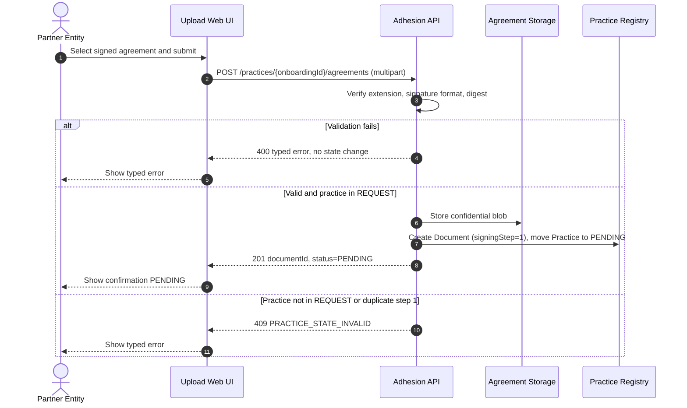

<!--
  Status `ready` is proposed with evidence (trigger, main flow, binary
  acceptance checks on Must, priority, component and contract references,
  domain entities, and typed errors). A human reviewer must confirm the
  promotion before it is treated as final. See design-review.md `ready.use-cases`.
-->

# `UC-01`: Upload signed agreement (step 1)

**Linked JTBD**: `JTBD-01` (PRD `demo/prd.md`)

**Primary actor**: Partner Entity (exact role TBD — representative or delegate; see DR `open.item-003` / PRD OQ-03)

**Secondary actors**: CED Back Office (reviews the practice after upload; out of pilot scope); Documents Archive and Practice Registry (supporting systems)

**Source artifact**: PRD `demo/prd.md`; embryonic blueprint cited by the PRD (no link supplied)

**Service Blueprint step**: Entity upload step. Back-office steps are visible in the blueprint but excluded from the pilot.

**Domain entities**: Practice (states `REQUEST`, `PENDING`), Document (`signingStep`)

**Trigger**: The Partner Entity selects the signed agreement file and submits the upload form.

**Preconditions**:

- A Practice exists in the proposed state `REQUEST` with a known `onboardingId` (assumption `open.item-011`).
- The agreement template and version are not frozen (`open.item-001`); the allowed signature format is not confirmed (`open.item-002`).
- The maximum upload size is not confirmed (`open.item-010`); the processing component treats it as a configuration hook.
- Whether the entity is authenticated in the pilot is not decided (`open.item-004`).

**Main flow**:

1. The Partner Entity selects the signed agreement file in the upload form of the CED Adhesion Portal.
2. The web UI sends a multipart request to the Adhesion API with `onboardingId` and the file.
3. The Agreement processing component verifies the file extension, the signature format, and the digest.
4. The component creates the Document record with `signingStep = 1` and stores the confidential blob in Agreement Storage.
5. The component moves the Practice from `REQUEST` to `PENDING`.
6. The API responds with `documentId` and `status = PENDING`.
7. The web UI shows the confirmation and the practice status `PENDING`.

**Alternate flows**:

- `A1`: If a valid Document with `signingStep = 1` already exists for the same `onboardingId`, the API responds `409` without overwriting the existing document (see `uc-open-01` for the idempotency proposal).

**Exception flows / edge cases**:

- `E1`: The file has a disallowed extension → `AGREEMENT_EXTENSION_INVALID`, no blob written, practice unchanged.
- `E2`: The signature is malformed or does not match the allowed format, or the digest does not match → `AGREEMENT_SIGNATURE_INVALID`, no blob written, practice unchanged.
- `E3`: The Practice is not in `REQUEST` (for example already `PENDING`) → `PRACTICE_STATE_INVALID`, no state change.
- `E4`: The file exceeds the pilot size limit → `AGREEMENT_FILE_TOO_LARGE`, no state change. The limit is not confirmed (`open.item-010`).

**Postconditions**:

- On success: the Document with `signingStep = 1` is persisted, the blob is present, and the Practice is in `PENDING`.
- On failure: the Practice is unchanged, no new blob is written, and the API returns a typed error whose `detail` contains no PII.

**Errors**:

Each error has a stable semantic identifier (`UPPER_SNAKE_CASE`), no owner, and the observable behavior it produces. The wire detail lives in `contracts.item-001`.

- `AGREEMENT_EXTENSION_INVALID`: the uploaded file has a disallowed extension → `400`, no blob written, practice unchanged.
- `AGREEMENT_SIGNATURE_INVALID`: the signature is malformed/invalid or the digest does not match → `400`, no blob written, practice unchanged.
- `PRACTICE_STATE_INVALID`: the Practice is not in `REQUEST`, or a valid `signingStep = 1` already exists → `409`, practice unchanged.
- `AGREEMENT_FILE_TOO_LARGE`: the file exceeds the pilot size limit → `400`, no blob written, practice unchanged.

**Acceptance checks**:

- `AC-01`: Given a Practice in `REQUEST` and a valid signed agreement within the pilot size limit, when the Partner Entity submits the upload, then the Practice becomes `PENDING` and the response returns a `documentId` and `status = PENDING`. Evidence: TBD (end-to-end demo fixture).
- `AC-02`: Given a Practice in `REQUEST` and a file that fails extension or signature validation, when the Partner Entity submits the upload, then the API returns the corresponding typed error (`AGREEMENT_EXTENSION_INVALID` or `AGREEMENT_SIGNATURE_INVALID`) and the Practice state and stored documents are unchanged. Evidence: TBD (negative test).
- `AC-03`: Given a Practice that already has a valid `signingStep = 1` Document, when the Partner Entity submits another step-1 upload, then the API returns `409` with `PRACTICE_STATE_INVALID` and the existing document is not overwritten. Evidence: TBD (concurrency/idempotency test).

**Tracking events**:

- Gap: no tracking event is defined. See the parent DR `open.item-008` (owner Product) rather than repeating the question here.

**Relevant links**:

- Sequence diagram:

- Service Blueprint: N/A — no Service Blueprint artifact was supplied (see DR `references.service-blueprint`; owner Product).
- Figma: N/A — no Figma frame was supplied (see DR `references.figma`).
- DR components: `solution.components.item-001` (agreement processing), `solution.components.item-003` (practice registry), `solution.components.item-004` (agreement storage), `solution.components.item-005` (telemetry).
- Endpoint / OpenAPI / Data Contract: `contracts.item-001`, `uploadSignedAgreement`, `POST /practices/{onboardingId}/agreements` — [`../openapi.yaml`](../openapi.yaml). The status read used by the UI is `getPractice`, `GET /practices/{onboardingId}`.
- Validation evidence: TBD — demo fixtures and negative tests to be added with the repository (`open.item-005`).

## Open questions and propagation

Questions that are local to this behavior only. Do not repeat a question that
already lives in the parent DR/SRS: reference its `open.item-XX` instead.
Cross-Use-Case or initiative questions belong to the parent document.

| ID           | Type                | Item                                                                                                   | Impact / blocker                                                        | Owner   | Resolution / link                                |
| ------------ | ------------------- | ------------------------------------------------------------------------------------------------------ | ----------------------------------------------------------------------- | ------- | ------------------------------------------------ |
| `uc-open-01` | proposed decision   | Should a repeated valid `signingStep = 1` upload be idempotent (`200`) or rejected (`409`)? Proposed `409`. | Determines `AC-03` and the API contract response for the alternate flow | Product | TBD — proposed `409` in this UC                   |
