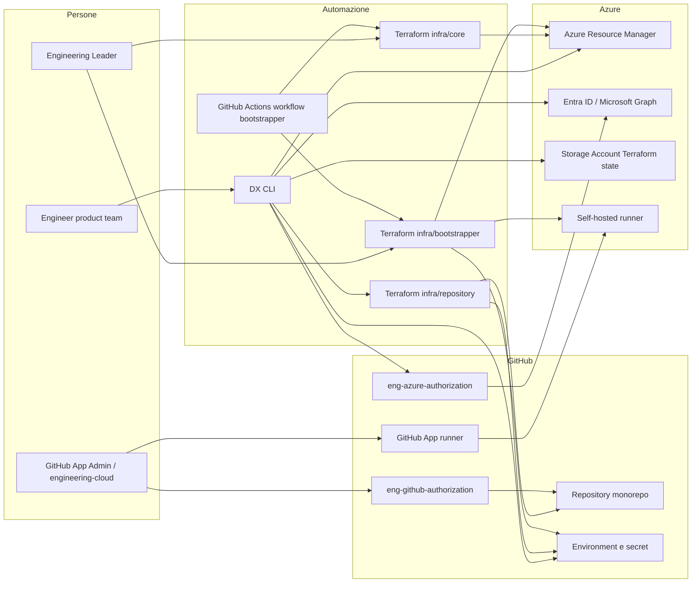
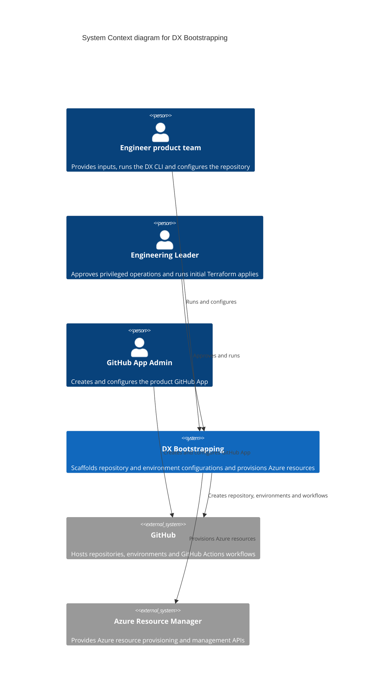
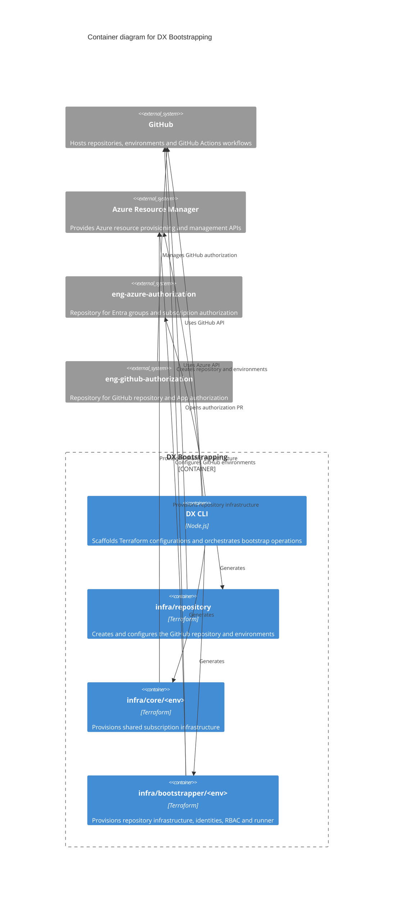
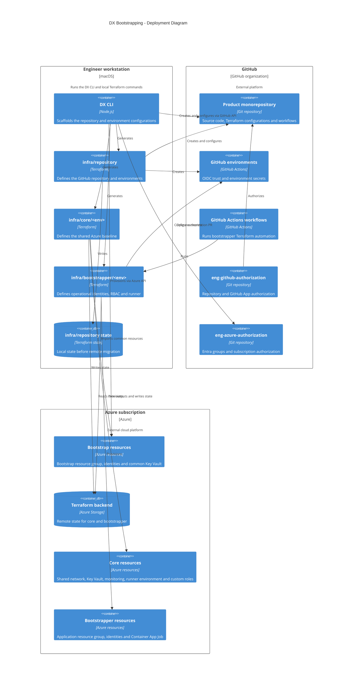
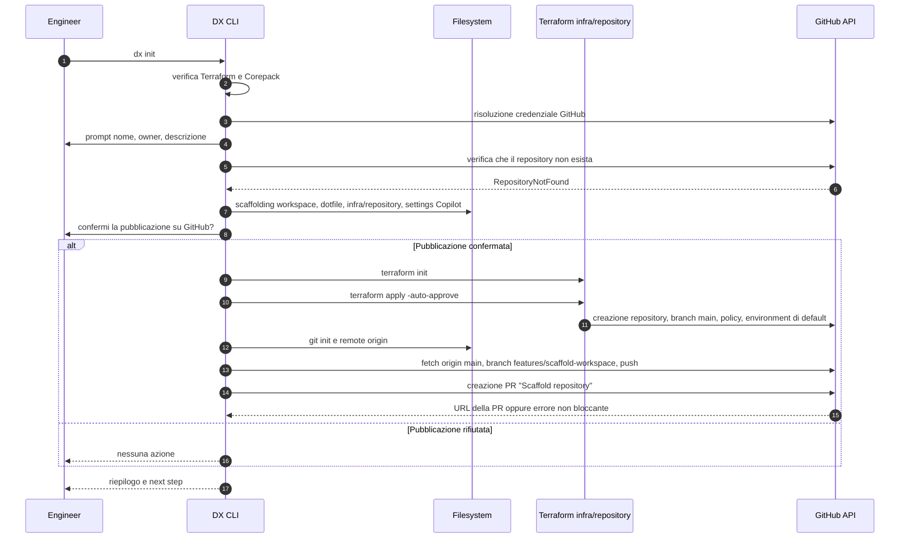
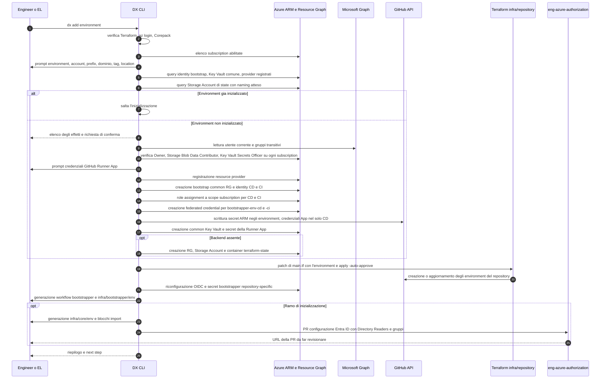
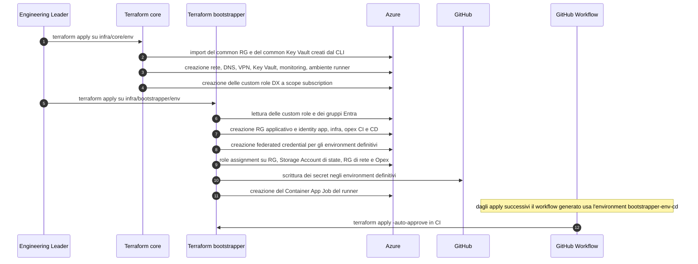
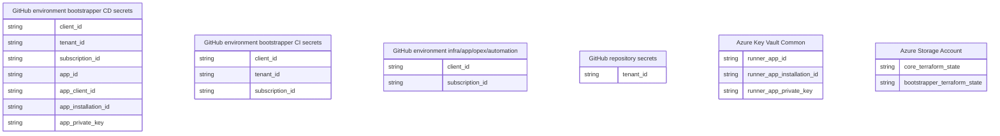
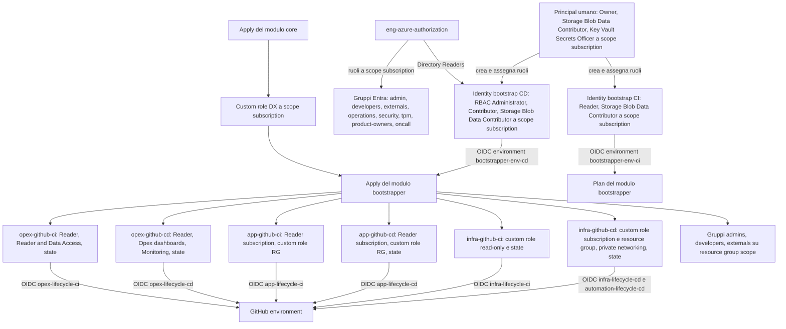

# Design Review — Bootstrapping DX su Azure

## L'esigenza

Il framework DX nasce perché, prima della sua esistenza, il bootstrap di un nuovo prodotto o repository era un'attività **interamente manuale e non normata**.
Infatti, non esistevano né una sequenza condivisa né regole comuni su naming, scope dei ruoli e confini di responsabilità. Le conseguenze dirette erano:

- **errori**: risorse create con naming divergente, ruoli assegnati a scope più ampi del necessario o mancanti, federated credential con subject sbagliato, secret non allineati fra Azure e GitHub;
- **configurazioni duplicate**: ogni repository riscriveva gli stessi blocchi Terraform e gli stessi workflow, che poi divergevano nel tempo;
- **risultati non uniformi**: due prodotti apparentemente identici arrivavano a topologie diverse, rendendo impossibile ragionare per convenzione;
- **troubleshooting difficile**: senza una convenzione condivisa, il debug di un fallimento richiedeva di ricostruire caso per caso.
  Il framework DX esiste per sostituire questo processo manuale con un **golden path** eseguibile, ripetibile, testabile e verificabile.

## L'esito atteso dell'iniziativa

- **Standardizzare** la topologia di bootstrap: stessa struttura di repository, stessi nomi di risorsa, stessi GitHub environment e stessi confini di ruolo per tutti i prodotti.
- **Automatizzare** i passaggi meccanici: scaffolding del monorepo, creazione delle risorse di bootstrap, configurazione OIDC e secret, generazione dei moduli Terraform e dei workflow.
- **Ridurre errori e duplicazioni** spostando la logica ricorrente dentro moduli versionati anziché dentro copie locali.
- **Rendere esplicite responsabilità e controlli**: chi esegue, chi approva, chi possiede il desired state, quale gate resta umano.
- **Abilitare il troubleshooting** grazie a naming deterministico e a una separazione netta fra stato locale, stato Terraform remoto, configurazione GitHub e configurazione Entra/RBAC.

## Attori del sistema

| Attore                                                                       | Responsabilità nel flusso                                                                                                                                                                                                                       |
| ---------------------------------------------------------------------------- | ----------------------------------------------------------------------------------------------------------------------------------------------------------------------------------------------------------------------------------------------- |
| **Engineer del product team**                                                | Raccoglie gli input (subscription, environment, prefix, dominio, tag), esegue `dx init` e `dx add environment`, revisiona gli artefatti generati, apre o completa le PR manuali, svolge il troubleshooting di primo livello.                    |
| **Engineering Leader (EL)**                                                  | Nel flusso AS-IS esegue o approva le operazioni privilegiate: dispone dei ruoli richiesti sulle subscription, coordina e in genere esegue gli apply iniziali di `core` e `bootstrapper` (`apps/website/docs/monorepository-setup.mdx:244-285`). |
| **DX Team**                                                                  | Mantiene CLI, template, moduli Terraform, action/workflow riusabili, convenzioni e documentazione; è owner delle correzioni ai gap rilevati.                                                                                                    |
| **DX CLI** (`apps/cli`)                                                      | Orchestra precondition, prompt, discovery, provisioning diretto via SDK, scaffolding, sincronizzazione GitHub e apertura best-effort della PR di autorizzazione Azure.                                                                          |
| **Principal locale Azure CLI**                                               | È il vero _grantor_ delle risorse e degli assignment creati direttamente dal CLI. Il controllo dei suoi permessi considera anche i gruppi Entra transitivi (`apps/cli/src/adapters/azure/cloud-account-service.ts:925-968`).                    |
| **Credenziale GitHub dell'utente**                                           | Crea repository, branch e PR, environment e secret GitHub, e modifica il repository esterno di autorizzazione Azure. Risolta da `GH_TOKEN` → `GITHUB_TOKEN` → `gh auth login` (`apps/website/docs/dx-cli/requirements.md`).                     |
| **GitHub organization e repository target**                                  | Ospitano monorepo, branch iniziale, PR di scaffolding, environment CI/CD, secret, policy di branch e workflow.                                                                                                                                  |
| **GitHub App del prodotto**                                                  | Autentica e gestisce i self-hosted runner. Le sue credenziali (App ID, Client ID, Installation ID, private key PEM) sono input obbligatori di `add environment` in fase di inizializzazione.                                                    |
| **GitHub App Admin / team `engineering-cloud`**                              | Crea e governa la GitHub App e approva le modifiche al relativo repository di autorizzazione (`apps/website/docs/monorepository-setup.mdx:118-185`).                                                                                            |
| **`eng-github-authorization` e relativi CODEOWNER**                          | Registrano repository, team/collaborator e associazione del repository alla GitHub App tramite PR esterna e pipeline dedicata.                                                                                                                  |
| **Azure Resource Manager e Microsoft Graph / Entra ID**                      | Espongono subscription, gruppi transitivi, resource provider, resource group, managed identity, federated credential e RBAC.                                                                                                                    |
| **`eng-azure-authorization` e relativi CODEOWNER**                           | Creano/aggiornano gruppi Entra, membership, ruoli a scope subscription e la lista Directory Readers dopo il merge della PR.                                                                                                                     |
| **Pipeline di autorizzazione Azure**                                         | Esegue `plan` sulla PR e `apply` su `main`, applicando la configurazione della subscription contenuta in `src/azure-subscriptions/subscriptions/<subscription>/terraform.tfvars.json`.                                                          |
| **Modulo `github-environment-bootstrap`** (`infra/repository`)               | Crea e governa repository GitHub, environment, branch protection e workflow permission (`infra/modules/github_environment_bootstrap`). Il suo state nasce **locale** e va migrato.                                                              |
| **Modulo `azure-core-infra`** (`infra/core/<env>`)                           | Crea la baseline condivisa: resource group `common`/`network`/`github-runner`/`opex`, rete, VPN/DNS, Key Vault, Log Analytics, Application Insights, ambiente runner e **custom role DX** (`infra/modules/azure_core_infra/main.tf`).           |
| **Modulo `azure-github-environment-bootstrap`** (`infra/bootstrapper/<env>`) | Crea il resource group applicativo, le identity app/infra/opex CI/CD, i federated credential, i secret GitHub, il runner e i role assignment mirati (`infra/modules/azure_github_environment_bootstrap`).                                       |
| **Managed identity bootstrap CI/CD**                                         | Create direttamente dal CLI per rendere eseguibile il workflow `bootstrapper` prima che esistano le identity definitive del modulo.                                                                                                             |
| **Managed identity app/infra/opex CI/CD**                                    | Create dal modulo `bootstrapper`; sono i principal operativi dei workflow steady-state.                                                                                                                                                         |
| **Terraform backend Azure**                                                  | Conserva state e lock di `core` e `bootstrapper`; è creato direttamente dal CLI se assente (`cloud-account-service.ts:511-614`).                                                                                                                |
| **Self-hosted GitHub runner**                                                | Esegue workload con accesso alla rete privata; creato dal modulo `bootstrapper` riusando l'ambiente Container App e il Key Vault predisposti.                                                                                                   |

### Diagramma di system context

## Casi d'uso

### Must have

| Caso d'uso                                                   | Descrizione                                                                                                                                                               | Evidenza                                                               |
| ------------------------------------------------------------ | ------------------------------------------------------------------------------------------------------------------------------------------------------------------------- | ---------------------------------------------------------------------- |
| Creazione di un nuovo monorepository                         | `dx init` genera workspace, dotfile e `infra/repository`, opzionalmente crea il repository GitHub, il branch `features/scaffold-workspace` e la PR `Scaffold repository`. | `apps/cli/src/adapters/commander/commands/init.ts:564-609`             |
| Inizializzazione di una subscription nuova                   | `dx add environment` registra i provider, crea bootstrap RG, identity CD/CI, OIDC, secret, Key Vault e, se serve, il backend Terraform.                                   | `apps/cli/src/adapters/azure/cloud-account-service.ts:315-462`         |
| Aggiunta di un environment su subscription già inizializzata | Il ramo "initialized" salta l'inizializzazione ma riconfigura comunque OIDC e secret, perché sono repository-specific, e genera solo il `bootstrapper`.                   | `apps/cli/src/adapters/plop/generators/environment/actions.ts:78-108`  |
| Multi-subscription per lo stesso environment                 | Selezione di più cloud account con location per account; il backend è ospitato su una sola subscription.                                                                  | `apps/cli/src/adapters/plop/generators/environment/prompts.ts:496-509` |
| Re-run / retry                                               | Le azioni di scaffolding usano `addMany` con `force: true` e le risorse Azure usano `createOrUpdate`, rendendo la maggior parte del flusso ri-eseguibile.                 | `apps/cli/src/adapters/plop/generators/environment/actions.ts:26-48`   |
| Onboarding di un nuovo team su un prodotto esistente         | Riuso della GitHub App e dei gruppi Entra già esistenti, con solo il ramo repository-specific da eseguire.                                                                | `apps/website/docs/monorepository-setup.mdx:121-136`                   |

### Nice to have

| Caso d'uso                                                                            | Stato attuale                                                                                                                                                           |
| ------------------------------------------------------------------------------------- | ----------------------------------------------------------------------------------------------------------------------------------------------------------------------- |
| Migrazione automatica dello state di `infra/repository` sul backend remoto            | Non implementata: la migrazione è un passo manuale documentato (`apps/website/docs/monorepository-setup.mdx:221-242`).                                                  |
| Apply automatico di `core`                                                            | Non implementato: il CLI genera `infra/core/<env>` ma **non** un workflow dedicato (`apps/cli/templates/environment/workflow/` contiene solo il template bootstrapper). |
| Registrazione automatica del repository su `eng-github-authorization`                 | Non implementata: resta una PR manuale (`apps/website/docs/monorepository-setup.mdx:287-298`).                                                                          |
| Controlli di coerenza post-bootstrap (ruoli, secret, gruppi effettivamente allineati) | Non implementati: la detection di "initialized" verifica solo presenza di risorse e provider (`cloud-account-service.ts:464-509`).                                      |

## Vincoli normativi

Nel repository **non sono documentati vincoli normativi o legali espliciti** (es. GDPR, PCI-DSS) specifici del processo di bootstrap. Non ne vengono quindi ipotizzati.

Esistono invece **vincoli di governance interna**, che il sistema tratta come gate di processo e che è corretto rappresentare come requisiti non funzionali:

- **Least privilege come principio dichiarato**: i ruoli operativi definitivi sono modellati come custom role composte e assegnate a scope circoscritti (`infra/modules/azure_core_infra/modules/custom_roles/custom_roles.tf`, `infra/modules/azure_github_environment_bootstrap/id_*_iam.tf`).
- **Segregazione dei compiti**: la creazione dei gruppi Entra e l'assegnazione dei ruoli a scope subscription sono riservate al repository di autorizzazione e ai suoi CODEOWNER; l'apply iniziale di `core`/`bootstrapper` richiede permessi elevati riservati all'EL (`apps/website/docs/monorepository-setup.mdx:73-79`, `:244-258`).
- **Secret handling**: le credenziali della GitHub App sono leggibili solo dagli App Administrator; il CLI le scrive come GitHub environment secret e come secret di Key Vault, mai come file nel repository (`cloud-account-service.ts:1014-1092`).
- **Auditabilità**: ogni modifica al desired state organizzativo (gruppi, Directory Readers, censimento repository, associazione GitHub App) passa da una PR revisionata; le risorse create dal CLI sono taggate `CreatedBy = "DX CLI"` (`cloud-account-service.ts:346-353`).

## Caratteristiche del sistema

- **Idempotenza parziale**: `createOrUpdate` su resource group, managed identity, federated credential e Key Vault; `addMany` con `force: true` sui template; `terraform apply` idempotente. Non idempotenti in senso stretto sono i passaggi git/PR di `dx init` e le PR verso i repository di autorizzazione, che però hanno logica di no-op (`azure-authorization.ts:281-287`).
- **Branching condizionale**: l'intero flusso di `add environment` si biforca sullo stato `initialized` calcolato per ogni subscription. Solo il ramo non inizializzato produce `infra/core/<env>`, gli import block e la PR di autorizzazione Azure.
- **Naming deterministico**: tutti i nomi derivano da `prefix`, `env_short` (`d`/`u`/`p`), `location_short`, dominio e instance number. Esempi: `<prefix>-<env>-<loc>-common-rg-01`, `<prefix>-<env>-<loc>-bootstrap-id-01`, `<prefix><env><loc>tfstatest01`, chiave di state `<prefix>/<domain>/<scope>.tfstate` (`cloud-account-service.ts:344`, `:366-367`, `:562`; `apps/cli/src/adapters/plop/helpers/terraform-state-key.ts:29-42`).
- **Environment tenant-qualified**: il CLI accetta `dev`/`uat`/`prod` oppure `<tenant>-<lifecycle>` (es. `ced-prod`), mappando comunque sullo short code del lifecycle (`apps/cli/src/domain/environment.ts:9-70`).
- **Rollback parziale**: se l'inizializzazione di una subscription fallisce, il CLI elimina il bootstrap common RG creato/usato dal flusso; se fallisce la creazione del container di state, elimina il relativo RG (`cloud-account-service.ts:451-461`, `:595-606`).
- **Dipendenze esterne bloccanti**: GitHub App esistente e credenziali disponibili, gruppi Entra esistenti, merge delle PR nei repository di autorizzazione, apply iniziali privilegiati.
- **Solo Azure**: `add environment` supporta unicamente il CSP `azure` (`apps/cli/src/domain/cloud-account.ts`), anche se esistono moduli Terraform AWS nel repository.

## Service Level Objective

**TBD**

Non esistono SLO definiti per il processo di bootstrap nel repository né nella documentazione pubblica. Questa sezione è volutamente lasciata a `TBD` e non propone target: qualunque soglia indicata qui sarebbe un'invenzione non supportata da evidenze.

## Make or buy

| Componente                                                                                                                                                   | Scelta                                                         | Motivazione osservabile                                                                                                                                           |
| ------------------------------------------------------------------------------------------------------------------------------------------------------------ | -------------------------------------------------------------- | ----------------------------------------------------------------------------------------------------------------------------------------------------------------- |
| DX CLI (`apps/cli`)                                                                                                                                          | **Build**                                                      | Nessun tool di mercato copre la sequenza PagoPA-specifica: discovery subscription, gruppi Entra di prodotto, repository di autorizzazione, GitHub App per runner. |
| Moduli Terraform `azure-core-infra`, `azure-github-environment-bootstrap`, `github-environment-bootstrap`, `azure-merge-roles`, runner su Container App Jobs | **Build** (pubblicati su Terraform Registry sotto `pagopa-dx`) | Incapsulano convenzioni interne di naming, ruoli e topologia; il versioning permette rollout controllati.                                                         |
| Action e workflow riusabili (`actions/`, `.github/workflows/release-terraform-bootstrapper-v1.yaml`)                                                         | **Build**                                                      | Standardizzano login OIDC, setup Terraform, plan sanitizzato e commenti su PR.                                                                                    |
| Terraform, provider `azurerm`/`azuread`/`github`, provider custom `pagopa-dx/azure`                                                                          | **Buy/adopt** (il provider `dx` è build interno)               | Terraform è lo standard IaC adottato; il provider custom espone solo le funzioni di naming.                                                                       |
| GitHub Actions, GitHub Environments/Secrets, GitHub App, OIDC                                                                                                | **Buy/adopt**                                                  | Piattaforma CI/CD già in uso a livello organizzativo.                                                                                                             |
| Azure (ARM, Entra ID, Key Vault, Storage, Container Apps, Log Analytics)                                                                                     | **Buy/adopt**                                                  | Cloud target.                                                                                                                                                     |
| Nx + pnpm come orchestratori di monorepo                                                                                                                     | **Buy/adopt**                                                  | Scelta esplicita rispetto a un orchestratore proprietario; lo scaffolding genera `nx.json` e `pnpm-workspace.yaml` (`apps/cli/templates/monorepo/`).              |
| Librerie OSS del CLI (`commander`, `inquirer`, `node-plop`, `zod`, `neverthrow`, SDK Azure, `octokit`)                                                       | **Buy/adopt**                                                  | Componenti generici, nessun valore differenziante nel riscriverli.                                                                                                |

## Design di alto livello

Il sistema di bootstrap è composto da quattro piani distinti:

1. **Piano di orchestrazione locale** — il DX CLI, che raccoglie input, interroga Azure e GitHub, decide il ramo di esecuzione e produce sia risorse cloud sia file.
2. **Piano di provisioning diretto** — le chiamate SDK/API che creano ciò che serve _prima_ che Terraform possa girare: provider registrati, bootstrap RG, identity CD/CI, OIDC, secret, Key Vault, backend di state.
3. **Piano dichiarativo Terraform** — tre configurazioni con cicli di vita separati: `infra/repository` (GitHub), `infra/core/<env>` (baseline Azure condivisa), `infra/bootstrapper/<env>` (identità operative, RBAC, runner, secret).
4. **Piano di desired state organizzativo** — i repository `eng-azure-authorization` ed `eng-github-authorization`, che restano la fonte di verità per gruppi Entra, ruoli a scope subscription, Directory Readers, censimento repository e associazione della GitHub App.

> **Nota evolutiva Nx (stato futuro, non implementato)**
> Quando tutti i team saranno migrati ai workflow Nx, l'ordine cambia: la **registrazione GitHub esterna** verrà eseguita **prima** degli apply, così che i workflow Nx possano applicare automaticamente sia `core` sia `bootstrapper`, eliminando gli apply manuali dell'EL. Nel flusso attuale l'ordine è invece: apply `core` → apply `bootstrapper` → registrazione GitHub.

## Servizi cloud

| Piattaforma | Servizio                                                                           | Uso nel bootstrap                                                                                                                                                             | Creato da                                             |
| ----------- | ---------------------------------------------------------------------------------- | ----------------------------------------------------------------------------------------------------------------------------------------------------------------------------- | ----------------------------------------------------- |
| Azure       | Resource Group                                                                     | `<prefix>-<env>-<loc>-common-rg-01` (bootstrap), `<prefix>-<env>-<loc>-tfstate-rg-01`, `common`/`network`/`github-runner`/`opex` di `core`, RG applicativo del `bootstrapper` | CLI + `core` + `bootstrapper`                         |
| Azure       | Managed Identity (user-assigned)                                                   | bootstrap CD/CI; app/infra/opex CD/CI                                                                                                                                         | CLI + `bootstrapper`                                  |
| Azure       | Federated Identity Credential                                                      | trust OIDC con i GitHub environment                                                                                                                                           | CLI + `bootstrapper`                                  |
| Azure       | Key Vault                                                                          | `<prefix>-<env>-<loc>-common-kv-01` con i secret della GitHub Runner App; Key Vault di `core` (RBAC, private endpoint)                                                        | CLI (poi importato da `core`)                         |
| Azure       | Storage Account + Blob container `terraform-state`                                 | backend remoto di `core` e `bootstrapper`                                                                                                                                     | CLI                                                   |
| Azure       | Virtual Network, subnet, Private DNS Zone, NAT Gateway, VPN Gateway, DNS forwarder | rete privata e risoluzione nomi                                                                                                                                               | `core`                                                |
| Azure       | Log Analytics Workspace, Application Insights                                      | osservabilità di base                                                                                                                                                         | `core`                                                |
| Azure       | Container App Environment + Container App Job                                      | self-hosted GitHub runner                                                                                                                                                     | `core` (ambiente) + `bootstrapper` (job)              |
| Azure       | Custom role definition a scope subscription                                        | bundle di ruoli DX App/Infra CI/CD                                                                                                                                            | `core` (`modules/custom_roles`)                       |
| Entra ID    | Gruppi, membership, Directory Readers                                              | governance degli accessi umani e lookup directory delle identity                                                                                                              | `eng-azure-authorization`                             |
| GitHub      | Repository, branch protection, autolink, workflow permission                       | governance del monorepo                                                                                                                                                       | modulo `github-environment-bootstrap`                 |
| GitHub      | Environment e Actions secret                                                       | trust OIDC e configurazione dei workflow                                                                                                                                      | CLI + `github-environment-bootstrap` + `bootstrapper` |
| GitHub      | GitHub App                                                                         | autenticazione del runner self-hosted                                                                                                                                         | App Admin (manuale)                                   |
| GitHub      | Actions (OIDC)                                                                     | esecuzione di plan/apply                                                                                                                                                      | Piattaforma                                           |

## Vista statica delle componenti

### Diagramma delle dipendenze

### Diagramma delle componenti

### Diagramma dell'architettura

## Vista dinamica delle componenti

### Sequenza di `dx init`

### Sequenza di `dx add environment`

### Sequenza degli apply iniziali e della transizione alle identity definitive

## Data layer

Non esiste un database applicativo. Il diagramma mostra solo quali e dove sono i dati generati e persistiti dal bootstrap.

NOTE:

- `tenant_id` è duplicato: CLI lo scrive negli environment `bootstrapper` CI/CD, il modulo `bootstrapper` lo scrive come repository secret.
- Le credenziali GitHub App (`app_id`, `app_client_id`, `app_installation_id`, `app_private_key`) esistono solo nell'environment `bootstrapper` CD.
- Il Key Vault Common conserva solo `runner_app_id`, `runner_app_installation_id` e `runner_app_private_key`. Manca `app_client_id`, presente invece su GitHub.
- Due writer diversi configurano i secret GitHub: CLI per `bootstrapper-*`, Terraform per repository secret e environment `infra`/`app`/`opex`/`automation`.

## Inventario degli artefatti

### Generati da `dx init`

| Artefatto                                      | Nome file                                                                                                  |
| ---------------------------------------------- | ---------------------------------------------------------------------------------------------------------- |
| Workspace Nx + pnpm                            | `nx.json`, `pnpm-workspace.yaml`, `package.json`                                                           |
| Version pin                                    | `.node-version`, `.terraform-version`                                                                      |
| Dotfile di qualità e sicurezza                 | `.pre-commit-config.yaml`, `.tflint.hcl`, `.trivyignore`, `.editorconfig`, `.prettierignore`, `.gitignore` |
| README                                         | `README.md`                                                                                                |
| Configurazione Terraform del repository GitHub | `infra/repository/main.tf`, `infra/repository/outputs.tf`, `infra/repository/providers.tf`                 |
| Configurazione marketplace/plugin Copilot      | `.github/copilot/settings.json`                                                                            |

### Generati da `dx add environment`

| Artefatto                                                               | Condizione                    |
| ----------------------------------------------------------------------- | ----------------------------- |
| `infra/bootstrapper/<env>/{data,main,providers}.tf`                     | Sempre                        |
| `infra/bootstrapper/<env>/{backend,locals}.tf`                          | Sempre                        |
| `.github/workflows/_release-terraform-apply-bootstrapper-<env>.yaml`    | Sempre                        |
| `infra/core/<env>/{main,outputs,providers}.tf`                          | Solo ramo di inizializzazione |
| `infra/core/<env>/imports.tf` con import block di common RG e Key Vault | Solo ramo di inizializzazione |
| Modifica in-place di `infra/repository/main.tf` (lista `environments`)  | Sempre                        |

### Creati da DX CLI

| Artefatto                                                                       |
| ------------------------------------------------------------------------------- |
| Repository GitHub, branch iniziale e PR di scaffolding (via Terraform e API)    |
| Registrazione dei 16 resource provider richiesti                                |
| Bootstrap common RG `<prefix>-<env>-<loc>-common-rg-01`                         |
| Managed identity `…-bootstrap-id-01` (CD) e `…-bootstrap-ci-id-01` (CI)         |
| Role assignment a scope subscription per le identity di bootstrap               |
| Federated credential OIDC per `bootstrapper-<env>-cd` e `-ci`                   |
| Secret negli environment GitHub `bootstrapper-<env>-ci/cd`                      |
| Common Key Vault e secret della Runner App                                      |
| Backend Terraform: RG, Storage Account, container `terraform-state`             |
| Apply automatico di `infra/repository` per creare/sincronizzare gli environment |
| PR su `eng-azure-authorization`                                                 |

### Non generati / manuali o esterni

| Passaggio                                                                                 | Owner                            |
| ----------------------------------------------------------------------------------------- | -------------------------------- |
| Creazione della GitHub App e recupero delle credenziali                                   | App Admin / `engineering-cloud`  |
| Creazione dei gruppi Entra e delle membership umane                                       | Team di autorizzazione Azure     |
| Review, approvazione e merge delle PR nei repository di autorizzazione                    | CODEOWNER                        |
| Apply iniziale di `infra/core/<env>` (nessun workflow generato)                           | EL                               |
| Apply iniziale di `infra/bootstrapper/<env>`                                              | EL (poi workflow)                |
| Migrazione dello state di `infra/repository` al backend remoto                            | Engineer                         |
| Registrazione del repository e associazione alla GitHub App su `eng-github-authorization` | Product team + App Admin         |
| Implementazione dei plugin Copilot abilitati dallo scaffolding                            | DX Team (repository `pagopa/dx`) |
| Codice applicativo e infrastruttura di prodotto (`infra/resources`)                       | Product team                     |

## Matrice RBAC

Legenda scope: `SUB` = subscription, `RG` = resource group, `RES` = risorsa singola, `DIR` = directory Entra.

### Permessi richiesti per nuovo ambiente (solo EL)

| Meccanismo                                                       | Principal                              | Ruolo                                                                 | Scope                                     | Momento                                | Owner della modifica      |
| ---------------------------------------------------------------- | -------------------------------------- | --------------------------------------------------------------------- | ----------------------------------------- | -------------------------------------- | ------------------------- |
| Assegnazione preesistente, diretta o via gruppo Entra transitivo | Utente che esegue `dx add environment` | `Owner`, `Storage Blob Data Contributor`, `Key Vault Secrets Officer` | `SUB` (tutte le subscription selezionate) | Verificato prima dell'inizializzazione | `eng-azure-authorization` |

### Grant assegnati direttamente dalla DX CLI alle identity di bootstrap

| Principal              | Ruolo                                                                               | Scope            | Momento                                                     |
| ---------------------- | ----------------------------------------------------------------------------------- | ---------------- | ----------------------------------------------------------- |
| `…-bootstrap-id-01`    | `Role Based Access Control Administrator`                                           | `SUB`            | Inizializzazione Azure                                      |
| `…-bootstrap-id-01`    | `Contributor`                                                                       | `SUB`            | Inizializzazione Azure                                      |
| `…-bootstrap-id-01`    | `Storage Blob Data Contributor`                                                     | `SUB`            | Inizializzazione Azure                                      |
| `…-bootstrap-ci-id-01` | `Reader`                                                                            | `SUB`            | Inizializzazione Azure                                      |
| `…-bootstrap-ci-id-01` | `Storage Blob Data Contributor`                                                     | `SUB`            | Inizializzazione Azure                                      |
| CD e CI di bootstrap   | Trust OIDC, subject `repo:<owner>/<repo>:environment:bootstrapper-<env>-cd` / `-ci` | `RES` (identity) | Inizializzazione Azure e configurazione GitHub environments |

Nota: il nome del federated credential include un suffisso derivato dal repository, così repository diversi possono condividere la stessa identity senza sovrascriversi.

### Grant assegnati tramite `eng-azure-authorization`

| Meccanismo                                  | Principal                                     | Ruolo                                                                                                                                                       | Scope | Momento                | Owner                                      |
| ------------------------------------------- | --------------------------------------------- | ----------------------------------------------------------------------------------------------------------------------------------------------------------- | ----- | ---------------------- | ------------------------------------------ |
| PR aperta dal CLI + merge su `main` + apply | `…-bootstrap-id-01` (CD)                      | Appartenenza a **Directory Readers**                                                                                                                        | `DIR` | Dopo il merge della PR | CODEOWNER del repository di autorizzazione |
| Idem                                        | Gruppo `<prefix>-<envShort>-adgroup-admin`    | `Owner`                                                                                                                                                     | `SUB` | Idem                   | CODEOWNER                                  |
| Idem                                        | Gruppo `…-adgroup-developers`                 | `Owner`                                                                                                                                                     | `SUB` | Idem                   | CODEOWNER                                  |
| Idem                                        | Gruppo `…-adgroup-externals`                  | `Owner`                                                                                                                                                     | `SUB` | Idem                   | CODEOWNER                                  |
| Idem                                        | Gruppo `…-adgroup-operations`                 | `Reader`, `Monitoring Contributor`, `Support Request Contributor`, `Storage Blob Data Reader`, `Storage Queue Data Reader`, `Cosmos DB Account Reader Role` | `SUB` | Idem                   | CODEOWNER                                  |
| Idem                                        | Gruppo `…-adgroup-security`                   | `Reader`, `Support Request Contributor`                                                                                                                     | `SUB` | Idem                   | CODEOWNER                                  |
| Idem                                        | Gruppo `…-adgroup-technical-project-managers` | `Reader`, `Monitoring Contributor`, `Support Request Contributor`                                                                                           | `SUB` | Idem                   | CODEOWNER                                  |
| Idem                                        | Gruppo `…-adgroup-product-owners`             | `Reader`, `Support Request Contributor`                                                                                                                     | `SUB` | Idem                   | CODEOWNER                                  |
| Idem                                        | Gruppo `…-adgroup-oncall`                     | `Reader`, `Monitoring Contributor`, `Support Request Contributor`, `Storage Blob Data Reader`, `Storage Queue Data Reader`, `Cosmos DB Account Reader Role` | `SUB` | Idem                   | CODEOWNER                                  |

Il CLI **preserva** i membri esistenti e i gruppi custom, aggiornando solo i ruoli dei gruppi standard e aggiungendo quelli mancanti con lista membri vuota.

### Custom role create da `core` (definizione, non assegnazione)

| Meccanismo                           | Custom role                                                           | Ruoli sorgente uniti                                                                                                                                                                               | Scope di definizione |
| ------------------------------------ | --------------------------------------------------------------------- | -------------------------------------------------------------------------------------------------------------------------------------------------------------------------------------------------- | -------------------- |
| modulo `pagopa-dx/azure-merge-roles` | ` DX App CD Resource Groups`                                     | Website Contributor, CDN Profile Contributor, Container Apps Contributor, Storage Blob Data Contributor, PagoPA Static Web Apps List Secrets                                                       | `SUB`                |
| modulo `pagopa-dx/azure-merge-roles` | ` DX App CI Resource Groups`                                     | PagoPA IaC Reader, PagoPA Static Web Apps List Secrets                                                                                                                                             | `SUB`                |
| modulo `pagopa-dx/azure-merge-roles` | ` DX Infra CD Private Networking`                                | Private DNS Zone Contributor, Network Contributor                                                                                                                                                  | `SUB`                |
| modulo `pagopa-dx/azure-merge-roles` | ` DX Infra CD Resource Groups`                                   | Contributor, User Access Administrator, Key Vault Secrets/Certificates/Crypto Officer, Storage Blob/Queue/Table Data Contributor, Container Apps Contributor                                       | `SUB`                |
| modulo `pagopa-dx/azure-merge-roles` | ` DX Infra CD Subscription`                                      | Reader, Role Based Access Control Administrator, Log Analytics Contributor, Azure Service Bus Data Owner, API Management Service Contributor + action aggiuntive su NAT Gateway e Private Endpoint | `SUB`                |
| modulo `pagopa-dx/azure-merge-roles` | ` DX Infra CI Subscription`, ` DX Infra CI Resource Groups` | Bundle di sola lettura per il piano CI                                                                                                                                                             | `SUB`                |

Le custom role sono **definite** da `core` e **assegnate** da `bootstrapper`, che le risolve con `data "azurerm_role_definition"` a scope subscription.

### Grant assegnati dal modulo `bootstrapper`

| Principal                           | Ruolo                                                                     | Scope                                             |
| ----------------------------------- | ------------------------------------------------------------------------- | ------------------------------------------------- |
| Gruppo `admins`                     | `Owner`                                                                   | `RG` principale + `additional_resource_group_ids` |
| Gruppo `admins`                     | `Key Vault Data Access Administrator`                                     | Stessi RG                                         |
| Gruppo `admins`                     | `Key Vault Administrator`                                                 | Stessi RG                                         |
| Gruppo `developers`                 | `Contributor`                                                             | Stessi RG                                         |
| Gruppo `developers`                 | `Key Vault Secrets Officer`                                               | Stessi RG                                         |
| Gruppo `externals` (opzionale)      | `Reader`                                                                  | Stessi RG                                         |
| `infra-github-cd`                   | custom role `DX Infra CD Subscription`                                    | `SUB`                                             |
| `infra-github-cd`                   | custom role `DX Infra CD Resource Groups`                                 | RG principale + aggiuntivi                        |
| `infra-github-cd`                   | custom role `DX Infra CD Private Networking`                              | `RG` di rete creato da `core`                     |
| `infra-github-cd`                   | `Storage Blob Data Contributor`                                           | `RES` Storage Account di state                    |
| `infra-github-ci`                   | custom role `DX Infra CI Subscription`                                    | `SUB`                                             |
| `infra-github-ci`                   | custom role `DX Infra CI Resource Groups`                                 | RG principale + aggiuntivi                        |
| `infra-github-ci`                   | `Storage Blob Data Contributor`                                           | `RES` Storage Account di state                    |
| `app-github-cd`                     | `Reader`                                                                  | `SUB`                                             |
| `app-github-cd`                     | custom role `DX App CD Resource Groups`                                   | RG principale + aggiuntivi                        |
| `app-github-cd`                     | `Storage Blob Data Contributor`                                           | `RES` Storage Account di state                    |
| `app-github-ci`                     | `Reader`                                                                  | `SUB`                                             |
| `app-github-ci`                     | custom role `DX App CI Resource Groups`                                   | RG principale + aggiuntivi                        |
| `opex-github-ci`                    | `Reader`, `Reader and Data Access`                                        | `SUB`                                             |
| `opex-github-cd`                    | `Reader`                                                                  | `SUB`                                             |
| `opex-github-ci` e `opex-github-cd` | `Storage Blob Data Contributor` (+ `Reader and Data Access` per CD)       | `RES` Storage Account di state                    |
| `opex-github-cd`                    | `PagoPA Opex Dashboards Contributor`, `Monitoring Contributor`            | `RG` Opex creato da `core`                        |
| Identity app/infra/opex             | Federated credential verso gli environment `<piano>-<lifecycle>-<ci\|cd>` | `RES` identity                                    |

### Grant speciali generati dal template CLI (solo ramo di inizializzazione)

| Meccanismo                                  | Principal         | Ruolo                       | Scope                                            |
| ------------------------------------------- | ----------------- | --------------------------- | ------------------------------------------------ |
| `azurerm_role_assignment` nel file generato | `infra-github-cd` | `User Access Administrator` | `RG` common creato dal CLI e importato da `core` |
| Idem                                        | `infra-github-cd` | `Key Vault Secrets Officer` | `RES` common Key Vault                           |
| Idem                                        | `infra-github-ci` | `Key Vault Secrets User`    | `RES` common Key Vault                           |

### Diagramma RBAC e trust OIDC

## Gap, bottleneck e possibili bug

I finding sono presentati come osservazioni verificabili sul codice corrente, non come correzioni già applicate.

### 1. Divergenza a tre vie sui ruoli dei gruppi Entra

Tre fonti descrivono ruoli diversi per gli stessi gruppi:

- **Documentazione pubblica** (`apps/website/docs/monorepository-setup.mdx:55-59`): `admins` → `Contributor`, `Storage Blob Data Contributor`, `Key Vault Secrets Officer`; `developers` → `Reader`, `Monitoring Contributor`, `Support Request Contributor`; `externals` → `Reader`.
- **Modulo `bootstrapper`** (a scope resource group): `admins` → `Owner` + ruoli Key Vault; `developers` → `Contributor` + `Key Vault Secrets Officer`; `externals` → `Reader` (`ad_admin_iam.tf`, `ad_devs_iam.tf`, `ad_ext_iam.tf`).
- **CLI `DEFAULT_GROUP_SPECS`** (a scope subscription, applicato dal repository di autorizzazione): `admin`, `developers` **ed** `externals` → `Owner` (`azure-authorization-config.ts:14-15`, `:36`).

Il codice corrente del CLI porta quindi `developers` ed `externals` a **`Owner` a scope subscription**, cioè a un privilegio superiore sia a quanto documentato sia a quanto il modulo assegna a scope resource group. Per `externals` il salto è particolarmente ampio (da `Reader` su RG a `Owner` su subscription).

### 2. Divergenza di naming `admin` / `admins` e posizione del dominio

- Il CLI genera il nome `<prefix>-<envShort>-adgroup-admin` (singolare), senza dominio (`azure-authorization-config.ts:50-54`).
- Il template del `bootstrapper` cerca `<prefix>-<envShort>-<domain>-adgroup-admin`, cioè **con** il dominio prima di `adgroup` (`apps/cli/templates/environment/bootstrapper/{{env.name}}/data.tf.hbs:1-13` combinato con `apps/cli/src/adapters/plop/helpers/resource-prefix.ts:6-17`).
- La documentazione usa `<product>-<env>-adgroup-[<domain>]-admins`, cioè plurale e con il dominio **dopo** `adgroup` (`apps/website/docs/monorepository-setup.mdx:55-59`).

Nessuna delle tre forme coincide con le altre. In pratica il gruppo creato dalla PR automatica non è quello cercato dal `data "azuread_group"` del `bootstrapper`, e l'apply può fallire con "group not found" oppure agganciare un gruppo diverso da quello previsto.

### 3. Directory Readers solo per la identity CD

La PR automatica aggiunge ai Directory Readers unicamente `…-bootstrap-id-01`, cioè la identity CD (`add.ts:281-288`, `azure-authorization.ts:186-212`). La identity CI (`…-bootstrap-ci-id-01`) non viene aggiunta, pur eseguendo `terraform plan` sullo stesso codice, che include `data "azuread_group"` e quindi richiede lookup di directory. Il piano CI può fallire su una configurazione appena creata anche quando il CD funziona.

### 4. La PR di autorizzazione Azure è best-effort

`authorizeCloudAccounts` cattura ogni errore e restituisce comunque `ok`: input non valido → `logger.warn` e `continue`; fallimento della richiesta → `logger.warn`; eccezione globale → `okAsync([])` (`add.ts:268-317`). Il comando può quindi terminare con "Cloud environment created successfully!" anche se **nessuna** PR è stata aperta. Se poi la PR non viene creata, i Directory Readers e i gruppi non vengono allineati e l'apply del `bootstrapper` fallirà più tardi, in un punto lontano dalla causa.

### 5. La detection "initialized" è incompleta

`isInitialized` considera inizializzata una subscription se esistono una identity con naming atteso, un Key Vault comune con naming atteso e tutti i resource provider registrati (`cloud-account-service.ts:464-509`). Non verifica: i role assignment delle identity, la presenza e la correttezza dei secret negli environment GitHub, l'esistenza dei federated credential, la presenza dei gruppi Entra, l'appartenenza a Directory Readers. Una subscription parzialmente configurata (o rimasta a metà da un run fallito prima del cleanup) viene classificata come inizializzata e il ramo di riparazione non viene eseguito.

Effetto collaterale correlato: nel ramo "initialized" il CLI **non** genera `infra/core/<env>` né gli import block; se la baseline `core` non esiste davvero, il `bootstrapper` non troverà né le custom role né i valori esportati.

### 6. Privilegi ampi e sovrapposti a scope subscription

- La identity di bootstrap CD riceve `Contributor` **e** `Role Based Access Control Administrator` a scope **subscription**, non limitati a un resource group (`cloud-account-service.ts:75-80`). È il livello di privilegio necessario per creare le identity definitive e i loro assignment, ma resta attivo anche dopo il bootstrap: non esiste alcuna revoca o riduzione di scope nel flusso.
- Le identity definitive hanno privilegi più circoscritti, ma `infra-github-cd` conserva comunque una custom role a scope subscription che include `Role Based Access Control Administrator` (`custom_roles.tf`, `id_infra_cd_iam.tf`).
- Gli stessi gruppi (`admins`, `developers`, `externals`) ricevono grant **sia** dal repository di autorizzazione a scope subscription **sia** dal modulo `bootstrapper` a scope resource group, con ruoli diversi. La risultante effettiva è l'unione dei due, e la fonte di verità di "quali permessi ha davvero il gruppo X" è distribuita su due sistemi.

### 7. State locale di `infra/repository` e apply automatico non presidiato

`dx init` esegue `terraform init` e `terraform apply -auto-approve` su `infra/repository` con **state locale** (`init.ts:338-351`). `dx add environment` ripete `terraform apply -auto-approve` sullo stesso modulo ad ogni esecuzione (`sync-repository-environments.ts:157-159`), dopo aver modificato `main.tf` tramite **regex su blocchi HCL** (`findRepositoryBlock`, `sync-repository-environments.ts:50-138`). Conseguenze:

- non esiste una fase di plan/review su un modulo che governa repository, branch protection ed environment;
- un `main.tf` con formattazione non prevista (ad esempio `repository` su una riga, o rientri diversi) fa fallire il match o produce un patch inatteso, applicato immediatamente;
- lo state resta locale finché non viene migrato manualmente (`apps/website/docs/monorepository-setup.mdx:221-242`): se l'engineer perde la macchina o il file, la configurazione del repository perde il proprio state e la migrazione documentata contiene inoltre un comando `perl -pi -e` che riscrive `infra/bootstrapper/prod/providers.tf` anziché il file di destinazione appena copiato.

### 8. Dipendenze manuali che bloccano il completamento

Il bootstrap non è completabile senza almeno quattro interventi umani esterni al CLI: creazione/consegna delle credenziali della GitHub App (App Admin), merge della PR su `eng-azure-authorization` (CODEOWNER), apply iniziali di `core` e `bootstrapper` (EL), registrazione del repository e associazione alla GitHub App (`eng-github-authorization`). Ognuno è un punto di attesa non misurato e senza owner tracciato nel sistema.

Esiste inoltre una dipendenza d'ordine implicita: il workflow generato `_release-terraform-apply-bootstrapper-<env>.yaml` delega a `release-terraform-bootstrapper-v1.yaml`, che crea un token GitHub App e **verifica** che l'installation id risolto coincida con `GH_APP_INSTALLATION_ID` (`.github/workflows/release-terraform-bootstrapper-v1.yaml:55-71`). Questo presuppone che l'App sia già installata sul repository, cosa che avviene solo con lo Step 3 — che nel flusso AS-IS è documentato **dopo** gli apply.

### 9. Cleanup parziale e rischio di risorse orfane

In caso di errore durante `initialize`, il CLI elimina il bootstrap common RG (`cloud-account-service.ts:451-461`). Il cleanup però:

- **non** rimuove i role assignment a scope subscription già creati per le identity, che sopravvivono all'eliminazione del RG come assignment orfani;
- **non** rimuove i secret già scritti negli environment GitHub;
- **non** rimuove eventuali provider registrati;
- elimina il RG **anche quando preesisteva**, perché `createOrUpdate` non distingue creazione da riuso: un errore tardivo su una subscription già parzialmente inizializzata può cancellare un resource group condiviso con le identity di bootstrap e il Key Vault comune;
- il ramo `provisionTerraformBackend` ha un cleanup analogo limitato al fallimento della sola creazione del container (`cloud-account-service.ts:595-606`).

### 10. `repo:pagopa` hardcoded nei federated credential definitivi

`dx init` consente di scegliere l'owner del repository (`--owner`, default `pagopa`, `apps/cli/src/adapters/plop/generators/monorepo/prompts.ts`), e il modulo `bootstrapper` espone `var.repository.owner`. Tuttavia i federated credential delle identity definitive costruiscono il subject con l'owner **letterale** `pagopa`: `subject = "repo:pagopa/${var.repository.name}:environment:…"` (`id_app.tf`, `id_infra.tf`, `id_opex.tf`). Per un repository ospitato sotto un'altra organizzazione il trust OIDC non corrisponde e i workflow definitivi falliscono l'autenticazione, mentre le credenziali di bootstrap create dal CLI usano correttamente `github.owner` (`cloud-account-service.ts:730`).

### 11. Environment tenant-qualified vs nomi derivati dal solo lifecycle

Il CLI supporta environment tenant-qualified (`ced-prod`, `cgn-dev`) e li usa per: cartelle `infra/*/<env>`, environment `bootstrapper-<env>-ci/cd`, lista `environments` di `infra/repository`. Il modulo `bootstrapper` invece deriva i nomi degli environment GitHub dal **solo lifecycle** (`local.env_name` = `dev`/`uat`/`prod` da `env_short`) e scrive i secret su `infra-<lifecycle>-cd`, `app-<lifecycle>-ci`, ecc. (`infra/modules/azure_github_environment_bootstrap/locals.tf:11-15`, `:56-60`; `github_environments_secrets_cd.tf`). Con `--name ced-prod`, il modulo `github-environment-bootstrap` crea `infra-ced-prod-cd` mentre il `bootstrapper` scrive su `infra-prod-cd`: due environment diversi, con conseguente fallimento o configurazione su un environment non gestito. Lo stesso vale per i subject dei federated credential definitivi.

### 12. Configurazione Copilot scaffoldata e non allineata al marketplace

`dx init` scaffolda `.github/copilot/settings.json` (`apps/cli/templates/monorepo/.github/copilot/settings.json`), che dichiara il marketplace `pagopa-dx` puntando a `pagopa/dx` e abilita sei plugin. Due osservazioni:

- il file **abilita** implementazioni che vivono fuori dal repository generato: nulla nello scaffolding fornisce quei plugin, che dipendono interamente dal repository `pagopa/dx`. Questo è il comportamento corrente, ma diverge dall'aspettativa iniziale che il bootstrap non toccasse la configurazione Copilot;
- il template abilita `tests@pagopa-dx`, ma `.github/plugin/marketplace.json` **non dichiara** un plugin `tests` (dichiara `azure`, `terraform`, `typescript`, `project-management`, `standards`, `aiepdf`), pur esistendo una cartella `plugins/tests/`. Il plugin abilitato non è quindi risolvibile dal marketplace così com'è pubblicato.

### 13. `core` senza workflow generato né drift detection

Il CLI genera un workflow solo per il `bootstrapper` (`apps/cli/templates/environment/workflow/` contiene un unico template). Per `infra/core/<env>` non esiste né un workflow di apply né uno di drift detection: la baseline più critica dell'ambiente resta senza automazione di allineamento e ogni modifica fuori banda non viene rilevata.

### 14. Divergenza documentazione/template su devcontainer

La documentazione afferma che `init` provisiona il monorepo "with dotfiles and a devcontainer configuration" (`apps/website/docs/dx-cli/usage.md:14-16`), ma `apps/cli/templates/monorepo/` non contiene alcun file di devcontainer. La documentazione promette un artefatto che lo scaffolding corrente non produce.

### 15. `dx doctor` documentato su Turborepo, implementato su Nx

Sia `apps/cli/README.md` sia `apps/website/docs/dx-cli/usage.md` descrivono `dx doctor` come verifica di `turbo.json`, mentre il dominio verifica la presenza della configurazione Nx (`apps/cli/src/domain/doctor.ts`, `apps/cli/src/domain/repository.ts`). Non è un difetto del bootstrap in senso stretto, ma incide sul troubleshooting immediatamente successivo, quando l'engineer usa `doctor` per capire se il workspace generato è conforme.

### 16. Assenza di una guida di troubleshooting per i fallimenti di apply

Non esiste documentazione strutturata per i fallimenti più probabili del bootstrap (gruppo Entra non trovato, custom role assente perché `core` non applicato, Directory Readers mancanti in CI, trust OIDC non corrispondente, environment GitHub inesistente). Combinato con l'assenza di SLO (capitolo dedicato, `TBD`), questo rende il tempo di recupero dipendente dall'esperienza individuale e non misurabile.
