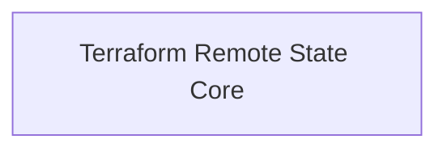

# DX - AWS Core Values Exporter

This Terraform module enables the standardized export and sharing of core AWS infrastructure values across projects and environments.  
It is designed to harmonize the configuration of cloud resources by exposing key outputs such as security groups, network details, and shared service endpoints from the main `aws-core-infra` state, making them easily consumable by dependent modules and project-specific stacks.

## Diagram
<!-- START_TF_GRAPH -->

<!-- END_TF_GRAPH -->

<!-- BEGIN_TF_DOCS -->
## Requirements

| Name | Version |
|------|---------|
|  [aws](#requirement\_aws) | ~> 5.0 |
|  [dx](#requirement\_dx) | >= 0.0.6, < 1.0.0 |

## Modules

No modules.

## Resources

| Name | Type |
|------|------|
| [terraform_remote_state.core](https://registry.terraform.io/providers/hashicorp/terraform/latest/docs/data-sources/remote_state) | data source |

## Inputs

| Name | Description | Type | Default | Required |
|------|-------------|------|---------|:--------:|
|  [core\_state](#input\_core\_state) | Configuration for accessing the core Terraform state where aws-core-infra module is deployed. | <pre>object({     bucket         = string     key            = string     region         = string     dynamodb_table = optional(string, null)   })</pre> | n/a | yes |

## Outputs

| Name | Description |
|------|-------------|
|  [availability\_zones](#output\_availability\_zones) | List of availability zones used |
|  [dynamodb\_endpoint\_id](#output\_dynamodb\_endpoint\_id) | The ID of the DynamoDB VPC endpoint |
|  [internet\_gateway\_id](#output\_internet\_gateway\_id) | The ID of the Internet Gateway |
|  [isolated\_route\_table\_ids](#output\_isolated\_route\_table\_ids) | List of IDs of the isolated route tables |
|  [isolated\_subnet\_ids](#output\_isolated\_subnet\_ids) | List of IDs of the isolated subnets |
|  [isolated\_subnets](#output\_isolated\_subnets) | Details of isolated subnets including IDs, CIDR blocks, and availability zones |
|  [nat\_gateway\_ids](#output\_nat\_gateway\_ids) | List of IDs of the NAT Gateways |
|  [nat\_gateway\_ips](#output\_nat\_gateway\_ips) | List of Elastic IP addresses assigned to the NAT Gateways |
|  [private\_route\_table\_ids](#output\_private\_route\_table\_ids) | List of IDs of the private route tables |
|  [private\_subnet\_ids](#output\_private\_subnet\_ids) | List of IDs of the private subnets |
|  [private\_subnets](#output\_private\_subnets) | Details of private subnets including IDs, CIDR blocks, and availability zones |
|  [project](#output\_project) | Project naming convention |
|  [public\_route\_table\_ids](#output\_public\_route\_table\_ids) | List of IDs of the public route tables |
|  [public\_subnet\_ids](#output\_public\_subnet\_ids) | List of IDs of the public subnets |
|  [public\_subnets](#output\_public\_subnets) | Details of public subnets including IDs, CIDR blocks, and availability zones |
|  [region](#output\_region) | AWS region where resources are created |
|  [s3\_endpoint\_id](#output\_s3\_endpoint\_id) | The ID of the S3 VPC endpoint |
|  [vpc\_cidr\_block](#output\_vpc\_cidr\_block) | The CIDR block of the VPC |
|  [vpc\_endpoints\_security\_group\_id](#output\_vpc\_endpoints\_security\_group\_id) | The ID of the security group for VPC endpoints |
|  [vpc\_id](#output\_vpc\_id) | The ID of the VPC |
<!-- END_TF_DOCS -->
