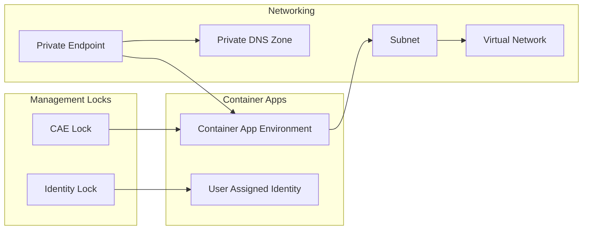

# DX - Azure Container App Environment

This Terraform module deploys an Azure Container App Environment along with necessary networking components.

## Features

- **Azure Container App Environment**: Deploys an Azure Container App Environment for hosting containerized applications.
- **Subnet Creation**: Creates a subnet for the container app environment if not provided.
- **Private Endpoint**: Enables secure connectivity by creating a private endpoint.
- **Zone Redundancy**: Supports zone redundancy for high availability, enabled by default unless the environment is set to development.

## Usage Example

For a complete example of how to use this module, refer to the [example/complete](https://github.com/pagopa-dx/terraform-azurerm-azure-container-app-environment/tree/main/examples/complete) directory.

## Troubleshooting

### Private Endpoint Deletion Timeout

When working with private endpoints (currently in preview), the `terraform destroy` process may get stuck while trying to delete the private endpoint. This happens because the private endpoint is not automatically detached from the environment, causing the operation to time out.

**Solution:**

1. Navigate to the Azure Portal.
2. Go to the specific Container App Environment.
3. Navigate to the **Networking** section.
4. Manually remove the connection between the private endpoint and the container app environment.
5. Re-run the `terraform destroy` command.

## Diagram
<!-- START_TF_GRAPH -->

<!-- END_TF_GRAPH -->

<!-- BEGIN_TF_DOCS -->
## Requirements

| Name | Version |
|------|---------|
|  [azurerm](#requirement\_azurerm) | ~> 4 |
|  [dx](#requirement\_dx) | >= 0.0.6, < 1.0.0 |

## Modules

No modules.

## Resources

| Name | Type |
|------|------|
| [azurerm_container_app_environment.this](https://registry.terraform.io/providers/hashicorp/azurerm/latest/docs/resources/container_app_environment) | resource |
| [azurerm_management_lock.cae_lock](https://registry.terraform.io/providers/hashicorp/azurerm/latest/docs/resources/management_lock) | resource |
| [azurerm_management_lock.identity_lock](https://registry.terraform.io/providers/hashicorp/azurerm/latest/docs/resources/management_lock) | resource |
| [azurerm_private_endpoint.this](https://registry.terraform.io/providers/hashicorp/azurerm/latest/docs/resources/private_endpoint) | resource |
| [azurerm_subnet.this](https://registry.terraform.io/providers/hashicorp/azurerm/latest/docs/resources/subnet) | resource |
| [azurerm_user_assigned_identity.cae_identity](https://registry.terraform.io/providers/hashicorp/azurerm/latest/docs/resources/user_assigned_identity) | resource |
| [azurerm_private_dns_zone.this](https://registry.terraform.io/providers/hashicorp/azurerm/latest/docs/data-sources/private_dns_zone) | data source |
| [azurerm_virtual_network.this](https://registry.terraform.io/providers/hashicorp/azurerm/latest/docs/data-sources/virtual_network) | data source |

## Inputs

| Name | Description | Type | Default | Required |
|------|-------------|------|---------|:--------:|
|  [environment](#input\_environment) | Values which are used to generate resource names and location short names. They are all mandatory except for domain, which should not be used only in the case of a resource used by multiple domains. | <pre>object({     prefix          = string     env_short       = string     location        = string     domain          = optional(string)     app_name        = string     instance_number = string   })</pre> | n/a | yes |
|  [log\_analytics\_workspace\_id](#input\_log\_analytics\_workspace\_id) | The ID of the Log Analytics workspace to use for the container app environment. | `string` | n/a | yes |
|  [private\_dns\_zone\_resource\_group\_name](#input\_private\_dns\_zone\_resource\_group\_name) | The name of the resource group containing the private DNS zone for private endpoints. Defaults to the resource group of the Virtual Network if not specified. | `string` | `null` | no |
|  [resource\_group\_name](#input\_resource\_group\_name) | The name of the Azure Resource Group where the resources will be deployed. | `string` | n/a | yes |
|  [subnet\_cidr](#input\_subnet\_cidr) | The CIDR block for the subnet used for Container App Environment connectivity. This is required if 'subnet\_id' is not specified. | `string` | `null` | no |
|  [subnet\_id](#input\_subnet\_id) | The ID of the subnet where the Container App Environment will be hosted. This is required if 'subnet\_cidr' is not specified. | `string` | `null` | no |
|  [subnet\_pep\_id](#input\_subnet\_pep\_id) | The ID of the subnet designated for hosting private endpoints. | `string` | n/a | yes |
|  [tags](#input\_tags) | A map of tags to assign to the resources. | `map(any)` | n/a | yes |
|  [virtual\_network](#input\_virtual\_network) | An object defining the virtual network where the subnet will be created. | <pre>object({     name                = string     resource_group_name = string   })</pre> | <pre>{   "name": null,   "resource_group_name": null }</pre> | no |

## Outputs

| Name | Description |
|------|-------------|
|  [id](#output\_id) | The ID of the Container App Environment resource. |
|  [name](#output\_name) | The name of the Container App Environment resource. |
|  [resource\_group\_name](#output\_resource\_group\_name) | The name of the Azure Resource Group where the Container App Environment is deployed. |
|  [user\_assigned\_identity](#output\_user\_assigned\_identity) | Details about the user-assigned managed identity created to manage roles of the Container Apps of this Environment |
<!-- END_TF_DOCS -->
