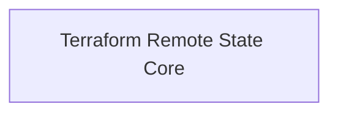

# DX - Azure Core Values Exporter

This Terraform module enables the standardized export and sharing of core Azure infrastructure values across projects and environments.  
It is designed to harmonize the configuration of cloud resources by exposing key outputs such as resource group names, network details, and shared service endpoints from the main `azure-core-infra` state, making them easily consumable by dependent modules and project-specific stacks.

## Diagram
<!-- START_TF_GRAPH -->

<!-- END_TF_GRAPH -->

<!-- BEGIN_TF_DOCS -->
## Requirements

| Name | Version |
|------|---------|
|  [azurerm](#requirement\_azurerm) | >= 3.0.0, < 5.0 |
|  [dx](#requirement\_dx) | >= 0.0.6, < 1.0.0 |

## Modules

No modules.

## Resources

| Name | Type |
|------|------|
| [terraform_remote_state.core](https://registry.terraform.io/providers/hashicorp/terraform/latest/docs/data-sources/remote_state) | data source |

## Inputs

| Name | Description | Type | Default | Required |
|------|-------------|------|---------|:--------:|
|  [core\_state](#input\_core\_state) | Configuration for accessing the core Terraform state where azure-core-infra module is deployed. | <pre>object({     resource_group_name  = string     storage_account_name = string     container_name       = string     key                  = string   })</pre> | n/a | yes |

## Outputs

| Name | Description |
|------|-------------|
|  [application\_insights](#output\_application\_insights) | Details of the Application Insights instance, including its ID, name, and instrumentation key. |
|  [common\_key\_vault](#output\_common\_key\_vault) | Details of the common Key Vault, including its name, ID, and resource group name. |
|  [common\_log\_analytics\_workspace](#output\_common\_log\_analytics\_workspace) | Details of the common Log Analytics Workspace, including its ID, name, and workspace ID. |
|  [common\_nat\_gateways](#output\_common\_nat\_gateways) | A list of NAT gateways, including their IDs and names. |
|  [common\_pep\_snet](#output\_common\_pep\_snet) | Details of the private endpoint subnet, including its name and ID. |
|  [common\_resource\_group\_id](#output\_common\_resource\_group\_id) | The ID of the common resource group. |
|  [common\_resource\_group\_name](#output\_common\_resource\_group\_name) | The name of the common resource group. |
|  [common\_test\_snet](#output\_common\_test\_snet) | Details of the test subnet, including its name and ID. |
|  [common\_vnet](#output\_common\_vnet) | Details of the common virtual network, including its name and ID. |
|  [github\_runner](#output\_github\_runner) | Details of the GitHub runner, including environment ID, resource group name, and subnet ID. |
|  [network\_resource\_group\_id](#output\_network\_resource\_group\_id) | The ID of the network resource group. |
|  [network\_resource\_group\_name](#output\_network\_resource\_group\_name) | The name of the network resource group. |
|  [opex\_resource\_group\_id](#output\_opex\_resource\_group\_id) | The ID of the OPEX resource group. |
|  [opex\_resource\_group\_name](#output\_opex\_resource\_group\_name) | The name of the OPEX resource group. |
|  [test\_resource\_group\_id](#output\_test\_resource\_group\_id) | The ID of the test resource group (null if testing is disabled). |
|  [test\_resource\_group\_name](#output\_test\_resource\_group\_name) | The name of the test resource group (null if testing is disabled). |
<!-- END_TF_DOCS -->
