# DX - Azure GitHub Environment Bootstrap


The Azure GitHub Environment Bootstrap module is designed for users who have just created a new GitHub repository and want to quickly focus on their goals without spending hours on setup. It is particularly useful for mono repositories.

The module performs the following actions:

- Creates the **GitHub Private Runner** associated with the repository.
- Creates Azure user-assigned **Managed Identities** to let GitHub workflows deploy:
  1. Infrastructure resources (IaC).
  2. Applications.
  3. Opex dashboards.
- Assigns **IAM roles** to allow workflows to work properly.
- Sets up the **GitHub repository settings** following best practices.
- Creates an Azure **resource group** tied with the Cloud Resources defined
  within the repository.

## Gotchas

### Ensure Necessary Azure Permissions

The Azure principal (user or managed identity) executing the `terraform apply` command must have the **Role Based Access Control Administrator** and **Contributor** roles on the target Azure subscription. This is required to create and assign necessary IAM roles.

### Use Entra Id to Authenticate Connections to Storage Accounts

Entra Id should be used as the authentication method for Storage Accounts, replacing
access keys.

Storage Account with Terraform state file:

```hcl
backend "azurerm" {
  resource_group_name  = "<value>"
  storage_account_name = "<value>"
  container_name       = "<value>"
  key                  = "<repo-name>.repository.tfstate"
  use_azuread_auth     = true
}
```

Other Storage Accounts:

```hcl
provider "azurerm" {
  features {
  }
  storage_use_azuread = true
}
```

### Import GitHub repository in the Terraform state file

Remember to import the GitHub repository you are using in the Terraform
state:

```hcl
import {
  id = "<repository-name>"
  to = module.repo.module.github_repository.github_repository.this
}
```

### Set up GitHub Environments Policies and Default Branch Name

You can customize deployment policies on `x-cd` GitHub environment by using the
optional properties of the `repository` variable:

- `infra_cd_policy_branches`
- `opex_cd_policy_branches`
- `app_cd_policy_branches`
- `infra_cd_policy_tags`
- `opex_cd_policy_tags`
- `app_cd_policy_tags`

The default branch name can be changed via the `default_branch_name` property.

## Extending the module for custom needs

The module provides the basic configuration adhering to DX and Technology standards. However, it can be extended according to new needs. In fact, the module export all the ids and names of the resources that creates, so it is straightforward to add further resources.

### Customizing GitHub configuration

If the GitHub repository configuration provided by the module is not sufficient to meet the team's requirements, it is possible to expand the capabilities using the information exported by the module.
For example, if you need a `release`
GitHub environment with a special deployment policy you can add:

```hcl
resource "github_repository_environment" "release" {
  environment = "release"
  repository  = module.repo.repository.name

  deployment_branch_policy {
    protected_branches     = false
    custom_branch_policies = true
  }
}

resource "github_repository_environment_deployment_policy" "release_branch" {
  repository     = module.repo.repository.name
  environment    = github_repository_environment.release.environment
  branch_pattern = "main"
}
```

### Managing multiple resource groups

This module includes a pre-configured resource group for deploying Azure resources. If you need additional resource groups, you can easily create them; the module will automatically assign all necessary roles.```

```hcl
resource "azurerm_resource_group" "new_rg01" {
  name     = "dx-d-itn-custom-rg-01"
  location = "italynorth"

  tags = local.tags
}

resource "azurerm_resource_group" "new_rg02" {
  name     = "dx-d-itn-custom-rg-02"
  location = "italynorth"

  tags = local.tags
}

module "bootstrapper" {
  source  = "pagopa-dx/azure-github-environment-bootstrap/azurerm"
  version = "~>x.0"

  additional_resource_group_ids = [
    azurerm_resource_group.new_rg01.id,
    azurerm_resource_group.new_rg02.id,
  ]
}
```

### Managing roles to common resources

The module facilitates the role assignment to resources that are generally, by their nature, centralized and shared by the entire product. These are the following ones:

- API Management
- Service Bus Namespace
- Log Analytics Workspace
- NAT Gateway

For each of these resources, the module provides an optional variable to which their IDs can be passed. Utilizing these IDs ensures that the requisite roles for operating on the resources are assigned to the Managed Identities associated with the repository's workflows.```

## Examples

This module includes practical examples to help you get started quickly:

- **Mono-environment example**: You can find a simple mono-environment setup example in the `examples/` folder of this module, which demonstrates basic usage for a single environment configuration.
- **Multi-environment example**: For a complete, production-ready multi-environment setup, check out the live example in the [DX bootstrapper](https://github.com/pagopa/dx/tree/main/infra/bootstrapper), which shows how to manage multiple environments (dev, prod, etc.) using this module.

## Diagram

```mermaid
graph LR

subgraph Federated Identity Credentials
  GitHubAppCd["GitHub App CD"]
  GitHubAppCi["GitHub App CI"]
  GitHubInfraCd["GitHub Infra CD"]
  GitHubInfraCi["GitHub Infra CI"]
  GitHubOpexCd["GitHub Opex CD"]
  GitHubOpexCi["GitHub Opex CI"]
end

subgraph Key Vault Access Policies
  InfraCdKVCommon["Key Vault Access Policy - Infra CD"]
  InfraCiKVCommon["Key Vault Access Policy - Infra CI"]
end

subgraph Role Assignments - Resource Groups
  AdminsGroupRGs["Admins Group - RGs"]
  AdminsGroupRGsKVAdmin["Admins Group - KV Admin"]
  AdminsGroupRGsKVData["Admins Group - KV Data"]
  DevsGroupRGs["Devs Group - RGs"]
  DevsGroupTFRGsKVSecret["Devs Group - TF RG KV Secret"]
  ExternalsGroupRGs["Externals Group - RGs"]
end

subgraph Role Assignments - App CD
  AppCDBlobContributor["Blob Data Contributor"]
  AppCDCAEContributor["CAE Contributor"]
  AppCDCdnProfileContributor["CDN Profile Contributor"]
  AppCDWebsiteContributor["Website Contributor"]
  AppCDSubscriptionReader["Subscription Reader"]
  AppCDTFRGBlobContributor["TF RG Blob Contributor"]
end

subgraph Role Assignments - App CI
  AppCISubscriptionPagopaIACReader["Subscription Pagopa IaC Reader"]
  AppCISubscriptionReader["Subscription Reader"]
end

subgraph Role Assignments - Infra CD
  InfraCDAPIMServiceContributor["APIM Service Contributor"]
  InfraCDLogAnalyticsContributor["Log Analytics Workspace Contributor"]
  InfraCDNatGwNetworkContributor["NAT GW Network Contributor"]
  InfraCDNetworkContributor["Network Contributor"]
  InfraCDPrivateDNSZoneContributor["Private DNS Zone Contributor"]
  InfraCDRGsCAContributor["RGs CA Contributor"]
  InfraCDRGsContributor["RGs Contributor"]
  InfraCDRGsKVCert["RGs KV Certificate Contributor"]
  InfraCDRGsKVCrypto["RGs KV Cryptography Contributor"]
  InfraCDRGsKVSecret["RGs KV Secret Contributor"]
  InfraCDRGsStBlobContributor["RGs Storage Blob Contributor"]
  InfraCDRGsUserAccessAdmin["RGs User Access Administrator"]
  InfraCDSBNSContributor["SBNS Contributor"]
  InfraCDSTTFBlobContributor["ST TF Blob Contributor"]
  InfraCDSubscriptionRBACAdmin["Subscription RBAC Administrator"]
  InfraCDSubscriptionReader["Subscription Reader"]
  InfraCDVNetNetworkContributor["VNet Network Contributor"]
end

subgraph Role Assignments - Infra CI
  InfraCIRGsCAOperator["RGs CA Operator"]
  InfraCIRGsCosmosContributor["RGs Cosmos DB Contributor"]
  InfraCIRGsKVCert["RGs KV Certificate"]
  InfraCIRGsKVCrypto["RGs KV Cryptography"]
  InfraCIRGsKVSecret["RGs KV Secret"]
  InfraCIRGsSTBlobReader["ST Blob Reader"]
  InfraCIRGsSTQueueContributor["ST Queue Contributor"]
  InfraCIRGsSTQueueReader["ST Queue Reader"]
  InfraCIRGsSTTableContributor["ST Table Contributor"]
  InfraCIRGsSTTableReader["ST Table Reader"]
  InfraCISubscriptionAPIMSecrets["Subscription APIM Secrets"]
  InfraCISubscriptionDataAccess["Subscription Data Access"]
  InfraCISubscriptionPagopaIACReader["Subscription Pagopa IaC Reader"]
  InfraCISubscriptionReader["Subscription Reader"]
  InfraCITFSTBlobContributor["TF ST Blob Contributor"]
end

subgraph Role Assignments - Opex CD
  OpexCDRGMonitoringContributor["RG Monitoring Contributor"]
  OpexCDRGOpexContributor["RG Opex Contributor"]
  OpexCDSubscriptionReader["Subscription Reader"]
  OpexCDTFRGBlobContributor["TF RG Blob Contributor"]
  OpexCDTFRGBlobDataAccess["TF RG Blob Data Access"]
end

subgraph Role Assignments - Opex CI
  OpexCISubscriptionDataAccess["Subscription Data Access"]
  OpexCISubscriptionReader["Subscription Reader"]
  OpexCITFRGBlobContributor["TF RG Blob Contributor"]
end

subgraph User Assigned Identities
  AppCDIdentity["App CD"]
  AppCIIdentity["App CI"]
  InfraCDIdentity["Infra CD"]
  InfraCIIdentity["Infra CI"]
  OpexCDIdentity["Opex CD"]
  OpexCIIdentity["Opex CI"]
end

subgraph GitHub Actions Secrets
  GHSecretAppCD["Env Secret - App CD"]
  GHSecretAppCI["Env Secret - App CI"]
  GHSecretInfraCD["Env Secret - Infra CD"]
  GHSecretInfraCI["Env Secret - Infra CI"]
  GHSecretOpexCD["Env Secret - Opex CD"]
  GHSecretOpexCI["Env Secret - Opex CI"]
end

subgraph GitHub Runner
  CurrentClientConfig["Current Client Config"]
  GitHubRunnerJob["GitHub Runner Job"]
  KVAccessPolicyContainerApp["Key Vault Access Policy - Container App"]
  RAKeyVaultContainerApp["Role Assignment - Container App Key Vault"]
end

MainRG["Resource Group - Main"]

GitHubAppCd --> AppCDIdentity
GitHubAppCi --> AppCIIdentity
GitHubInfraCd --> InfraCDIdentity
GitHubInfraCi --> InfraCIIdentity
GitHubOpexCd --> OpexCDIdentity
GitHubOpexCi --> OpexCIIdentity

InfraCdKVCommon --> InfraCDIdentity
InfraCiKVCommon --> InfraCIIdentity

AdminsGroupRGs --> MainRG
AdminsGroupRGsKVAdmin --> MainRG
AdminsGroupRGsKVData --> MainRG
DevsGroupRGs --> MainRG
DevsGroupTFRGsKVSecret --> MainRG
ExternalsGroupRGs --> MainRG

AppCDIdentity --> MainRG
AppCIIdentity --> MainRG
InfraCDIdentity --> MainRG
InfraCIIdentity --> MainRG
OpexCDIdentity --> MainRG
OpexCIIdentity --> MainRG

AppCDBlobContributor --> AppCDIdentity
AppCDCAEContributor --> AppCDIdentity
AppCDCdnProfileContributor --> AppCDIdentity
AppCDWebsiteContributor --> AppCDIdentity
AppCDSubscriptionReader --> AppCDIdentity
AppCDTFRGBlobContributor --> AppCDIdentity

AppCISubscriptionPagopaIACReader --> AppCIIdentity
AppCISubscriptionReader --> AppCIIdentity

InfraCDAPIMServiceContributor --> InfraCDIdentity
InfraCDLogAnalyticsContributor --> InfraCDIdentity
InfraCDNatGwNetworkContributor --> InfraCDIdentity
InfraCDNetworkContributor --> InfraCDIdentity
InfraCDPrivateDNSZoneContributor --> InfraCDIdentity
InfraCDRGsCAContributor --> InfraCDIdentity
InfraCDRGsContributor --> InfraCDIdentity
InfraCDRGsKVCert --> InfraCDIdentity
InfraCDRGsKVCrypto --> InfraCDIdentity
InfraCDRGsKVSecret --> InfraCDIdentity
InfraCDRGsStBlobContributor --> InfraCDIdentity
InfraCDRGsUserAccessAdmin --> InfraCDIdentity
InfraCDSBNSContributor --> InfraCDIdentity
InfraCDSTTFBlobContributor --> InfraCDIdentity
InfraCDSubscriptionRBACAdmin --> InfraCDIdentity
InfraCDSubscriptionReader --> InfraCDIdentity
InfraCDVNetNetworkContributor --> InfraCDIdentity

InfraCIRGsCAOperator --> InfraCIIdentity
InfraCIRGsCosmosContributor --> InfraCIIdentity
InfraCIRGsKVCert --> InfraCIIdentity
InfraCIRGsKVCrypto --> InfraCIIdentity
InfraCIRGsKVSecret --> InfraCIIdentity
InfraCIRGsSTBlobReader --> InfraCIIdentity
InfraCIRGsSTQueueContributor --> InfraCIIdentity
InfraCIRGsSTQueueReader --> InfraCIIdentity
InfraCIRGsSTTableContributor --> InfraCIIdentity
InfraCIRGsSTTableReader --> InfraCIIdentity
InfraCISubscriptionAPIMSecrets --> InfraCIIdentity
InfraCISubscriptionDataAccess --> InfraCIIdentity
InfraCISubscriptionPagopaIACReader --> InfraCIIdentity
InfraCISubscriptionReader --> InfraCIIdentity
InfraCITFSTBlobContributor --> InfraCIIdentity

OpexCDRGMonitoringContributor --> OpexCDIdentity
OpexCDRGOpexContributor --> OpexCDIdentity
OpexCDSubscriptionReader --> OpexCDIdentity
OpexCDTFRGBlobContributor --> OpexCDIdentity
OpexCDTFRGBlobDataAccess --> OpexCDIdentity

OpexCISubscriptionDataAccess --> OpexCIIdentity
OpexCISubscriptionReader --> OpexCIIdentity
OpexCITFRGBlobContributor --> OpexCIIdentity

GHSecretAppCD --> AppCDIdentity
GHSecretAppCI --> AppCIIdentity
GHSecretInfraCD --> InfraCDIdentity
GHSecretInfraCI --> InfraCIIdentity
GHSecretOpexCD --> OpexCDIdentity
GHSecretOpexCI --> OpexCIIdentity

KVAccessPolicyContainerApp --> CurrentClientConfig
KVAccessPolicyContainerApp --> GitHubRunnerJob
RAKeyVaultContainerApp --> CurrentClientConfig
RAKeyVaultContainerApp --> GitHubRunnerJob
GitHubRunnerJob --> MainRG
```

<!-- START_TF_GRAPH -->


<!-- END_TF_GRAPH -->

<!-- markdownlint-disable -->
<!-- BEGIN_TF_DOCS -->
## Requirements

| Name | Version |
|------|---------|
| <a name="requirement_azurerm"></a> [azurerm](#requirement\_azurerm) | ~>4 |
| <a name="requirement_dx"></a> [dx](#requirement\_dx) | >= 0.0.7, < 1.0.0 |
| <a name="requirement_github"></a> [github](#requirement\_github) | ~>6 |

## Modules

| Name | Source | Version |
|------|--------|---------|
| <a name="module_github_runner"></a> [github\_runner](#module\_github\_runner) | pagopa-dx/github-selfhosted-runner-on-container-app-jobs/azurerm | ~> 1.0 |

## Resources

| Name | Type |
|------|------|
| [azurerm_federated_identity_credential.github_app_cd](https://registry.terraform.io/providers/hashicorp/azurerm/latest/docs/resources/federated_identity_credential) | resource |
| [azurerm_federated_identity_credential.github_app_ci](https://registry.terraform.io/providers/hashicorp/azurerm/latest/docs/resources/federated_identity_credential) | resource |
| [azurerm_federated_identity_credential.github_infra_cd](https://registry.terraform.io/providers/hashicorp/azurerm/latest/docs/resources/federated_identity_credential) | resource |
| [azurerm_federated_identity_credential.github_infra_ci](https://registry.terraform.io/providers/hashicorp/azurerm/latest/docs/resources/federated_identity_credential) | resource |
| [azurerm_federated_identity_credential.github_opex_cd](https://registry.terraform.io/providers/hashicorp/azurerm/latest/docs/resources/federated_identity_credential) | resource |
| [azurerm_federated_identity_credential.github_opex_ci](https://registry.terraform.io/providers/hashicorp/azurerm/latest/docs/resources/federated_identity_credential) | resource |
| [azurerm_key_vault_access_policy.infra_cd_kv_common](https://registry.terraform.io/providers/hashicorp/azurerm/latest/docs/resources/key_vault_access_policy) | resource |
| [azurerm_key_vault_access_policy.infra_ci_kv_common](https://registry.terraform.io/providers/hashicorp/azurerm/latest/docs/resources/key_vault_access_policy) | resource |
| [azurerm_resource_group.main](https://registry.terraform.io/providers/hashicorp/azurerm/latest/docs/resources/resource_group) | resource |
| [azurerm_role_assignment.admins_group_rgs](https://registry.terraform.io/providers/hashicorp/azurerm/latest/docs/resources/role_assignment) | resource |
| [azurerm_role_assignment.admins_group_rgs_kv_admin](https://registry.terraform.io/providers/hashicorp/azurerm/latest/docs/resources/role_assignment) | resource |
| [azurerm_role_assignment.admins_group_rgs_kv_data](https://registry.terraform.io/providers/hashicorp/azurerm/latest/docs/resources/role_assignment) | resource |
| [azurerm_role_assignment.app_cd_rgs_blob_contributor](https://registry.terraform.io/providers/hashicorp/azurerm/latest/docs/resources/role_assignment) | resource |
| [azurerm_role_assignment.app_cd_rgs_cae_contributor](https://registry.terraform.io/providers/hashicorp/azurerm/latest/docs/resources/role_assignment) | resource |
| [azurerm_role_assignment.app_cd_rgs_cdn_profile_contributor](https://registry.terraform.io/providers/hashicorp/azurerm/latest/docs/resources/role_assignment) | resource |
| [azurerm_role_assignment.app_cd_rgs_website_contributor](https://registry.terraform.io/providers/hashicorp/azurerm/latest/docs/resources/role_assignment) | resource |
| [azurerm_role_assignment.app_cd_subscription_reader](https://registry.terraform.io/providers/hashicorp/azurerm/latest/docs/resources/role_assignment) | resource |
| [azurerm_role_assignment.app_cd_tf_rg_blob_contributor](https://registry.terraform.io/providers/hashicorp/azurerm/latest/docs/resources/role_assignment) | resource |
| [azurerm_role_assignment.app_ci_subscription_pagopa_iac_reader](https://registry.terraform.io/providers/hashicorp/azurerm/latest/docs/resources/role_assignment) | resource |
| [azurerm_role_assignment.app_ci_subscription_reader](https://registry.terraform.io/providers/hashicorp/azurerm/latest/docs/resources/role_assignment) | resource |
| [azurerm_role_assignment.devs_group_rgs](https://registry.terraform.io/providers/hashicorp/azurerm/latest/docs/resources/role_assignment) | resource |
| [azurerm_role_assignment.devs_group_tf_rgs_kv_secr](https://registry.terraform.io/providers/hashicorp/azurerm/latest/docs/resources/role_assignment) | resource |
| [azurerm_role_assignment.externals_group_rgs](https://registry.terraform.io/providers/hashicorp/azurerm/latest/docs/resources/role_assignment) | resource |
| [azurerm_role_assignment.infra_cd_apim_service_contributor](https://registry.terraform.io/providers/hashicorp/azurerm/latest/docs/resources/role_assignment) | resource |
| [azurerm_role_assignment.infra_cd_log_analytics_workspace_contributor](https://registry.terraform.io/providers/hashicorp/azurerm/latest/docs/resources/role_assignment) | resource |
| [azurerm_role_assignment.infra_cd_rg_nat_gw_network_contributor](https://registry.terraform.io/providers/hashicorp/azurerm/latest/docs/resources/role_assignment) | resource |
| [azurerm_role_assignment.infra_cd_rg_network_contributor](https://registry.terraform.io/providers/hashicorp/azurerm/latest/docs/resources/role_assignment) | resource |
| [azurerm_role_assignment.infra_cd_rg_private_dns_zone_contributor](https://registry.terraform.io/providers/hashicorp/azurerm/latest/docs/resources/role_assignment) | resource |
| [azurerm_role_assignment.infra_cd_rgs_ca_contributor](https://registry.terraform.io/providers/hashicorp/azurerm/latest/docs/resources/role_assignment) | resource |
| [azurerm_role_assignment.infra_cd_rgs_contributor](https://registry.terraform.io/providers/hashicorp/azurerm/latest/docs/resources/role_assignment) | resource |
| [azurerm_role_assignment.infra_cd_rgs_kv_cert](https://registry.terraform.io/providers/hashicorp/azurerm/latest/docs/resources/role_assignment) | resource |
| [azurerm_role_assignment.infra_cd_rgs_kv_crypto](https://registry.terraform.io/providers/hashicorp/azurerm/latest/docs/resources/role_assignment) | resource |
| [azurerm_role_assignment.infra_cd_rgs_kv_secr](https://registry.terraform.io/providers/hashicorp/azurerm/latest/docs/resources/role_assignment) | resource |
| [azurerm_role_assignment.infra_cd_rgs_st_blob_contributor](https://registry.terraform.io/providers/hashicorp/azurerm/latest/docs/resources/role_assignment) | resource |
| [azurerm_role_assignment.infra_cd_rgs_user_access_admin](https://registry.terraform.io/providers/hashicorp/azurerm/latest/docs/resources/role_assignment) | resource |
| [azurerm_role_assignment.infra_cd_sbns_contributor](https://registry.terraform.io/providers/hashicorp/azurerm/latest/docs/resources/role_assignment) | resource |
| [azurerm_role_assignment.infra_cd_st_tf_blob_contributor](https://registry.terraform.io/providers/hashicorp/azurerm/latest/docs/resources/role_assignment) | resource |
| [azurerm_role_assignment.infra_cd_subscription_rbac_admin](https://registry.terraform.io/providers/hashicorp/azurerm/latest/docs/resources/role_assignment) | resource |
| [azurerm_role_assignment.infra_cd_subscription_reader](https://registry.terraform.io/providers/hashicorp/azurerm/latest/docs/resources/role_assignment) | resource |
| [azurerm_role_assignment.infra_cd_vnet_network_contributor](https://registry.terraform.io/providers/hashicorp/azurerm/latest/docs/resources/role_assignment) | resource |
| [azurerm_role_assignment.infra_ci_rgs_ca_operator](https://registry.terraform.io/providers/hashicorp/azurerm/latest/docs/resources/role_assignment) | resource |
| [azurerm_role_assignment.infra_ci_rgs_cosmos_contributor](https://registry.terraform.io/providers/hashicorp/azurerm/latest/docs/resources/role_assignment) | resource |
| [azurerm_role_assignment.infra_ci_rgs_kv_cert](https://registry.terraform.io/providers/hashicorp/azurerm/latest/docs/resources/role_assignment) | resource |
| [azurerm_role_assignment.infra_ci_rgs_kv_crypto](https://registry.terraform.io/providers/hashicorp/azurerm/latest/docs/resources/role_assignment) | resource |
| [azurerm_role_assignment.infra_ci_rgs_kv_secr](https://registry.terraform.io/providers/hashicorp/azurerm/latest/docs/resources/role_assignment) | resource |
| [azurerm_role_assignment.infra_ci_rgs_st_blob_reader](https://registry.terraform.io/providers/hashicorp/azurerm/latest/docs/resources/role_assignment) | resource |
| [azurerm_role_assignment.infra_ci_rgs_st_queue_contributor](https://registry.terraform.io/providers/hashicorp/azurerm/latest/docs/resources/role_assignment) | resource |
| [azurerm_role_assignment.infra_ci_rgs_st_queue_reader](https://registry.terraform.io/providers/hashicorp/azurerm/latest/docs/resources/role_assignment) | resource |
| [azurerm_role_assignment.infra_ci_rgs_st_table_contributor](https://registry.terraform.io/providers/hashicorp/azurerm/latest/docs/resources/role_assignment) | resource |
| [azurerm_role_assignment.infra_ci_rgs_st_table_reader](https://registry.terraform.io/providers/hashicorp/azurerm/latest/docs/resources/role_assignment) | resource |
| [azurerm_role_assignment.infra_ci_subscription_apim_secrets](https://registry.terraform.io/providers/hashicorp/azurerm/latest/docs/resources/role_assignment) | resource |
| [azurerm_role_assignment.infra_ci_subscription_data_access](https://registry.terraform.io/providers/hashicorp/azurerm/latest/docs/resources/role_assignment) | resource |
| [azurerm_role_assignment.infra_ci_subscription_pagopa_iac_reader](https://registry.terraform.io/providers/hashicorp/azurerm/latest/docs/resources/role_assignment) | resource |
| [azurerm_role_assignment.infra_ci_subscription_reader](https://registry.terraform.io/providers/hashicorp/azurerm/latest/docs/resources/role_assignment) | resource |
| [azurerm_role_assignment.infra_ci_tf_st_blob_contributor](https://registry.terraform.io/providers/hashicorp/azurerm/latest/docs/resources/role_assignment) | resource |
| [azurerm_role_assignment.opex_cd_rg_monitoring_contributor](https://registry.terraform.io/providers/hashicorp/azurerm/latest/docs/resources/role_assignment) | resource |
| [azurerm_role_assignment.opex_cd_rg_opex_contributor](https://registry.terraform.io/providers/hashicorp/azurerm/latest/docs/resources/role_assignment) | resource |
| [azurerm_role_assignment.opex_cd_subscription_reader](https://registry.terraform.io/providers/hashicorp/azurerm/latest/docs/resources/role_assignment) | resource |
| [azurerm_role_assignment.opex_cd_tf_rg_blob_contributor](https://registry.terraform.io/providers/hashicorp/azurerm/latest/docs/resources/role_assignment) | resource |
| [azurerm_role_assignment.opex_cd_tf_rg_blob_data_access](https://registry.terraform.io/providers/hashicorp/azurerm/latest/docs/resources/role_assignment) | resource |
| [azurerm_role_assignment.opex_ci_subscription_data_access](https://registry.terraform.io/providers/hashicorp/azurerm/latest/docs/resources/role_assignment) | resource |
| [azurerm_role_assignment.opex_ci_subscription_reader](https://registry.terraform.io/providers/hashicorp/azurerm/latest/docs/resources/role_assignment) | resource |
| [azurerm_role_assignment.opex_ci_tf_rg_blob_contributor](https://registry.terraform.io/providers/hashicorp/azurerm/latest/docs/resources/role_assignment) | resource |
| [azurerm_user_assigned_identity.app_cd](https://registry.terraform.io/providers/hashicorp/azurerm/latest/docs/resources/user_assigned_identity) | resource |
| [azurerm_user_assigned_identity.app_ci](https://registry.terraform.io/providers/hashicorp/azurerm/latest/docs/resources/user_assigned_identity) | resource |
| [azurerm_user_assigned_identity.infra_cd](https://registry.terraform.io/providers/hashicorp/azurerm/latest/docs/resources/user_assigned_identity) | resource |
| [azurerm_user_assigned_identity.infra_ci](https://registry.terraform.io/providers/hashicorp/azurerm/latest/docs/resources/user_assigned_identity) | resource |
| [azurerm_user_assigned_identity.opex_cd](https://registry.terraform.io/providers/hashicorp/azurerm/latest/docs/resources/user_assigned_identity) | resource |
| [azurerm_user_assigned_identity.opex_ci](https://registry.terraform.io/providers/hashicorp/azurerm/latest/docs/resources/user_assigned_identity) | resource |
| [github_actions_environment_secret.app_cd](https://registry.terraform.io/providers/integrations/github/latest/docs/resources/actions_environment_secret) | resource |
| [github_actions_environment_secret.app_ci](https://registry.terraform.io/providers/integrations/github/latest/docs/resources/actions_environment_secret) | resource |
| [github_actions_environment_secret.infra_cd](https://registry.terraform.io/providers/integrations/github/latest/docs/resources/actions_environment_secret) | resource |
| [github_actions_environment_secret.infra_ci](https://registry.terraform.io/providers/integrations/github/latest/docs/resources/actions_environment_secret) | resource |
| [github_actions_environment_secret.opex_cd](https://registry.terraform.io/providers/integrations/github/latest/docs/resources/actions_environment_secret) | resource |
| [github_actions_environment_secret.opex_ci](https://registry.terraform.io/providers/integrations/github/latest/docs/resources/actions_environment_secret) | resource |
| [github_actions_secret.repo_secrets](https://registry.terraform.io/providers/integrations/github/latest/docs/resources/actions_secret) | resource |

## Inputs

| Name | Description | Type | Default | Required |
|------|-------------|------|---------|:--------:|
| <a name="input_additional_resource_group_ids"></a> [additional\_resource\_group\_ids](#input\_additional\_resource\_group\_ids) | A set of IDs for existing resource groups owned by the domain team. | `set(string)` | `[]` | no |
| <a name="input_apim_id"></a> [apim\_id](#input\_apim\_id) | The ID of the Azure API Management (APIM) instance. | `string` | `null` | no |
| <a name="input_entraid_groups"></a> [entraid\_groups](#input\_entraid\_groups) | The Azure Entra ID groups to give role to. | <pre>object({<br/>    admins_object_id    = string<br/>    devs_object_id      = string<br/>    externals_object_id = optional(string, null)<br/>  })</pre> | n/a | yes |
| <a name="input_environment"></a> [environment](#input\_environment) | Values which are used to generate resource names and location short names. They are all mandatory except for domain, which should not be used only in the case of a resource used by multiple domains. | <pre>object({<br/>    prefix          = string<br/>    env_short       = string<br/>    location        = string<br/>    domain          = string<br/>    instance_number = string<br/>  })</pre> | n/a | yes |
| <a name="input_github_private_runner"></a> [github\_private\_runner](#input\_github\_private\_runner) | Configuration for GitHub private runners, including environment details, scaling options, and Key Vault integration. | <pre>object({<br/>    container_app_environment_id       = string<br/>    container_app_environment_location = string<br/>    replica_timeout_in_seconds         = optional(number, 1800)<br/>    polling_interval_in_seconds        = optional(number, 30)<br/>    min_instances                      = optional(number, 0)<br/>    max_instances                      = optional(number, 30)<br/>    labels                             = optional(list(string), [])<br/>    key_vault = object({<br/>      name                = string<br/>      resource_group_name = string<br/>      secret_name         = optional(string, "github-runner-pat")<br/>      use_rbac            = optional(bool, false)<br/>    })<br/>    cpu    = optional(number, 1.5)<br/>    memory = optional(string, "3Gi")<br/>  })</pre> | n/a | yes |
| <a name="input_keyvault_common_ids"></a> [keyvault\_common\_ids](#input\_keyvault\_common\_ids) | A list of IDs for Key Vaults containing common secrets. | `list(string)` | `[]` | no |
| <a name="input_log_analytics_workspace_id"></a> [log\_analytics\_workspace\_id](#input\_log\_analytics\_workspace\_id) | The ID of the Log Analytics Workspace for monitoring and diagnostics. | `string` | `null` | no |
| <a name="input_nat_gateway_resource_group_id"></a> [nat\_gateway\_resource\_group\_id](#input\_nat\_gateway\_resource\_group\_id) | The ID of the resource group hosting NAT Gateways. | `string` | `null` | no |
| <a name="input_opex_resource_group_id"></a> [opex\_resource\_group\_id](#input\_opex\_resource\_group\_id) | The ID of the resource group containing Opex dashboards. | `string` | n/a | yes |
| <a name="input_pep_vnet_id"></a> [pep\_vnet\_id](#input\_pep\_vnet\_id) | The ID of the Virtual Network (VNet) containing the subnet dedicated to Private Endpoints. | `string` | n/a | yes |
| <a name="input_private_dns_zone_resource_group_id"></a> [private\_dns\_zone\_resource\_group\_id](#input\_private\_dns\_zone\_resource\_group\_id) | The ID of the resource group containing private DNS zones. | `string` | n/a | yes |
| <a name="input_repository"></a> [repository](#input\_repository) | Details about the GitHub repository, including owner and name. | <pre>object({<br/>    owner = optional(string, "pagopa")<br/>    name  = string<br/>  })</pre> | n/a | yes |
| <a name="input_sbns_id"></a> [sbns\_id](#input\_sbns\_id) | The ID of the Azure Service Bus Namespace. | `string` | `null` | no |
| <a name="input_subscription_id"></a> [subscription\_id](#input\_subscription\_id) | The Azure subscription ID where resources will be created. | `string` | n/a | yes |
| <a name="input_tags"></a> [tags](#input\_tags) | A map of tags to assign to the resources. | `map(string)` | n/a | yes |
| <a name="input_tenant_id"></a> [tenant\_id](#input\_tenant\_id) | The Azure tenant ID where resources will be created. | `string` | n/a | yes |
| <a name="input_terraform_storage_account"></a> [terraform\_storage\_account](#input\_terraform\_storage\_account) | Details of the Storage Account (name and resource group) hosting the Terraform state file. | <pre>object({<br/>    resource_group_name = string<br/>    name                = string<br/>  })</pre> | n/a | yes |

## Outputs

| Name | Description |
|------|-------------|
| <a name="output_github_private_runner"></a> [github\_private\_runner](#output\_github\_private\_runner) | Details of the GitHub private runner, including ID, name, and resource group name. |
| <a name="output_identities"></a> [identities](#output\_identities) | Details of the user-assigned identities for app, infra, and opex, including IDs and names. |
| <a name="output_repository"></a> [repository](#output\_repository) | GitHub repository name and owner. |
| <a name="output_resource_group"></a> [resource\_group](#output\_resource\_group) | Details of the main resource group, including ID, name, and location. |
<!-- END_TF_DOCS -->
