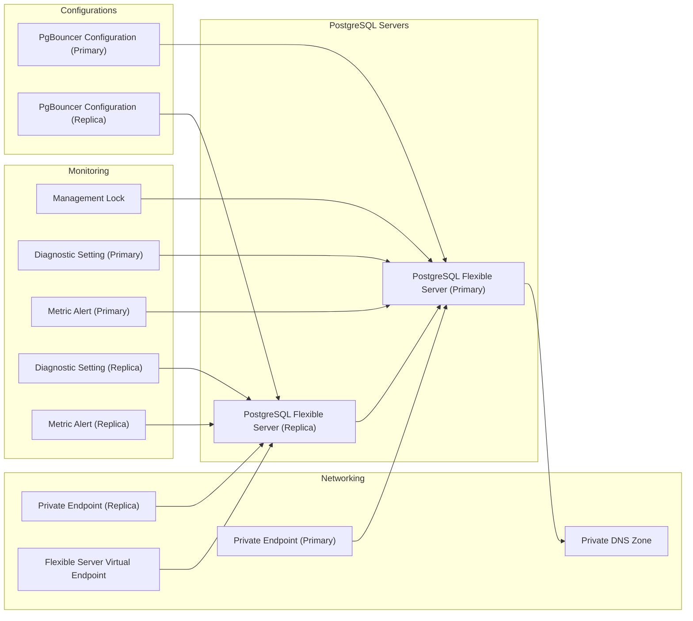

# DX - Azure PostgreSQL Flexible Server

This Terraform module provisions an Azure PostgreSQL Flexible Server along with optional configurations for high availability, monitoring, and private networking.

## Features

- **Primary and Replica Servers**: Provisions a primary PostgreSQL Flexible Server and optionally a replica server for read scaling.
- **High Availability**: Supports zone-redundant high availability for production-grade reliability.
- **Monitoring**: Includes default and customizable metric alerts, as well as diagnostic settings for logs and metrics to ensure operational visibility.
- **Connection Pooling**: Enables PgBouncer for efficient connection pooling, reducing overhead for high-connection scenarios.
- **Private Networking**: Integrates private endpoints and DNS zone configurations for secure and isolated network access.
- **Backup and Recovery**: Configurable backup retention and geo-redundant backups for disaster recovery.
- **Scalability**: Supports auto-grow storage and scaling configurations for dynamic workload demands.
- **Management Lock**: Adds a management lock to prevent accidental deletion of critical resources.

## Tier Comparison

| Tier | Description                                                      | High Availability | Geo-Redundant Backup  | Replica Server | Auto Grow |
|------|------------------------------------------------------------------|-------------------|-----------------------|----------------|-----------|
| `s`  | Ideal for lightweight workloads, testing, and development.       | None              | None                  | None           | None      |
| `m`  | Suitable for production with low to moderate performance needs.  | Yes               | Yes                   | None           | Yes       |
| `l`  | Best for high-demand production workloads with scaling needs.    | Yes               | Yes                   | Yes            | Yes       |

## Usage Example

A complete example of how to use this module can be found in the [example/complete](https://github.com/pagopa-dx/terraform-azurerm-azure-postgres-server/tree/main/example/complete) directory.

## Diagram
<!-- START_TF_GRAPH -->

<!-- END_TF_GRAPH -->

<!-- markdownlint-disable -->
<!-- BEGIN_TF_DOCS -->
## Requirements

| Name | Version |
|------|---------|
|  [azurerm](#requirement\_azurerm) | >= 3.116, < 5.0 |
|  [dx](#requirement\_dx) | >= 0.0.6, < 1.0.0 |

## Modules

No modules.

## Resources

| Name | Type |
|------|------|
| [azurerm_management_lock.this](https://registry.terraform.io/providers/hashicorp/azurerm/latest/docs/resources/management_lock) | resource |
| [azurerm_monitor_diagnostic_setting.replica](https://registry.terraform.io/providers/hashicorp/azurerm/latest/docs/resources/monitor_diagnostic_setting) | resource |
| [azurerm_monitor_diagnostic_setting.this](https://registry.terraform.io/providers/hashicorp/azurerm/latest/docs/resources/monitor_diagnostic_setting) | resource |
| [azurerm_monitor_metric_alert.replica](https://registry.terraform.io/providers/hashicorp/azurerm/latest/docs/resources/monitor_metric_alert) | resource |
| [azurerm_monitor_metric_alert.this](https://registry.terraform.io/providers/hashicorp/azurerm/latest/docs/resources/monitor_metric_alert) | resource |
| [azurerm_postgresql_flexible_server.replica](https://registry.terraform.io/providers/hashicorp/azurerm/latest/docs/resources/postgresql_flexible_server) | resource |
| [azurerm_postgresql_flexible_server.this](https://registry.terraform.io/providers/hashicorp/azurerm/latest/docs/resources/postgresql_flexible_server) | resource |
| [azurerm_postgresql_flexible_server_configuration.pgbouncer](https://registry.terraform.io/providers/hashicorp/azurerm/latest/docs/resources/postgresql_flexible_server_configuration) | resource |
| [azurerm_postgresql_flexible_server_configuration.pgbouncer_replica](https://registry.terraform.io/providers/hashicorp/azurerm/latest/docs/resources/postgresql_flexible_server_configuration) | resource |
| [azurerm_postgresql_flexible_server_virtual_endpoint.endpoint](https://registry.terraform.io/providers/hashicorp/azurerm/latest/docs/resources/postgresql_flexible_server_virtual_endpoint) | resource |
| [azurerm_private_endpoint.postgre_pep](https://registry.terraform.io/providers/hashicorp/azurerm/latest/docs/resources/private_endpoint) | resource |
| [azurerm_private_endpoint.replica_postgre_pep](https://registry.terraform.io/providers/hashicorp/azurerm/latest/docs/resources/private_endpoint) | resource |
| [azurerm_private_dns_zone.postgre_dns_zone](https://registry.terraform.io/providers/hashicorp/azurerm/latest/docs/data-sources/private_dns_zone) | data source |

## Inputs

| Name | Description | Type | Default | Required |
|------|-------------|------|---------|:--------:|
|  [administrator\_credentials](#input\_administrator\_credentials) | Administrator credentials for the PostgreSQL Flexible Server, including username and password. | <pre>object({     name     = string     password = string   })</pre> | n/a | yes |
|  [alert\_action](#input\_alert\_action) | The ID of the Action Group and optional map of custom string properties to include with the post webhook operation. | <pre>list(object(     {       action_group_id = string     }   ))</pre> | `[]` | no |
|  [alerts\_enabled](#input\_alerts\_enabled) | Define if alerts should be enabled. | `bool` | `false` | no |
|  [backup\_retention\_days](#input\_backup\_retention\_days) | Number of days to retain backups. Valid values range from 7 to 35. Defaults to 7. | `number` | `7` | no |
|  [custom\_metric\_alerts](#input\_custom\_metric\_alerts) | Map of name = criteria objects | <pre>map(object({     # criteria.*.aggregation to be one of [Average Count Minimum Maximum Total]     aggregation = string     metric_name = string     # "Insights.Container/pods" "Insights.Container/nodes"     metric_namespace = string     # criteria.0.operator to be one of [Equals NotEquals GreaterThan GreaterThanOrEqual LessThan LessThanOrEqual]     operator  = string     threshold = number     # Possible values are PT1M, PT5M, PT15M, PT30M and PT1H     frequency = string     # Possible values are PT1M, PT5M, PT15M, PT30M, PT1H, PT6H, PT12H and P1D.     window_size = string     # severity: The severity of this Metric Alert. Possible values are 0, 1, 2, 3 and 4. Defaults to 3.     severity = number   }))</pre> | `null` | no |
|  [db\_version](#input\_db\_version) | Specifies the PostgreSQL version to use. Supported versions are 11, 12, 13, 14, 15, and 16. Defaults to 16. | `string` | `"16"` | no |
|  [default\_metric\_alerts](#input\_default\_metric\_alerts) | Map of name = criteria objects | <pre>map(object({     # criteria.*.aggregation to be one of [Average Count Minimum Maximum Total]     aggregation = string     metric_name = string     # "Insights.Container/pods" "Insights.Container/nodes"     metric_namespace = string     # criteria.0.operator to be one of [Equals NotEquals GreaterThan GreaterThanOrEqual LessThan LessThanOrEqual]     operator  = string     threshold = number     # Possible values are PT1M, PT5M, PT15M, PT30M and PT1H     frequency = string     # Possible values are PT1M, PT5M, PT15M, PT30M, PT1H, PT6H, PT12H and P1D.     window_size = string     # severity: The severity of this Metric Alert. Possible values are 0, 1, 2, 3 and 4. Defaults to 3.     severity = number   }))</pre> | <pre>{   "active_connections": {     "aggregation": "Average",     "frequency": "PT5M",     "metric_name": "active_connections",     "metric_namespace": "Microsoft.DBforPostgreSQL/flexibleServers",     "operator": "GreaterThan",     "severity": 2,     "threshold": 80,     "window_size": "PT30M"   },   "connections_failed": {     "aggregation": "Total",     "frequency": "PT5M",     "metric_name": "connections_failed",     "metric_namespace": "Microsoft.DBforPostgreSQL/flexibleServers",     "operator": "GreaterThan",     "severity": 2,     "threshold": 80,     "window_size": "PT30M"   },   "cpu_percent": {     "aggregation": "Average",     "frequency": "PT5M",     "metric_name": "cpu_percent",     "metric_namespace": "Microsoft.DBforPostgreSQL/flexibleServers",     "operator": "GreaterThan",     "severity": 2,     "threshold": 80,     "window_size": "PT30M"   },   "memory_percent": {     "aggregation": "Average",     "frequency": "PT5M",     "metric_name": "memory_percent",     "metric_namespace": "Microsoft.DBforPostgreSQL/flexibleServers",     "operator": "GreaterThan",     "severity": 2,     "threshold": 80,     "window_size": "PT30M"   },   "storage_percent": {     "aggregation": "Average",     "frequency": "PT5M",     "metric_name": "storage_percent",     "metric_namespace": "Microsoft.DBforPostgreSQL/flexibleServers",     "operator": "GreaterThan",     "severity": 2,     "threshold": 80,     "window_size": "PT30M"   } }</pre> | no |
|  [delegated\_subnet\_id](#input\_delegated\_subnet\_id) | The ID of the subnet to which the PostgreSQL Flexible Server will be delegated. | `string` | `null` | no |
|  [diagnostic\_settings](#input\_diagnostic\_settings) | Define if diagnostic settings should be enabled. if it is: Specifies the ID of a Log Analytics Workspace where Diagnostics Data should be sent and  the ID of the Storage Account where logs should be sent. (Changing this forces a new resource to be created) | <pre>object({     enabled                                   = bool     log_analytics_workspace_id                = string     diagnostic_setting_destination_storage_id = string   })</pre> | <pre>{   "diagnostic_setting_destination_storage_id": null,   "enabled": false,   "log_analytics_workspace_id": null }</pre> | no |
|  [enable\_lock](#input\_enable\_lock) | Define if lock should be enabled. | `bool` | `true` | no |
|  [environment](#input\_environment) | Values which are used to generate resource names and location short names. They are all mandatory except for domain, which should not be used only in the case of a resource used by multiple domains. | <pre>object({     prefix          = string     env_short       = string     location        = string     domain          = optional(string)     app_name        = string     instance_number = string   })</pre> | n/a | yes |
|  [high\_availability\_override](#input\_high\_availability\_override) | Override if high availability should be enabled. | `bool` | `false` | no |
|  [pgbouncer\_enabled](#input\_pgbouncer\_enabled) | Indicates whether PgBouncer, a connection pooling tool, is enabled. Defaults to true. | `bool` | `true` | no |
|  [private\_dns\_zone\_resource\_group\_name](#input\_private\_dns\_zone\_resource\_group\_name) | The name of the resource group containing the private DNS zone. | `string` | n/a | yes |
|  [replica\_zone](#input\_replica\_zone) | Specifies the Availability Zone in which the Replica PostgreSQL Flexible Server should be located. | `string` | `null` | no |
|  [resource\_group\_name](#input\_resource\_group\_name) | The name of the resource group where resources will be deployed. | `string` | n/a | yes |
|  [storage\_mb](#input\_storage\_mb) | The max storage allowed for the PostgreSQL Flexible Server. Possible values are 32768, 65536, 131072, 262144, 524288, 1048576, 2097152, 4194304, 8388608, 16777216, and 33554432. | `number` | `32768` | no |
|  [subnet\_pep\_id](#input\_subnet\_pep\_id) | The ID of the subnet used for private endpoints. | `string` | `null` | no |
|  [tags](#input\_tags) | A map of tags to assign to the resources. | `map(any)` | n/a | yes |
|  [tier](#input\_tier) | Resource tiers depending on demanding workload. Allowed values are 's', 'm', 'l'. | `string` | `"s"` | no |
|  [zone](#input\_zone) | Specifies the Availability Zone in which the PostgreSQL Flexible Server should be located. | `string` | `null` | no |

## Outputs

| Name | Description |
|------|-------------|
|  [postgres](#output\_postgres) | Details of the PostgreSQL Flexible Server, including its name, ID, and resource group name. |
|  [postgres\_replica](#output\_postgres\_replica) | Details of the PostgreSQL Flexible Server Replica, including its name and ID. Returns an empty object if the tier is not 'l'. |
|  [private\_endpoint](#output\_private\_endpoint) | The resource ID of the Private Endpoint associated with the PostgreSQL Flexible Server. |
|  [private\_endpoint\_replica](#output\_private\_endpoint\_replica) | The resource ID of the Private Endpoint associated with the PostgreSQL Flexible Server Replica. Returns null if the tier is not 'l'. |
<!-- END_TF_DOCS -->
