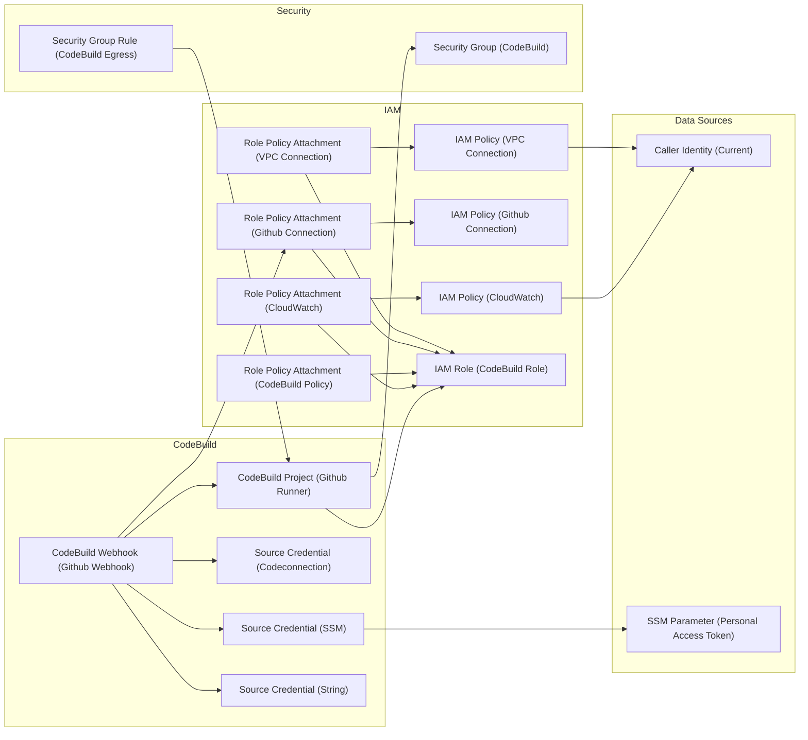

# GitHub self-hosted runner on AWS CodeBuild

This module creates a GitHub self-hosted runner on AWS CodeBuild, providing a secure and scalable solution for running GitHub Actions workflows in your AWS infrastructure.

## Overview

The module sets up a fully managed GitHub runner using AWS CodeBuild, which automatically scales based on your workflow needs. It supports both GitHub App and Personal Access Token authentication methods, and can be configured to run in a VPC for enhanced security.

### Key Features

- Managed scaling - AWS CodeBuild handles the provisioning and scaling of runners
- VPC support - Run workflows in your private network
- Flexible authentication - Support for both GitHub Apps and Personal Access Tokens
- Additional environment variables and secrets merged with the ones set in GitHub
- Configurable build specifications through different tiers

## Usage Example

A complete example of how to use this module can be found in the [example/complete](https://github.com/pagopa-dx/terraform-aws-github-selfhosted-runner-on-codebuild/tree/main/examples/complete) directory.

## Tiers and Configurations

The module supports different tiers to accommodate various workload requirements:

- **Small (s)**: 2 vCPU, 4GB RAM - Suitable for basic CI/CD workflows
- **Medium (m)**: 4 vCPU, 8GB RAM - Default tier, balanced for most use cases
- **Large (l)**: 8 vCPU, 16GB RAM - For resource-intensive builds

## Authentication Methods

### GitHub App (Recommended)
Use AWS CodeBuild's native GitHub App integration for enhanced security and simplified token management. 

**Important Notes:**
- Even though the GitHub App connection can be created via Terraform using `aws_codestar_connections_connection`, it requires manual approval in the AWS Console
- The connection needs to be configured only once per AWS account as it is account-wide
- To complete the setup:
  1. Go to the AWS Console > CodeBuild > Settings > Connections
  2. Find your connection and click on "Update pending connection"
  3. Follow the GitHub authorization flow
  4. The connection status should change from "Pending" to "Available"

### Personal Access Token
For scenarios where GitHub App integration is not possible, you can use a Personal Access Token:

```hcl
module "github_runner" {
  # ... other configuration ...

  personal_access_token = {
    ssm_parameter_name = "/github/pat"  # Store token in SSM Parameter Store
    # OR
    value = "ghp_your_token"  # Direct value (not recommended for production)
  }
}
```

## Extending Permissions and Access

### Additional IAM Permissions

The module outputs the CodeBuild IAM role that can be used to attach additional policies. Here's how to grant specific permissions:

```hcl
# Grant access to DynamoDB table
resource "aws_iam_role_policy_attachment" "dynamodb" {
  role       = module.runner.iam_role.name
  policy_arn = aws_iam_policy.dynamodb.arn
}

resource "aws_iam_policy" "dynamodb" {
  name = "${local.project}-dynamodb-policy"
  policy = jsonencode({
    Version = "2012-10-17"
    Statement = [
      {
        Effect = "Allow"
        Action = [
          "dynamodb:GetItem",
          "dynamodb:PutItem",
          "dynamodb:UpdateItem"
        ]
        Resource = aws_dynamodb_table.my_table.arn
      }
    ]
  })
}

# Grant access to specific SSM parameters
resource "aws_iam_role_policy_attachment" "ssm" {
  role       = module.runner.iam_role.name
  policy_arn = aws_iam_policy.ssm.arn
}

resource "aws_iam_policy" "ssm" {
  name = "${local.project}-ssm-policy"
  policy = jsonencode({
    Version = "2012-10-17"
    Statement = [
      {
        Effect = "Allow"
        Action = [
          "ssm:GetParameter",
          "ssm:GetParameters"
        ]
        Resource = [
          "arn:aws:ssm:${data.aws_region.current.name}:${data.aws_caller_identity.current.account_id}:parameter/myapp/*"
        ]
      }
    ]
  })
}
```

### Security Group Rules

The module outputs the CodeBuild security group that can be used to add custom rules:

```hcl
# Allow access to RDS database
resource "aws_security_group_rule" "database_access" {
  type                     = "egress"
  from_port                = 5432
  to_port                  = 5432
  protocol                 = "tcp"
  source_security_group_id = aws_security_group.database.id
  security_group_id        = module.runner.security_group.id
  description              = "Allow access to PostgreSQL database"
}

# Allow access to Redis cluster
resource "aws_security_group_rule" "redis_access" {
  type                     = "egress"
  from_port                = 6379
  to_port                  = 6379
  protocol                 = "tcp"
  source_security_group_id = aws_security_group.redis.id
  security_group_id        = module.runner.security_group.id
  description              = "Allow access to Redis cluster"
}
```

## Troubleshooting

Common issues and solutions:

1. **VPC Connectivity Issues**
   - Ensure the VPC has an Internet Gateway or NAT Gateway
   - Check security group rules allow outbound traffic

2. **Authentication Failures**
   - Verify PAT has required permissions (repo, workflow)
   - Check SSM parameter exists and is accessible

3. **Build Timeouts**
   - Adjust `build_timeout` value (default 480 minutes)
   - Consider using a larger tier for resource-intensive workflows

## Diagram
<!-- START_TF_GRAPH -->


<!-- END_TF_GRAPH -->

<!-- BEGIN_TF_DOCS -->
## Requirements

| Name | Version |
|------|---------|
| <a name="requirement_aws"></a> [aws](#requirement\_aws) | ~> 5.0 |

## Modules

No modules.

## Resources

| Name | Type |
|------|------|
| [aws_codebuild_project.github_runner](https://registry.terraform.io/providers/hashicorp/aws/latest/docs/resources/codebuild_project) | resource |
| [aws_codebuild_source_credential.codeconnection](https://registry.terraform.io/providers/hashicorp/aws/latest/docs/resources/codebuild_source_credential) | resource |
| [aws_codebuild_source_credential.ssm](https://registry.terraform.io/providers/hashicorp/aws/latest/docs/resources/codebuild_source_credential) | resource |
| [aws_codebuild_source_credential.string](https://registry.terraform.io/providers/hashicorp/aws/latest/docs/resources/codebuild_source_credential) | resource |
| [aws_codebuild_webhook.github_webhook](https://registry.terraform.io/providers/hashicorp/aws/latest/docs/resources/codebuild_webhook) | resource |
| [aws_iam_policy.cloudwatch](https://registry.terraform.io/providers/hashicorp/aws/latest/docs/resources/iam_policy) | resource |
| [aws_iam_policy.github_connection](https://registry.terraform.io/providers/hashicorp/aws/latest/docs/resources/iam_policy) | resource |
| [aws_iam_policy.vpc_connection](https://registry.terraform.io/providers/hashicorp/aws/latest/docs/resources/iam_policy) | resource |
| [aws_iam_role.codebuild_role](https://registry.terraform.io/providers/hashicorp/aws/latest/docs/resources/iam_role) | resource |
| [aws_iam_role_policy_attachment.cloudwatch](https://registry.terraform.io/providers/hashicorp/aws/latest/docs/resources/iam_role_policy_attachment) | resource |
| [aws_iam_role_policy_attachment.codebuild_policy](https://registry.terraform.io/providers/hashicorp/aws/latest/docs/resources/iam_role_policy_attachment) | resource |
| [aws_iam_role_policy_attachment.github_connection](https://registry.terraform.io/providers/hashicorp/aws/latest/docs/resources/iam_role_policy_attachment) | resource |
| [aws_iam_role_policy_attachment.vpc_connection](https://registry.terraform.io/providers/hashicorp/aws/latest/docs/resources/iam_role_policy_attachment) | resource |
| [aws_security_group.codebuild](https://registry.terraform.io/providers/hashicorp/aws/latest/docs/resources/security_group) | resource |
| [aws_security_group_rule.codebuild_egress](https://registry.terraform.io/providers/hashicorp/aws/latest/docs/resources/security_group_rule) | resource |
| [aws_caller_identity.current](https://registry.terraform.io/providers/hashicorp/aws/latest/docs/data-sources/caller_identity) | data source |
| [aws_ssm_parameter.personal_access_token](https://registry.terraform.io/providers/hashicorp/aws/latest/docs/data-sources/ssm_parameter) | data source |

## Inputs

| Name | Description | Type | Default | Required |
|------|-------------|------|---------|:--------:|
| <a name="input_build_timeout"></a> [build\_timeout](#input\_build\_timeout) | The timeout for the build process in minutes | `number` | `480` | no |
| <a name="input_codeconnection_arn"></a> [codeconnection\_arn](#input\_codeconnection\_arn) | The ARN of the CodeConnection connection. One of personal\_access\_token or codeconnection\_arn must be set. Please, make sure that one has already been installed in your repository (See how: https://docs.aws.amazon.com/dtconsole/latest/userguide/connections-create-github.html). | `string` | `null` | no |
| <a name="input_docker_image"></a> [docker\_image](#input\_docker\_image) | The docker image to be used in the self-hosted runner. If not set, the default image will be used. | `string` | `null` | no |
| <a name="input_env_variables"></a> [env\_variables](#input\_env\_variables) | Build environment variables. These are intended as an addition to the ones specified in the GitHub environment. | `map(string)` | `{}` | no |
| <a name="input_environment"></a> [environment](#input\_environment) | Values which are used to generate resource names and region short names. They are all mandatory except for domain, which should not be used only in the case of a resource used by multiple domains. | <pre>object({<br/>    prefix          = string<br/>    env_short       = string<br/>    region          = string<br/>    domain          = optional(string)<br/>    app_name        = string<br/>    instance_number = string<br/>  })</pre> | n/a | yes |
| <a name="input_name"></a> [name](#input\_name) | The name of the codebuild project. If not set, the name will be generated using the environment variable. This is useful when you want to customize the runner label. | `string` | `null` | no |
| <a name="input_personal_access_token"></a> [personal\_access\_token](#input\_personal\_access\_token) | GitHub personal access token used to authenticate. One of personal\_access\_token or codeconnection\_arn must be set. | <pre>object({<br/>    ssm_parameter_name = optional(string, null)<br/>    value              = optional(string, null)<br/>  })</pre> | `null` | no |
| <a name="input_repository"></a> [repository](#input\_repository) | Source repository information | <pre>object({<br/>    owner = optional(string, "pagopa")<br/>    name  = string<br/>  })</pre> | n/a | yes |
| <a name="input_secrets"></a> [secrets](#input\_secrets) | Secrets to be used in the build environment. The key is the name of the environment variable, and the value is the name of the SSM parameter or Secrets Manager secret. These are intended as an addition to the ones specified in the GitHub environment. | <pre>map(object({<br/>    ssm_parameter_name   = optional(string, null)<br/>    secrets_manager_name = optional(string, null)<br/>  }))</pre> | `{}` | no |
| <a name="input_tags"></a> [tags](#input\_tags) | Resources tags | `map(any)` | `{}` | no |
| <a name="input_tier"></a> [tier](#input\_tier) | Resource tiers depending on build requirements. Allowed values are 's', 'm', 'l'. | `string` | `"m"` | no |
| <a name="input_vpc"></a> [vpc](#input\_vpc) | The VPC used to deploy the resources | <pre>object({<br/>    id              = string<br/>    private_subnets = list(string)<br/>  })</pre> | n/a | yes |

## Outputs

| Name | Description |
|------|-------------|
| <a name="output_iam_role"></a> [iam\_role](#output\_iam\_role) | n/a |
| <a name="output_security_group"></a> [security\_group](#output\_security\_group) | n/a |
<!-- END_TF_DOCS -->
