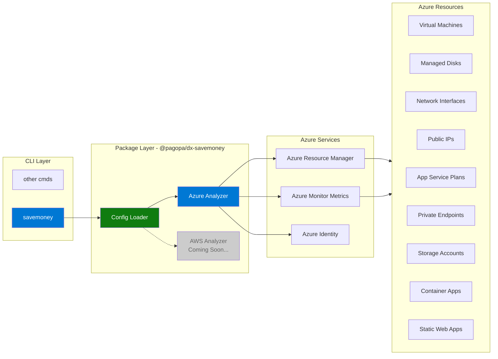

# DX Save Money

A TypeScript library for analyzing CSP (Cloud Service Provider) resources to identify potential cost inefficiencies and underutilized resources. It operates in read-only mode and does not modify, tag, or delete any resources; instead, it generates detailed reports to support FinOps decisions.

## Supported Cloud Providers

### ✅ Azure

Full support for Azure resource analysis with intelligent detection and flexible reporting.

### 🚧 AWS (Coming Soon)

AWS support is planned for future releases. The architecture is designed to support multiple CSPs with provider-specific analyzers.

## Architecture

The SaveMoney tool follows a modular architecture designed for multi-CSP
support:



## Installation

```bash
npm install @pagopa/dx-savemoney
# or
pnpm add @pagopa/dx-savemoney
# or
yarn add @pagopa/dx-savemoney
```

## Azure

### Main Features

- **Multi-Subscription Analysis**: Scans multiple Azure subscriptions in a single command.
- **Intelligent Detection**: Uses Azure Monitor metrics (e.g. CPU, network traffic, transactions) to scientifically identify inactive resources.
- **Orphaned Resource Identification**: Detects commonly "forgotten" resources like unattached disks, unassociated public IPs, and unused network interfaces.
- **Flexible Reporting**: Offers multiple output formats:
  - `table`: A human-readable summary for the terminal.
  - `json`: Standard format for integration with other tools.
  - `detailed-json`: A comprehensive output with all resource metadata, ideal for in-depth analysis via AI or custom scripts.
  - `lint`: A linter-style output grouped by resource, with risk icons and a summary — ideal for CI pipelines and quick triage.
- **Simplified Configuration**: Supports configuration via files, command-line options, environment variables, or an interactive prompt.
- **Configurable Thresholds**: All analysis thresholds (CPU%, memory, transaction counts, etc.) can be overridden via the `thresholds` section of the YAML config file.
- **Tag Filtering**: Restrict the analysis to resources that match specific tag key-value pairs.

### Analyzed Resources

The tool analyzes the following Azure resource types with specific detection methods and risk levels:

| Resource Type           | Detection Method        | Cost Risk | What's Checked                                                                                                      |
| :---------------------- | :---------------------- | :-------: | :------------------------------------------------------------------------------------------------------------------ |
| **Virtual Machines**    | Instance View + Metrics |  🔴 High  | Deallocated/stopped state, Low CPU usage (<1%), Low network traffic (<3MB per days)                                 |
| **App Service Plans**   | API Details + Metrics   |  🔴 High  | No apps deployed, Very low CPU (<5%), Very low memory (<10%), Oversized Premium tier                                |
| **Container Apps**      | API Details + Metrics   | 🟡 Medium | Not running state, Zero replicas configured, Low CPU (<0.001 cores), Low memory (<10MB), Low network traffic (<1MB) |
| **Managed Disks**       | API Details             | 🟡 Medium | Unattached state, No `managedBy` property                                                                           |
| **Public IP Addresses** | API Details + Metrics   | 🟡 Medium | Not associated with any resource, Static IP not in use, Very low network traffic (<~340KB per day)                  |
| **Network Interfaces**  | API Details             | 🟡 Medium | Not attached to VM or Private Endpoint, No public IP assigned                                                       |
| **Private Endpoints**   | API Details             | 🟡 Medium | No private link connections, Rejected/disconnected connections, No network interfaces                               |
| **Storage Accounts**    | Metrics                 | 🟡 Medium | Very low transaction count (<10 per days in timespan)                                                               |
| **Static Web Apps**     | Metrics                 |  🟢 Low   | No traffic data available, Very low site hits (<100 requests in 30 days), Very low data transfer (<1MB in 30 days)  |

#### Generic Checks

All resources are also checked for:

- **Missing tags**: Resources without tags are flagged as potentially unmanaged
- **Location mismatch**: Resources not in the preferred location are reported

### Prerequisites

1. **Node.js**: Version 22 or higher.
2. **Azure Credentials**: The library uses `DefaultAzureCredential` from `@azure/identity`, which supports various authentication methods:
   - Azure CLI (`az login`)
   - Managed Identity
   - Environment variables
   - Visual Studio Code
   - And more...

### Usage

#### Quick Start

```typescript
import { azure, loadConfig } from "@pagopa/dx-savemoney";

// Load configuration (from file, env vars, or interactive prompt)
const config = await loadConfig("./config.yaml");

// Run analysis and generate report
await azure.analyzeAzureResources(config, "table");
```

#### Configuration Inputs

The tool requires the following configuration:

| Input               | Type                     | Required | Default      | Description                                                               |
| :------------------ | :----------------------- | :------: | :----------- | :------------------------------------------------------------------------ |
| `subscriptionIds`   | `string[]`               |    ✅    | -            | Array of Azure subscription IDs to analyze                                |
| `preferredLocation` | `string`                 |    ❌    | `italynorth` | Preferred Azure region (resources elsewhere will be flagged)              |
| `timespanDays`      | `number`                 |    ❌    | `30`         | Number of days to look back for metrics analysis                          |
| `verbose`           | `boolean`                |    ❌    | `false`      | Enable detailed logging for each resource analyzed                        |
| `filterTags`        | `Record<string, string>` |    ❌    | -            | Only analyze resources matching **all** the specified tag key-value pairs |
| `thresholds`        | `Thresholds`             |    ❌    | see below    | Override the default numeric thresholds used during analysis              |

#### Output Formats

The tool supports multiple output formats for different use cases:

| Format          | Description                                         | Use Case                       |
| :-------------- | :-------------------------------------------------- | :----------------------------- |
| `table`         | Human-readable table in terminal                    | Quick visual inspection        |
| `json`          | Structured JSON with resource summaries             | Integration with other tools   |
| `detailed-json` | Complete JSON with full Azure resource metadata     | AI analysis or deep inspection |
| `lint`          | Linter-style output grouped by resource, with icons | CI pipelines and quick triage  |

#### How to Load Configuration

The `loadConfig()` function loads configuration in the following priority order:

1. **Configuration file** (pass file path as parameter)
2. **Environment variable** (`ARM_SUBSCRIPTION_ID`)
3. **Interactive prompt** (if no other configuration is found)

**Example:**

```typescript
// From file
const config1 = await loadConfig("./config.yaml");

// From environment variable or prompt
const config2 = await loadConfig();
```

#### Configuration File Example

```yaml
azure:
  subscriptionIds:
    - xxxxxxxx-xxxx-xxxx-xxxx-xxxxxxxxxxxx
  preferredLocation: italynorth
  timespanDays: 30
  verbose: false
  thresholds: # optional — omit to use built-in defaults
    vm:
      cpuPercent: 5
    storage:
      transactionsPerDay: 50
```

#### Thresholds Configuration

All numeric thresholds used during analysis can be overridden by adding a
`thresholds` section inside the `azure` block of your config YAML.
Only the fields you want to change are required — all others keep their
built-in defaults.

**Example (full override, `config.yaml`):**

```yaml
azure:
  subscriptionIds:
    - xxxxxxxx-xxxx-xxxx-xxxx-xxxxxxxxxxxx
  thresholds:
    vm:
      cpuPercent: 5
      networkInBytesPerDay: 10485760
    appService:
      cpuPercent: 10
      memoryPercent: 20
      premiumCpuPercent: 15
    containerApp:
      cpuNanoCores: 5000000
      memoryBytes: 52428800
      networkBytes: 100000
    storage:
      transactionsPerDay: 50
    publicIp:
      bytesInDDoS: 1048576
    staticSite:
      siteHits: 500
      bytesSent: 5242880
```

**Default threshold values:**

| Resource       | Field                  | Default Value           | Description                                   |
| :------------- | :--------------------- | :---------------------- | :-------------------------------------------- |
| `vm`           | `cpuPercent`           | `1` (%)                 | Average CPU below which VM is flagged         |
| `vm`           | `networkInBytesPerDay` | `3145728` (3 MB)        | Average inbound traffic below which flagged   |
| `appService`   | `cpuPercent`           | `5` (%)                 | Average CPU below which plan is flagged       |
| `appService`   | `memoryPercent`        | `10` (%)                | Average memory below which plan is flagged    |
| `appService`   | `premiumCpuPercent`    | `10` (%)                | CPU threshold for Premium-tier over-provision |
| `containerApp` | `cpuNanoCores`         | `1000000` (0.001 cores) | Average CPU below which app is flagged        |
| `containerApp` | `memoryBytes`          | `10485760` (10 MB)      | Average memory below which app is flagged     |
| `containerApp` | `networkBytes`         | `34000` (~33 KB)        | Combined Rx+Tx below which app is flagged     |
| `storage`      | `transactionsPerDay`   | `10`                    | Avg daily transactions below which flagged    |
| `publicIp`     | `bytesInDDoS`          | `340000` (~332 KB)      | Avg inbound bytes/day below which flagged     |
| `staticSite`   | `siteHits`             | `100`                   | Total requests below which site is flagged    |
| `staticSite`   | `bytesSent`            | `1048576` (1 MB)        | Total bytes sent below which site is flagged  |

#### Usage Examples

##### Tag Filtering

```typescript
import { azure, loadConfig } from "@pagopa/dx-savemoney";

const config = await loadConfig("./config.yaml");
// Analyze only resources tagged with environment=prod AND team=platform
await azure.analyzeAzureResources(
  {
    ...config,
    filterTags: new Map([
      ["environment", "prod"],
      ["team", "platform"],
    ]),
  },
  "lint",
);
```

##### Basic Usage

```typescript
import { azure, loadConfig } from "@pagopa/dx-savemoney";

// Load from config file
const config = await loadConfig("./config.yaml");
await azure.analyzeAzureResources(config, "table");
```

##### Custom Configuration

```typescript
import { azure } from "@pagopa/dx-savemoney";
import type { AzureConfig } from "@pagopa/dx-savemoney";

const config: AzureConfig = {
  subscriptionIds: ["sub-id-1", "sub-id-2"],
  preferredLocation: "italynorth",
  timespanDays: 30,
  verbose: true,
};

await azure.analyzeAzureResources(config, "json");
```

##### Generate Detailed Report

```typescript
import { azure, loadConfig } from "@pagopa/dx-savemoney";

const config = await loadConfig();
// Generate detailed JSON with full resource metadata
await azure.analyzeAzureResources(config, "detailed-json");
```

##### Using Environment Variables

```typescript
import { loadConfig, azure } from "@pagopa/dx-savemoney";

// Set environment variables
// ARM_SUBSCRIPTION_ID=sub1,sub2

const config = await loadConfig(); // Will read from env vars
await azure.analyzeAzureResources(config, "json");
```

## AWS (Coming Soon)

AWS support is planned for future releases with similar capabilities:

- Multi-account analysis
- Resource-specific detection algorithms
- Flexible reporting formats
- AWS-specific configuration options

The API will follow a similar pattern:

```typescript
import { aws, loadAwsConfig } from "@pagopa/dx-savemoney";

const config = await loadAwsConfig("./aws-config.json");
await aws.analyzeAwsResources(config, "table");
```

## Development

### Type Checking

```bash
pnpm typecheck
```

### Linting

```bash
pnpm lint        # Auto-fix issues
pnpm lint:check  # Check without fixing
```

### Testing

```bash
pnpm test              # Run tests
pnpm test:watch        # Watch mode
pnpm test:coverage     # With coverage report
```

### Formatting

```bash
pnpm format        # Format code
pnpm format:check  # Check formatting
```
