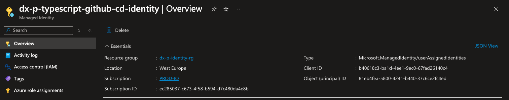

# Azure Login

There are several ways to log into Azure by a GitHub Action. The our chosen method doesn't require maintenance or secret management as it is a passwordless approach. Once set up, it works.

Only two components are needed to log into Azure:

- An Azure Managed Identity resource
- A federation between the Azure Managed Identity and GitHub

The folder `infra/identity` contains the Terraform definition, often created by Cloud Engineers using a [Terraform custom module](https://github.com/pagopa/dx/tree/main/infra/modules/azure_federated_identity_with_github) to create both the Managed Identity and the federation with GitHub. Module also provides a set of default roles in the current subscription, which are likely to be enough for new repositories - more on this later.

Once the Managed Identity is created, only `client id` value and note it apart.

Once done, you are technically ready to log into Azure from a GitHub pipeline:

```yaml
- name: Azure Login
  uses: azure/login@v2
  with:
    client-id: <managed identity client id>
    tenant-id: <tenant id>
    subscription-id: <subscription id>
```

:::note

The Managed Identity Client Id is available in the Azure Portal, navigating to the Managed Identity resource:


:::

Despite the three mentioned values are not secrets, they should not be harcoded in the pipeline but shall be stored as repository or GitHub _environment_ secrets.

:::important

> Rather than specifying the `azure/login` action, it is likely you need to pass these values as arguments of workflow templates available in this repository.

:::

## GitHub environments

A GitHub pipeline could use GitHub environments to inherits settings, secrets, variables, permissions and other stuff. As subscription are grouped by project (`PROD-IO`, `PROD-SELFCARE`, etc.) and environment (`DEV-SELFCARE`, `UAT-SELFCARE`, etc.), GitHub environments are used to get the value of a given secret depending on the current scope.

Then, `subscription id` and `managed identity client id` values can be stored as secrets of a specific GitHub environment. In particular:

- `tenant id`: the value is always the same and could be stored as repository secret
- `subscription id`: if the project has a single environment it could be stored as repository secret; otherwise as environment secret
- `managed identity client id`: always as environment secret

:::tip

This setup is generally defined via Terraform in the `infra/repository` folder.

:::

### Managing multiple GitHub environments

A managed identity has a set of roles in a given subscription. Then, each pipeline which would require the same roles could use the same managed identity - including the same GitHub environment.

Let's say a repository has two Azure Functions App, including both application code and Terraform code. Terraform deployments need high privileges to create and update networking resources, identities, key vaults' secrets and more.\
Instead, the set of roles required by the Function App deployments is limited to have a write access to the Function App resource control plane. It doesn't need access to other stuff like networking, storages, or neither secrets. However, both Functions Apps require the same roles as the action is identical.\
Then, the two Function App pipelines could share the same Managed Identity and related GitHub environment, while the Terraform code should use have a dedicated GitHub environment.

:::tip

Generally, the following convention is used to name the GitHub environments:

- `<env>-ci/cd`: dedicated to the Terraform code (i.e. `prod-ci`)
- `app-<env>-ci/cd`: dedicated to Azure Functions App/App Service deployments
- `opex-<env>-ci/cd`: dedicated to the Opex dashboard deployments

For any other need, add the desired environment sticking to this pattern.

:::

## Managing identity roles

The mentioned module to create a Managed Identity federated with GitHub, assignes a set of default roles to the Identity. However, the Managed Identity roles cannot be static and is very likely they will be changed over time.\
This could happens if for example a new resource which requires special roles is added to the configuration. Or the Terraform code reads a secret of a new KeyVault or blobs from a new Storage Account. It is impossible to foresee all possible cases as things changes over time.

Then, the identity definition should be updated with appropriated roles when a new role is needed. There are hundreds of cases of when this could happen, but the most common ones could be:

- altering roles of system-assigned managed identities
- reading a new entity from the KeyVault (certificate, secrets, keys)
- adding VNet peerings
- updating APIM configuration
- reading from a Storage Account container, queue or table

The general advice is to check the CI pipeline, which could fail for a missing role. In this case, identify the role using the official documentation and create a PR with the new definition.

:::warning

Setting new roles is quite easy and must be done separately for CI and CD identities.

:::

:::tip

Granularity is set at subscription and resource group level. Check the module documentation for details.

:::
