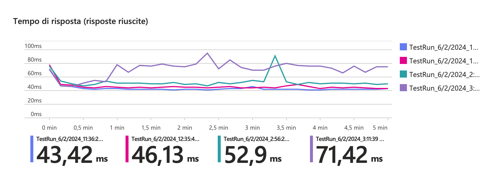
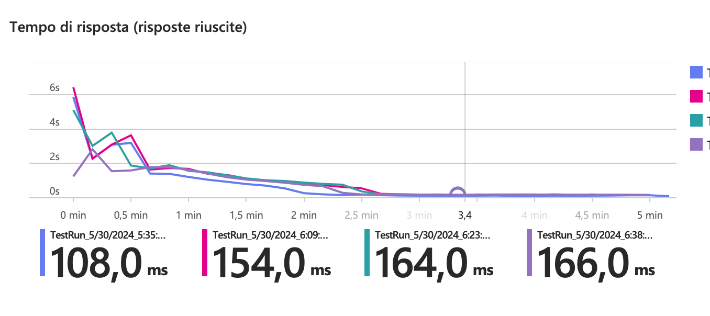

# Azure and Tracing for NodeJS Applications

This guide covers the integration of Azure services with OpenTelemetry (OT) for
tracing NodeJS applications, along with benchmarking and performance insights.

## Azure and OpenTelemetry

Microsoft is rapidly adopting **OpenTelemetry (OT)** as the standard for
tracing, migrating from older custom solutions (e.g., vendor protocols for
**Application Insights**).

**OpenTelemetry (OT)** is an open-source framework for collecting monitoring and
telemetry data, including traces, metrics, and logs, from software applications
to improve observability and debugging.

The OT ecosystem for NodeJS consists of vendor-neutral libraries that enable a
NodeJS process (whether on Azure or AWS) to send metrics to an OT "collector":

[open-telemetry/opentelemetry-js: OpenTelemetry JavaScript Client](https://github.com/open-telemetry/opentelemetry-js)

In the specific case of Azure, the collector is **Azure Monitor**.

The reference OT package for NodeJS in the Azure ecosystem is
[@azure/monitor-opentelemetry](https://www.npmjs.com/package/@azure/monitor-opentelemetry),
which exports a method `useAzureMonitor` that enables the necessary
instrumentation for popular libraries (such as `http`, `redis`, `mysql`,
`postgresql`, etc.), so metrics can be transparently traced for users of
different SDK clients.

OT instrumentation is implemented through runtime patching of the client SDK
calls. Therefore, you need to import the necessary libraries
(`@azure/monitor-opentelemetry`) and call the `useAzureMonitor` method before
including any other package in the codebase.

## Patching native NodeJS fetch

The `@azure/monitor-opentelemetry` package does not patch the native fetch
method by default, which is commonly used in modern NodeJS applications.

At the time of writing this document, instrumenting the native fetch of NodeJS
(based on the undici package) requires an additional step on top of using the
`useAzureMonitor` method:

[Monitor OpenTelemetry - Add native fetch instrumentation](https://github.com/Azure/azure-sdk-for-js/issues/29864)

See
[Example Integration with App Service](#example-integration-with-app-service)
for a complete example.

:::warning

If you are using version 2.x of the Application Insights SDK, be aware that it
does not support instrumentation of the native fetch methods so external HTTP
requests will not be traced unless you use some custom fetch wrapper.

:::

## Using the Application Insights SDK

The latest version of the Application Insights SDK (3.x) is essentially a
wrapper around OT functionalities provided by the `@azure/monitor-opentelemetry`
package:

[microsoft/ApplicationInsights-node.js: Microsoft Application Insights SDK for Node.js](https://github.com/microsoft/ApplicationInsights-node.js)

The new AI SDK uses the `@azure/monitor-opentelemetry` package under the hood:
the `useAzureMonitor` method is called at the bootstrap of the application to
enable tracing and metrics.

Moreover the SDK provides a series of
"[shims](https://github.com/microsoft/ApplicationInsights-node.js/tree/main/src/shim)"
that enable its adoption in legacy applications using tracing methods from
previous versions (e.g., `trackEvent`) without refactoring the existing code.

:::note

Although you can enable tracing and metrics using only the
`@azure/monitor-opentelemetry` package, if you want to use legacy AI methods
(e.g., `trackEvent`), you must use the **AI SDK** and call the `setup` and
`start` methods at the bootstrap of the application to initialize the default
`TelemetryClient`.

:::

Alternatively, you can use only `@azure/monitor-opentelemetry` to send custom
events, but in this case, you would need to re-implement the wrapper, similar to
what the AI SDK does:

[Send Custom Event to AI · Issue #29196 · Azure/azure-sdk-for-js](https://github.com/Azure/azure-sdk-for-js/issues/29196)

:::warning

This approach is not recommended because it requires alignment with the
internals of Application Insights, which may change over time. On the other
hand, the AI SDK may fall behind new versions of `@azure/monitor-opentelemetry`.

:::

## Enabling HTTP KeepAlive

:::note

Unlike previous versions, HTTP KeepAlive is enabled by default in all modern
Azure SDKs, and there is no longer a need to set up a custom agent.

[azure-sdk-for-js/sdk/core/core-rest-pipeline/src/pipelineRequest.ts](https://github.com/Azure/azure-sdk-for-js/blob/main/sdk/core/core-rest-pipeline/src/pipelineRequest.ts#L149)

:::

## Setting Sample Rate in AI SDK

When using the AI SDK, it's a good practice to limit the number of traces sent
to **Application Insights** by setting the sample rate.

The sample rate can be set in different ways.

### Using the `applicationinsights.json` configuration file

See
https://github.com/microsoft/ApplicationInsights-node.js?tab=readme-ov-file#configuration

```json
{
  "samplingPercentage": 30
}
```

### Using the `APPLICATIONINSIGHTS_CONFIGURATION_CONTENT` environment variable

This environment variable takes precedence over the `applicationinsights.json`
and has the same format as the JSON file.

```typescript
process.env["APPLICATIONINSIGHTS_CONFIGURATION_CONTENT"] =
  process.env["APPLICATIONINSIGHTS_CONFIGURATION_CONTENT"] ??
  JSON.stringify({
    samplingPercentage: 5,
  } satisfies Partial<IJsonConfig>);
```

### Set sample rate programmatically

```typescript
import * as ai from "applicationinsights";

ai.setup();
ai.defaultClient.config.samplingPercentage = 5;
ai.start();
```

## Enable sampling of traces and custom events with OpenTelemetry

OpenTelemetry uses Tracer and Loggers for different types of telemetry data:

- **traces**: Used for traces and metrics.
- **logs**: Used for console logs and custom events.

:::warning

By design OpenTelemetry SDKs samples only _traces_ but not _logs_.

:::

In the context of Application Insights, the terminology differs slightly.
_Traces_ in Application Insights refer to logs emitted by the application using
`console.log` (or `context.log` in Azure Functions) and _custom events_, which
are considered _logs_ in OpenTelemetry. Conversely, _requests_ and
_dependencies_ in Application Insights correspond to _traces_ in OpenTelemetry
¯\_(ツ)\_/¯.

To enable **parent based** sampling for logs and custom events, you can set the
following option when initializing the AI SDK:

```typescript
// this enables sampling for traces and custom events
ai.defaultClient.config.azureMonitorOpenTelemetryOptions = {
  enableTraceBasedSamplingForLogs: true,
};
```

:::warning

This setting only applies to traces and custom events that occur within a **Span
Context**. This is not always the case, such as when using an Azure Function. In
most cases, you will need to implement custom logic within a
[LogRecordProcessor](https://github.com/open-telemetry/opentelemetry-js/blob/main/experimental/packages/sdk-logs/src/LogRecordProcessor.ts)
to sample logs.

:::

## Check is sampling is enabled

To check if sampling is enabled, you can use the following query in **Log
Analytics**:

```
union requests,dependencies,pageViews,browserTimings,exceptions,traces,customEvents
| where timestamp > ago(1h)
| summarize RetainedPercentage = 100/avg(itemCount) by bin(timestamp, 1m), itemType, sdkVersion
```

If you see values < 100 then sampling is enabled for that item type.

## Integration with App Service

Both **Azure Functions** and **App Services (NodeJS)** allow integration with
**Application Insights** without using the SDK. This integration is active in
the following scenarios:

1. The legacy environment variable **APPINSIGHTS_INSTRUMENTATIONKEY** is set.
2. The environment variable **APPLICATIONINSIGHTS_CONNECTION_STRING** is set.

When either of these variables is set, the **NodeJS** application incorporates a
custom AI agent that starts at bootstrap before importing any other module.

:::warning

On App Services, this mechanism interferes with the programmatic setup of the AI
SDK, overwriting its settings. Therefore, it is recommended to disable the
default integration by removing these environment variables whether you are
using the AI SDK programmatically.

:::

At the time of writing, the default integration (agent) does not support
end-to-end tracing.

If using the AI SDK, check that the default AI integration is disabled by
ensuring that the `APPINSIGHTS_INSTRUMENTATIONKEY` and
`APPLICATIONINSIGHTS_CONNECTION_STRING` variables are not set. It is recommended
to use a custom environment variable that will be configured in the
`useAzureMonitor` and/or `setup` settings.

To verify that the default integration is indeed disabled, navigate to the
**"Application Insights"** panel of the App Service on the Azure portal.

## Integration with Next.js Deployed on Azure App Service

For `Next.js` applications deployed on **App Service**, similar considerations
apply. However, since there is no single entry point as with other frameworks,
you must use the **instrumentation module**. This module is loaded first by
**Next.js** to ensure that **Application Insights/OpenTelemetry** is initialized
before anything else:

https://nextjs.org/docs/app/building-your-application/optimizing/open-telemetry#manual-opentelemetry-configuration

## Integration with Azure Functions

**Azure Functions** are a bit more complex to integrate with **OpenTelemetry**
since you have to handle it both in the **Azure Functions** runtime (host) and
in the application code (worker).

### End-to-End tracing with host AI integration enabled

The **Azure Functions** runtime (host) activates monitoring when the
`APPLICATIONINSIGHTS_CONNECTION_STRING` is set.

:::warning

At the time of writing, only when activating OpenTelemetry
(`"telemetryMode": "OpenTelemetry"` in host.json), the **Azure Functions**
runtime produces extraneous traces that are not part of the application code.
This behavior is expected to be fixed in the future:

https://github.com/Azure/azure-functions-host/issues/10770#issuecomment-2627874412

:::

In both configurations (OpenTelemetry enabled or disabled), when using the AI
3.x SDK, you get end-to-end tracing of the application code (worker). Next step
is align sample rate in AI SDK and Azure Functions runtime.

### Align Sample Rate in AI SDK and Azure Functions Runtime

AI SDK use a fixed sample rate, while the Azure Functions runtime uses an
adaptive sampling mechanism. To avoid discrepancies in the number of traces
recorded, it is recommended to align the sample rate in the AI SDK with the
Azure Functions runtime.

To align the sample rate in the Azure Functions runtime with the AI SDK, you can
set these options in `host.json` to the same value used programmatically:

```json
{
  "logging": {
    "applicationInsights": {
      "samplingSettings": {
        "minSamplingPercentage": 5,
        "maxSamplingPercentage": 5,
        "initialSamplingPercentage": 5
      }
    }
  }
}
```

Alternatively, you may use the following environment variables for the same
purpose:

`AzureFunctionsJobHost__logging__applicationInsights__samplingSettings__minSamplingPercentage`
`AzureFunctionsJobHost__logging__applicationInsights__samplingSettings__maxSamplingPercentage`
`AzureFunctionsJobHost__logging__applicationInsights__samplingSettings__initialSamplingPercentage`

Beware that the runtime also relies on the
`AzureFunctionsJobHost__logging__applicationInsights__samplingSettings_maxTelemetryItemsPerSecond`
variable to limit the number of traces sent.

#### Sampling gotchas within Azure Functions

1. Beware that `traces` and `customEvents` emitted by the AI SDK are not
   sampled. This implies that even if you configure a sample rate of 5% in the
   AI SDK, you will still see 100% of `traces` and `customEvents`.
2. When using `"telemetryMode": "OpenTelemetry"` in `host.json`, it appears that
   there is no way to enable sampling at all fot the host yet:
   https://github.com/Azure/azure-functions-host/issues/10770#issuecomment-2629318006
3. If you want to override `logLevels` using environment variables, beware that
   "_App settings that contain a period aren't supported when running on Linux
   in an Elastic Premium plan or a Dedicated (App Service) plan_", see
   https://learn.microsoft.com/en-us/azure/azure-functions/configure-monitoring?tabs=v2#overriding-monitoring-configuration-at-runtime

### End-to-End tracing with host AI integration disabled

If you choose to disable the default AI integration and rely solely on the AI
SDK (using a variable other than `APPLICATIONINSIGHTS_CONNECTION_STRING`), you
will lose end-to-end tracing of the application code (worker) because the
runtime (host) will no longer record HTTP requests.

To achieve full integration and enable end-to-end tracing of calls in this
scenario, you need to incorporate a wrapper around the Functions' handlers that
[programmatically activates the OpenTelemetry mechanisms](#example-of-ot-context-wrapper-for-azure-functions).

Benchmarks have shown that this wrapper does not introduce any significant
performance penalties, so you can safely use it in production.

## Cloud Role Name

When using the AI SDK, the `cloudRoleName` is set by default to the name of the
**App Service** or **Azure Function**. This value is used to identify the
service in **Application Insights** and group traces.

If you need to customize the `cloudRoleName` (the name of the service in
Application Insights), you can set the `OTEL_SERVICE_NAME` environment.

Setting a value for
`ai.defaultClient.context.tags[ai.defaultClient.context.keys.cloudRole]`
produces no result, even though some online tutorials suggest it. These
tutorials are now considered obsolete.

## Performance

Load tests were performed on **App Service** and **Azure Functions**, with the
following conditions:

1. AI completely disabled.
2. AI enabled with sampling at 0%.
3. AI enabled with sampling at 50%.
4. AI enabled with sampling at 100%.

### Benchmark on App Service

The test was conducted using **Azure Load Test** on a test App Service (B1) for
5 minutes with an average of 200 requests per second. There was a maximum
overhead of 30ms observed between tests with 100% sampling compared to those
with AI disabled.



:::note

Using a sampling level < 30% introduces negligible overhead with AI enabled via
SDK

:::

### Benchmark on Azure Functions

The test was conducted on an **Azure Function** using the **Y1 consumption
plan** for 5 minutes with an average of 200 requests per second. Once the
instances had scaled, a maximum overhead of 60ms was observed between tests with
100% sampling and those with AI disabled.



It seems that the sampling value had less impact on time differences once the
instances had scaled horizontally. However, the time needed for scaling
increased linearly with the sampling values.

## Key Takeaways

1. It is recommended to start migrating logging and metric tracing procedures to
   **OpenTelemetry**, incorporating the new version of the **AI SDK 3.x**.
2. Adopting **OT** is currently the only method for achieving end-to-end
   tracing, including the tracing of native NodeJS fetch requests.
3. It is advisable to disable the default integrations and use the SDK
   programmatically on App Services.
4. The current OT implementation on **Azure Functions** is still unstable;
   monitor progress and avoid using `"telemetryMode": "OpenTelemetry"` in
   host.json.

## Code Snippets

### Example Integration with App Service

```javascript
import * as ai from "applicationinsights";

import { UndiciInstrumentation } from "@opentelemetry/instrumentation-undici";
import { registerInstrumentations } from "@opentelemetry/instrumentation";
import { metrics, trace } from "@opentelemetry/api";
import { IJsonConfig } from "applicationinsights/out/src/shim/types";

if (process.env["AI_SDK_CONNECTION_STRING"]) {

// setup sampling percentage from environment (optional)
  // see https://github.com/microsoft/ApplicationInsights-node.js?tab=readme-ov-file#configuration
  // for other options. environment variable is in JSON format and takes
  // precedence over applicationinsights.json
  process.env["APPLICATIONINSIGHTS_CONFIGURATION_CONTENT"] =
    process.env["APPLICATIONINSIGHTS_CONFIGURATION_CONTENT"] ??
    JSON.stringify({
      samplingPercentage: 30,
    } satisfies Partial<IJsonConfig>);

  // setup cloudRoleName (optional)
  process.env.OTEL_SERVICE_NAME =
    process.env.WEBSITE_SITE_NAME ?? "local-app-service";

  ai.setup(process.env["AI_SDK_CONNECTION_STRING"]).start();

  // instrument native node fetch
  // this must be called after starting the AI SDK
  // in order to instantiate the OTEL tracer provider
  registerInstrumentations({
    tracerProvider: trace.getTracerProvider(),
    meterProvider: metrics.getMeterProvider(),
    // When using Azure Functions, you may want to add Azure Functions support for traces as well
    // see https://github.com/Azure/azure-functions-nodejs-opentelemetry
    instrumentations: [new UndiciInstrumentation()],
  });
}
export default ai;
```

### Example of OT Context wrapper for Azure Functions

```javascript
import { HttpRequest, InvocationContext, HttpHandler } from "@azure/functions";
import {
  Attributes,
  SpanKind,
  SpanOptions,
  SpanStatusCode,
  TraceFlags,
  context,
  trace,
  Span,
  SpanContext,
} from "@opentelemetry/api";
import {
  SEMATTRS_HTTP_METHOD,
  SEMATTRS_HTTP_STATUS_CODE,
  SEMATTRS_HTTP_URL,
} from "@opentelemetry/semantic-conventions";

export default function withAppInsights(func: HttpHandler) {
  return async (req: HttpRequest, invocationContext: InvocationContext) => {
    if (
      process.env["DISABLE_FUNCTION_WRAPPER"]
    ) {
      return await func(req, invocationContext);
    }
    const startTime = Date.now();

    // Extract the trace context from the incoming request
    const traceParent = req.headers.get("traceparent");
    const parts = traceParent?.split("-");

    const parentSpanContext: SpanContext | null =
      parts &&
      parts.length === 4 &&
      parts[1].length === 32 &&
      parts[2].length === 16
        ? {
            traceId: parts[1],
            spanId: parts[2],
            traceFlags: TraceFlags.NONE,
          }
        : null;

    const activeContext = context.active();

    // Set span context as the parent context if any
    const parentContext = parentSpanContext
      ? trace.setSpanContext(activeContext, parentSpanContext)
      : activeContext;

    const attributes: Attributes = {
      [SEMATTRS_HTTP_METHOD]: "HTTP",
      [SEMATTRS_HTTP_URL]: req.url,
    };

    const options: SpanOptions = {
      kind: SpanKind.SERVER,
      attributes: attributes,
      startTime: startTime,
    };

    // Emulates an HTTP request span
    const span: Span = trace
      .getTracer("ApplicationInsightsTracer")
      .startSpan(`${req.method} ${req.url}`, options, parentContext);

    let res;
    try {
      res = await context.with(trace.setSpan(activeContext, span), async () => {
        return await func(req, invocationContext);
      });
      const status = res?.status;
      if (status) {
        span.setStatus({
          code: status < 400 ? SpanStatusCode.OK : SpanStatusCode.ERROR,
        });
        span.setAttribute(SEMATTRS_HTTP_STATUS_CODE, status);
      }
    } catch (error) {
      span.setStatus({
        code: SpanStatusCode.ERROR,
        message: error instanceof Error ? error.message : JSON.stringify(error),
      });
      throw error;
    } finally {
      span.end(Date.now());
    }

    return res;
  };
}
```

```javascript
app.http("root", {
  route: "/",
  methods: ["GET"],
  authLevel: "anonymous",
  handler: withAppInsights(async (req) => ({
    body: `Hello, ${req.query.get("name")}!`,
  })),
});
```
