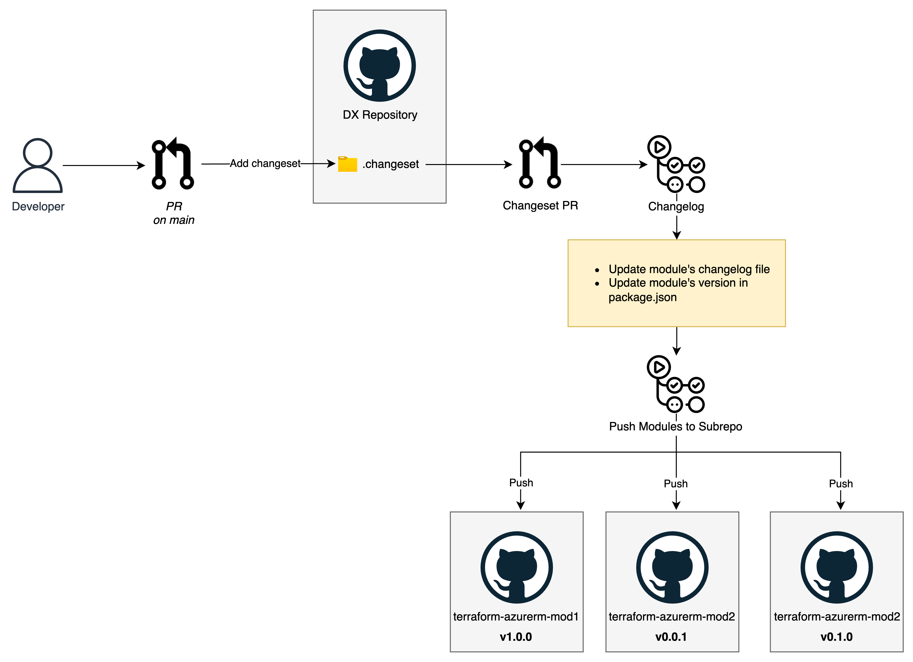

# Publishing Terraform modules to the Registry

This guide walks through the process of creating, developing, and publishing Terraform modules from the [DX monorepo](https://github.com/pagopa/dx) to the Terraform Registry.

:::note

This documentation is intended for contributors working on DevEx Terraform modules.

:::

The Terraform Registry serves as a central repository where organizations can publish and share their Terraform modules with the community. It provides a standardized way to discover, distribute, and version infrastructure as code components. Our organization maintains a collection of modules in the PagoPA namespace, which you can find [here](https://registry.terraform.io/namespaces/pagopa).

We'll cover the entire lifecycle from initialization to publication, including our versioning system and automated workflows.

Our Terraform modules are organized in the `infra/modules` directory, with each module containing its own code, tests, and examples.

## Creating a New Module

### Initialize the module

To create a new module, we provide an automated initialization script called `add-module.sh` located in the `infra/scripts` directory. This script handles all the necessary setup steps and ensures consistency across module creation.

The script accepts the following parameters:

```bash
./add-module.sh --name <module-name> --description <brief-module-description> [--gh-org <organization>] [--provider <provider>]
```

Parameters explained:
- `--name`: Required. The name of your module (e.g., `azure_api_management`)
- `--description`: Required. A brief description of the module's objective (e.g., `Deploys an Azure API Management service with monitoring and network configuration`)
- `--gh-org`: Optional. The GitHub organization where the module's sub-repository will be created. Defaults to `pagopa`.
- `--provider`: Optional. Defaults to `azurerm`. Specifies the cloud provider (e.g., `aws`, `azurerm`)

### What the Initialization Script Does

The script performs several important steps:

1. Validates if the module directory already exists to prevent accidental overwrites
2. Creates the module directory structure under `infra-modules/<provider_name>/`
3. Generates a `package.json` file for version management
4. Creates a dedicated sub-repository with Terraform Registry compliant naming and description
5. Initializes the repository with the module's base code

After successful initialization, you'll need to:
1. Contact DevEx team members in the #team_devex_help channel, to add the new repository to:
   - The dx-pagopa-bot PAT
   - Track it in the eng-github-authorization

## Module Development and Versioning

We use [Changeset](https://github.com/changesets/changesets) for version management and changelog generation. This helps maintain a clear history of changes and ensures proper [semantic versioning](https://semver.org/).

### Managing Changes with Changeset

Before starting development:

1. Initialize and install dependencies:
   ```bash
   yarn install
   ```

2. After making changes, create a changeset:
   ```bash
   yarn changeset
   ```

This will prompt you to:
- Select the type of change (major/minor/patch)
- Provide a description of your changes
- Review and confirm

### Publishing Process

When you're ready to publish your changes:

1. The Changeset release action will automatically create a pull request
2. Review and merge the pull request to trigger:
   - Version bumping
   - Changelog updates
   - Code publication to the module sub-repository
   - Tag creation

#### Sub-repository Management

The Terraform Registry has specific requirements about repository structure - each module must live in its own repository with a standardized naming convention. To accommodate this while maintaining the benefits of a monorepo development workflow, we've implemented an automated system that:

1. Takes the code from our monorepo's `infra/modules` directory
2. Pushes each module to its dedicated sub-repository, following the Terraform Registry naming convention:
   - Repository name format: `terraform-<PROVIDER>-dx-<NAME>`
   - Example: `terraform-azurerm-dx-azure-api-management`

This process is handled by the [`Push modules to subrepo`](https://github.com/pagopa/dx/blob/main/.github/workflows/push_modules_to_subrepo.yml) GitHub Action, which:
- Identifies modified modules in the monorepo
- Updates their respective sub-repositories with the latest code
- Ensures version tags are properly synchronized

For example, if you have three modules in your monorepo:
```
infra/modules/
  ├── azure_api_management/
  ├── azure_container_app/
  └── azure_cosmos_db/
```

They will be automatically pushed to separate repositories:
- `terraform-azurerm-dx-azure-api-management`
- `terraform-azurerm-dx-azure-container-app`
- `terraform-azurerm-dx-azure-cosmos-db`

Each sub-repository maintains its own version history and tags, making it compatible with the Terraform Registry while allowing us to keep our centralized development workflow in the monorepo.



This approach gives us the best of both worlds:
- Centralized development and code review in our monorepo
- Compliance with Terraform Registry requirements
- Automated version management and changelog generation
- Clean, separate version histories for each module

## Best Practices and Tips

- Always create a changeset for any meaningful code changes
- Provide clear, descriptive changelog messages that help users understand the impact of changes
- Test your modules thoroughly before publishing
- Keep module documentation up to date with any changes
- Follow the established naming conventions for consistency

## Next Steps

After successfully publishing your module:
- Monitor the GitHub Actions workflow for successful completion
- Verify the module's version is correctly listed in the Terraform Registry
- Update any dependent infrastructure code to use the new version

For additional help or questions, reach out to the DevEx team.