---
sidebar_label:
  Connecting Resources Across Azure Subscription via Private Endpoints
---

# Connecting resources across Azure Subscription via Private Endpoints

## Overview

This guide explains how to enable network connectivity between two Azure
resources in different subscriptions using Azure Private Endpoints via
Terraform.

The diagram below is a high-level view of the architecture described in the next
sections. The ultimate goal of is to ensure a clear separation of concerns and
resource ownership.



In short:

- Team B is the exclusive owner of the Private Endpoint
  - The Private Endpoint code should be declared in the caller's repository
    (subscription B)
- Team A must approve the connection request without further interaction between
  the two teams
- Each resource of the subscription B requires its own Private Endpoint
- The same Private Endpoint should be used by multiple apps from the same team

## Step-by-Step Implementation

### Define the Private Endpoint in the caller's Terraform codebase (Subscription B)

Add the following code in caller's repository to create a Private Endpoint:

```hcl
resource "azurerm_private_endpoint" "example" {
  name                = "example-private-endpoint"
  location            = "caller-resource-location"
  resource_group_name = "caller-team-domain-rg"
  subnet_id           = "caller-team-pep-subnet"

  private_service_connection {
    name                           = "example-private-endpoint"
    private_connection_resource_id = "/subscriptions/<SUBSCRIPTION_A>/resourceGroups/<RESOURCE_GROUP>/providers/Microsoft.DocumentDB/databaseAccounts/<COSMOSDB_ACCOUNT>"
    is_manual_connection           = true
  }
}
```

:::warning

For resources in the same subscription, it is recommended to set the property
`is_manual_connection` to `false` in order to skip the approval step as the
owner of the two resources is often the same. However, in this case, the
property must be set to `true`; otherwise, the approval mechanism will not work.

:::

:::info

In this example, the `private_connection_resource_id` value is a hardcoded
string. If you prefer to have a reference via Terraform `data` block, you and
the Managed Identities federated with your GitHub workflows need to have the
`Reader` role on the target resource (subscription A).

:::

### Request Approval from the Target Team

Once the Terraform configuration is applied, the target team (Subscription A)
will receive a connection request. The connection between the two resources will
not work until the request is not approved.

#### Private Endpoint Approval mechanism

##### Via Azure Portal

1. In the Azure Portal, navigate to `Private Link Center`
2. Select `Pending Connections`
3. Locate the request and click `Approve`

##### Via Azure CLI

```bash
az network private-endpoint-connection approve \
  --resource-group <TARGET_RESOURCE_GROUP> \
  --name <PRIVATE_ENDPOINT_NAME> \
  --description "<DESCRIPTION>"
```

::: info

It is recommended to add a meaningful description to the connection, indicating
who and why is trying to connect to.

:::
